# Практическая работа №1. Основы командной строки Linux

**Студент:** Казыханов Владимир  
**Имя ВМ / пользователь / hostname:** `kazykhanov`

---

## 1. Создание виртуальной машины

Создана виртуальная машина Ubuntu 22.04 в VMware Workstation Player.  
Имя ВМ: `kazykhanov`, пользователь: `kazykhanov`, hostname: `kazykhanov`.

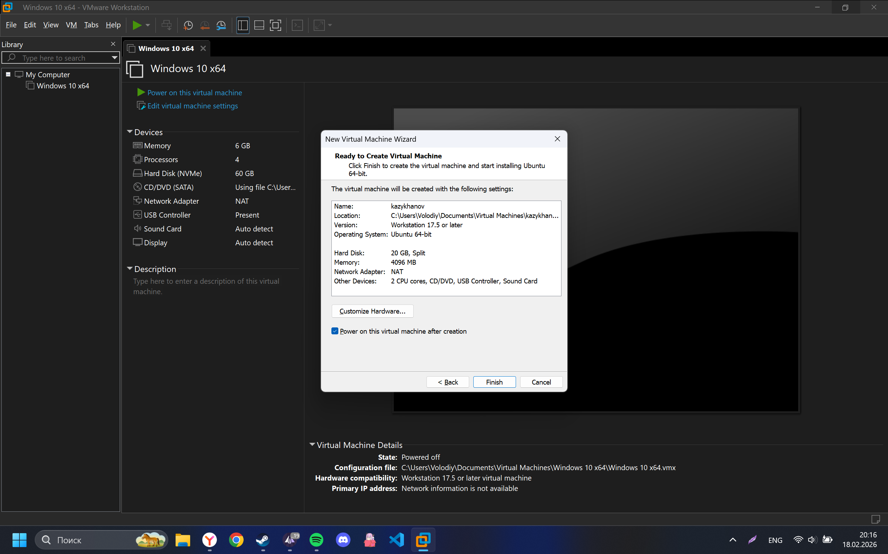


---

## 2. Информация о системе

Выполнены команды для сбора информации о системе, результат сохранён в `~/report/01-system.txt`.

```bash
mkdir -p ~/report
echo '=== СИСТЕМА ===' > ~/report/01-system.txt
uname -a >> ~/report/01-system.txt
echo '' >> ~/report/01-system.txt
echo '=== ОС ===' >> ~/report/01-system.txt
cat /etc/os-release >> ~/report/01-system.txt
echo '' >> ~/report/01-system.txt
echo '=== ПРОЦЕССОР ===' >> ~/report/01-system.txt
lscpu | head -15 >> ~/report/01-system.txt
echo '' >> ~/report/01-system.txt
echo '=== ПАМЯТЬ ===' >> ~/report/01-system.txt
free -h >> ~/report/01-system.txt
echo '' >> ~/report/01-system.txt
echo '=== ДИСКИ ===' >> ~/report/01-system.txt
df -h >> ~/report/01-system.txt
```

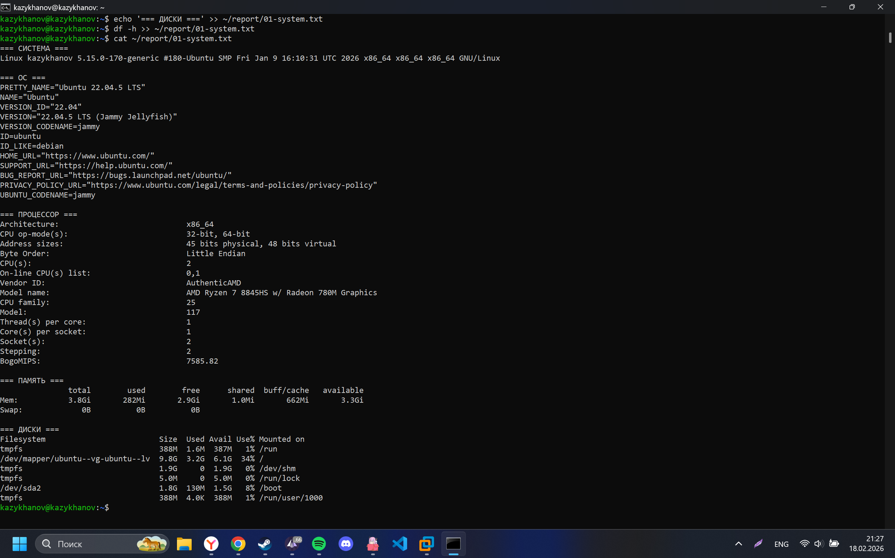

---

## 3. Сеть: IP-адрес и открытые порты

Выполнены команды для получения сетевой информации, результат сохранён в `~/report/02-network.txt`.

```bash
echo '=== IP-АДРЕСА ===' > ~/report/02-network.txt
ip addr show >> ~/report/02-network.txt
echo '' >> ~/report/02-network.txt
echo '=== ОТКРЫТЫЕ ПОРТЫ ===' >> ~/report/02-network.txt
sudo ss -tlnp >> ~/report/02-network.txt
```

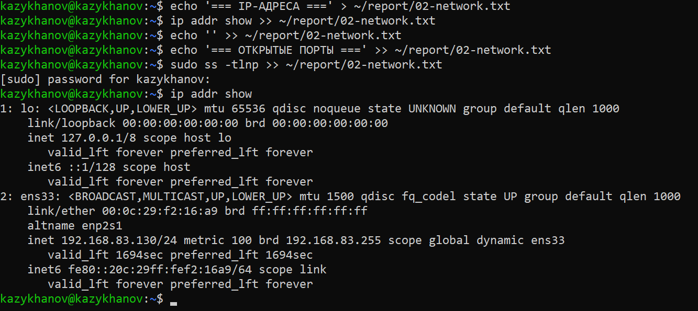

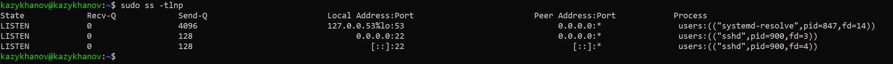

---

## 4. Сервис SSH

Проверен статус сервиса SSH и определён его порт. Результат сохранён в `~/report/03-ssh.txt`.

```bash
echo '=== СТАТУС SSH ===' > ~/report/03-ssh.txt
sudo systemctl status ssh >> ~/report/03-ssh.txt 2>&1
echo '' >> ~/report/03-ssh.txt
echo '=== ПОРТ SSH ===' >> ~/report/03-ssh.txt
sudo ss -tlnp | grep ssh >> ~/report/03-ssh.txt
```

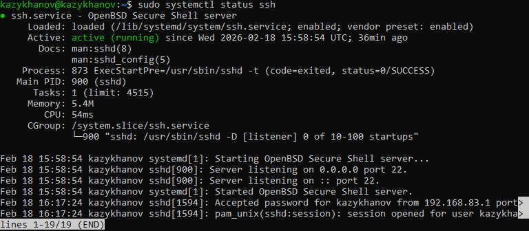

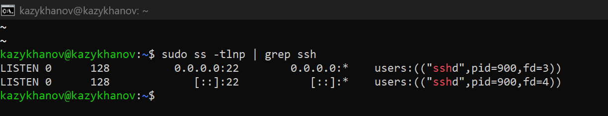

---

## 5. Пользователи и группы

Выведена информация о пользователях и группах. Создан пользователь `boardy`, добавлен в группу `sudo`. Результат сохранён в `~/report/04-users.txt`.

```bash
echo '=== ТЕКУЩИЙ ПОЛЬЗОВАТЕЛЬ ===' > ~/report/04-users.txt
whoami >> ~/report/04-users.txt
id >> ~/report/04-users.txt
echo '' >> ~/report/04-users.txt
echo '=== ПОЛЬЗОВАТЕЛИ С BASH ===' >> ~/report/04-users.txt
grep '/bin/bash' /etc/passwd >> ~/report/04-users.txt
echo '' >> ~/report/04-users.txt
echo '=== ВСЕ ПОЛЬЗОВАТЕЛИ ===' >> ~/report/04-users.txt
cut -d: -f1 /etc/passwd | sort >> ~/report/04-users.txt
echo '' >> ~/report/04-users.txt
echo '=== ГРУППЫ ===' >> ~/report/04-users.txt
groups >> ~/report/04-users.txt
```

Создание пользователя:

```bash
sudo adduser boardy
sudo usermod -aG sudo boardy
id boardy
```

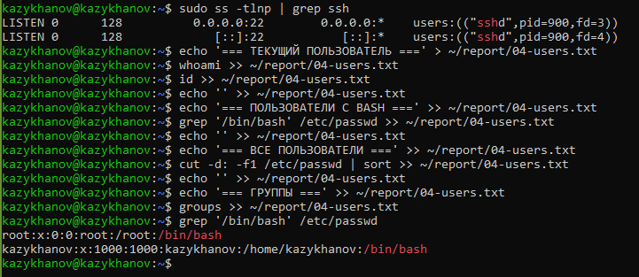

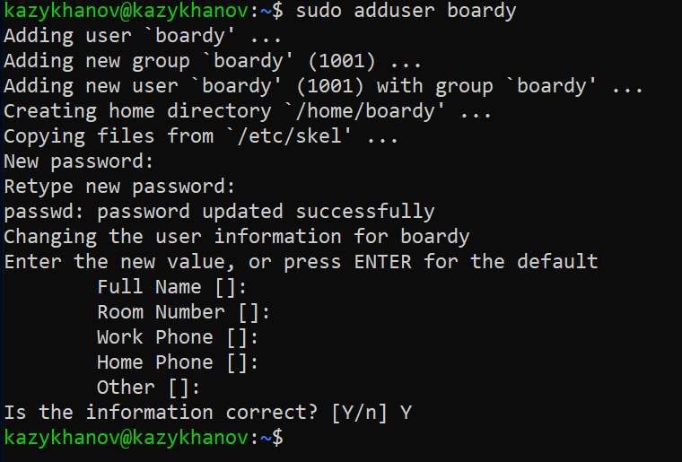

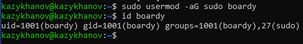

---

## 6. Дерево каталогов

Изучена структура файловой системы. Результат сохранён в `~/report/05-tree.txt`.

```bash
echo '=== КОРЕНЬ ===' > ~/report/05-tree.txt
ls -la / >> ~/report/05-tree.txt
echo '' >> ~/report/05-tree.txt
echo '=== /home ===' >> ~/report/05-tree.txt
ls -la /home >> ~/report/05-tree.txt
echo '' >> ~/report/05-tree.txt
echo '=== ДОМАШНИЙ КАТАЛОГ ===' >> ~/report/05-tree.txt
ls -la ~ >> ~/report/05-tree.txt
```

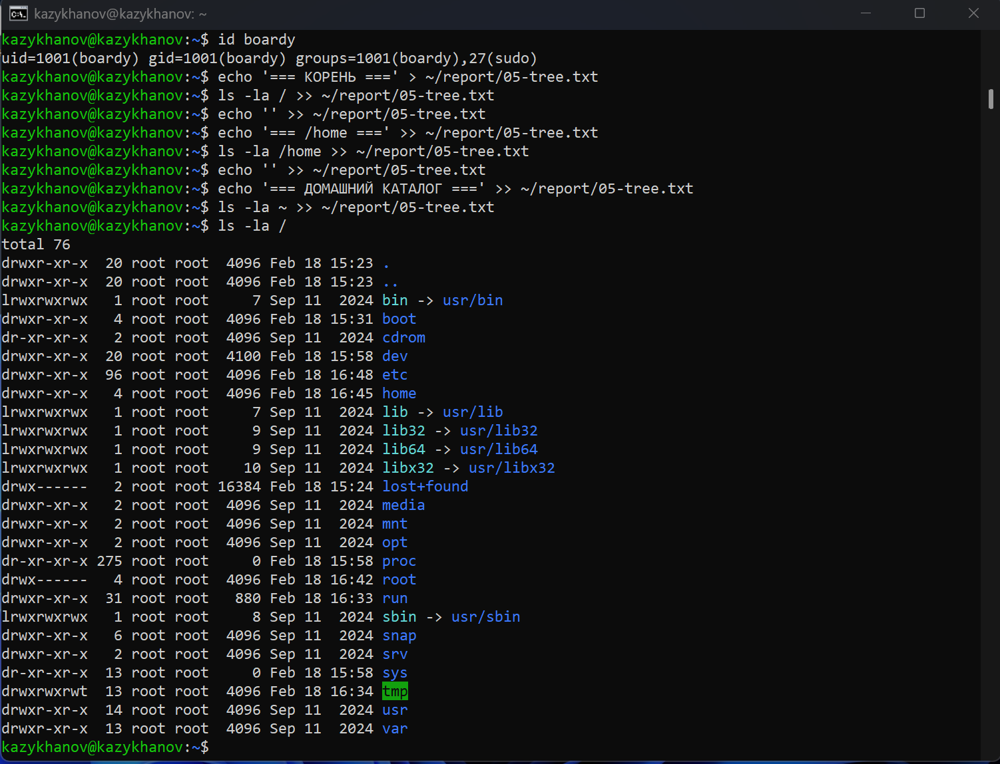

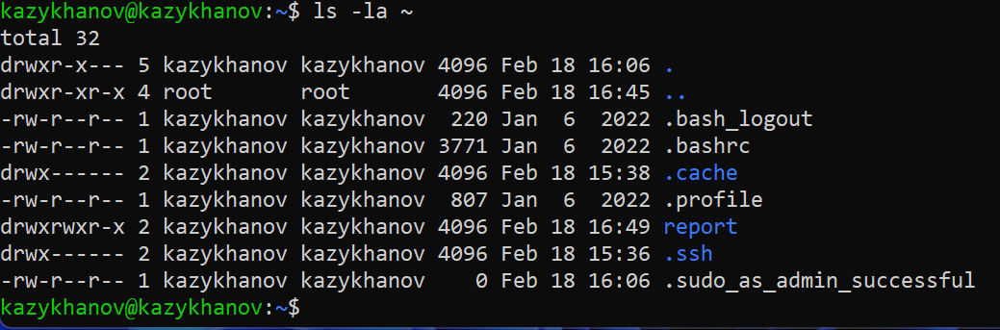

---

## 7. Права доступа

Изучены права на ключевые каталоги, выполнено изменение прав на тестовом файле. Результат сохранён в `~/report/06-permissions.txt`.

```bash
echo '=== ПРАВА НА КАТАЛОГИ ===' > ~/report/06-permissions.txt
ls -ld / /etc /var /tmp /home >> ~/report/06-permissions.txt
echo '' >> ~/report/06-permissions.txt
echo '=== ИЗМЕНЕНИЕ ПРАВ ===' >> ~/report/06-permissions.txt
touch ~/report/testfile.txt
ls -l ~/report/testfile.txt >> ~/report/06-permissions.txt
chmod 755 ~/report/testfile.txt
ls -l ~/report/testfile.txt >> ~/report/06-permissions.txt
chmod 600 ~/report/testfile.txt
ls -l ~/report/testfile.txt >> ~/report/06-permissions.txt
```

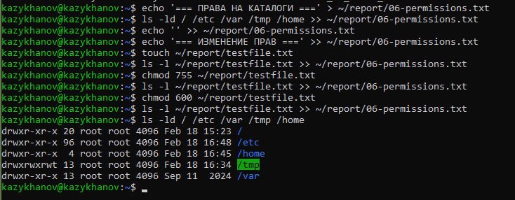

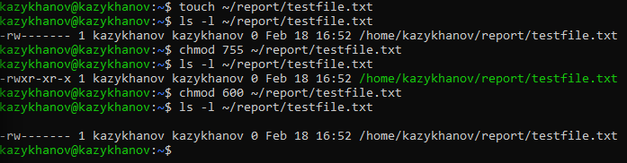

---

## 8. Установленные пакеты и сервисы

Просмотрены ключевые пакеты и запущенные сервисы. Результат сохранён в `~/report/07-packages.txt`.

```bash
echo '=== КЛЮЧЕВЫЕ ПАКЕТЫ ===' > ~/report/07-packages.txt
dpkg -l | grep -E 'openssh|python|git|curl|vim|nano' >> ~/report/07-packages.txt
echo '' >> ~/report/07-packages.txt
echo '=== КОЛИЧЕСТВО ПАКЕТОВ ===' >> ~/report/07-packages.txt
dpkg -l | grep '^ii' | wc -l >> ~/report/07-packages.txt
echo '' >> ~/report/07-packages.txt
echo '=== ЗАПУЩЕННЫЕ СЕРВИСЫ ===' >> ~/report/07-packages.txt
systemctl list-units --type=service --state=running >> ~/report/07-packages.txt
```

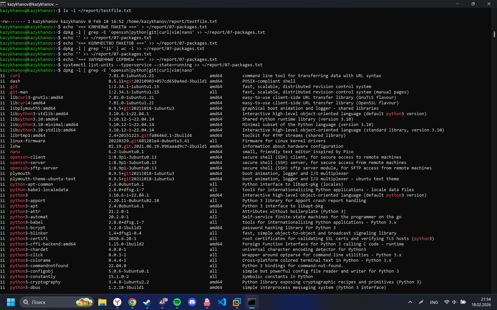

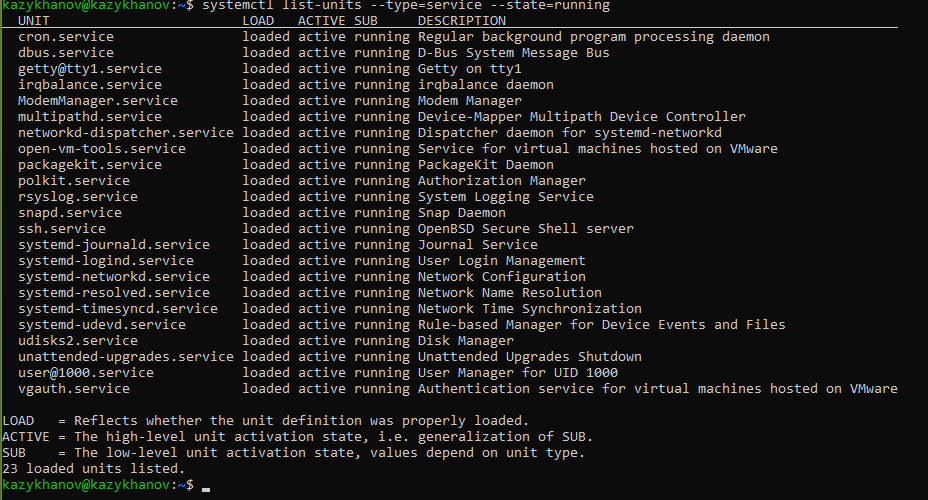

---

## 9. Конвейер и перенаправление

Выполнены комплексные команды с конвейерами. Результат сохранён в `~/report/08-pipes.txt`.

```bash
echo '=== ТОП-10 ПРОЦЕССОВ ПО ПАМЯТИ ===' > ~/report/08-pipes.txt
ps aux --sort=-%mem | head -11 >> ~/report/08-pipes.txt
echo '' >> ~/report/08-pipes.txt
echo '=== ПРОЦЕССЫ ПО ПОЛЬЗОВАТЕЛЯМ ===' >> ~/report/08-pipes.txt
ps aux | tail -n +2 | awk '{print $1}' | sort | uniq -c | sort -rn >> ~/report/08-pipes.txt
echo '' >> ~/report/08-pipes.txt
echo '=== БОЛЬШИЕ ФАЙЛЫ В /var ===' >> ~/report/08-pipes.txt
sudo du -ah /var 2>/dev/null | sort -rh | head -10 >> ~/report/08-pipes.txt
```

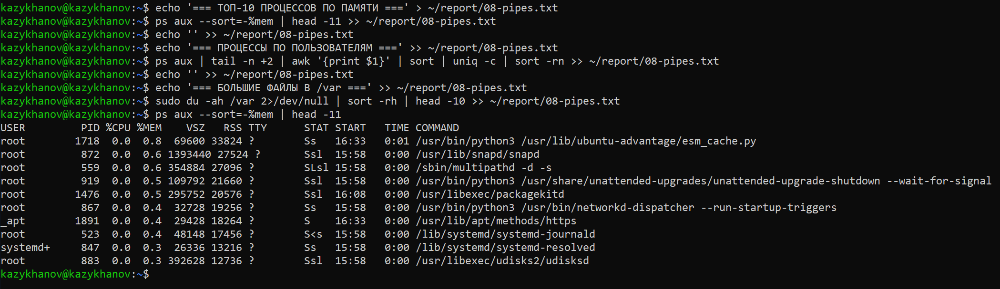

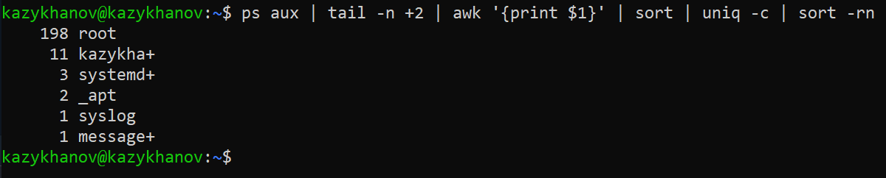

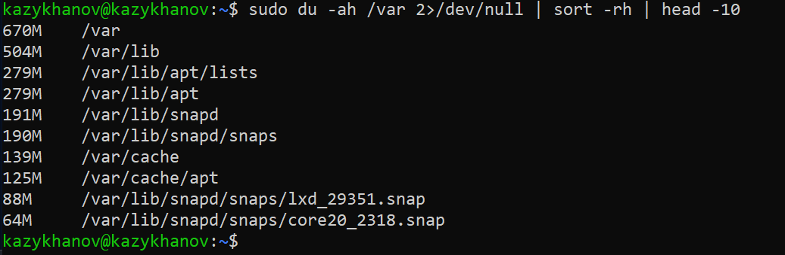

---

## 10. Итоговый файл

Все файлы собраны в единый отчёт `FULL-REPORT.txt`.

```bash
cat ~/report/0*.txt > ~/report/FULL-REPORT.txt
wc -l ~/report/FULL-REPORT.txt
ls -lh ~/report/
```

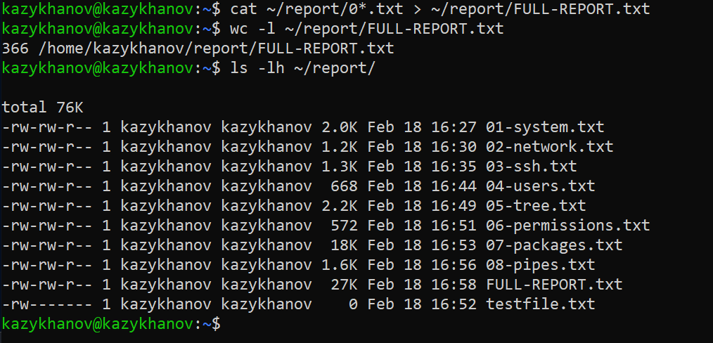
