# Практическая работа №11. JWT для API и OAuth через GitHub

**Студент:** Казыханов Владимир
**Среда:** WSL (Ubuntu 24.04), локальная разработка
**Сайт:** `http://localhost`
**API:** `http://localhost:8000`

---

## Часть A. JWT для API

### Задание 1. auth.py

Создан `auth.py` с `get_current_user`. В `routers/comments.py` добавлен `Depends(get_current_user)` в POST/PUT/DELETE. POST без токена возвращает 401.

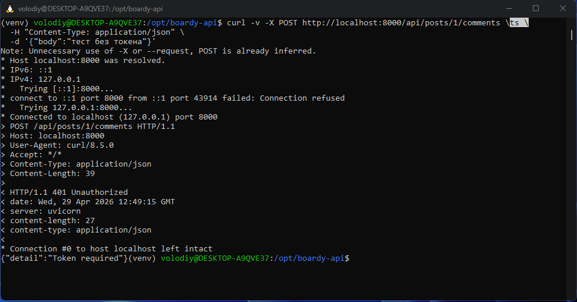

`Bearer` - это название схемы аутентификации (RFC 6750). Сервер по этому слову понимает, как разбирать остаток заголовка.

---

### Задание 2. /api/me.php

`me.php` берёт `$_SESSION['user_id']` по куке `PHPSESSID`, подписывает JWT общим секретом и отдаёт JSON.

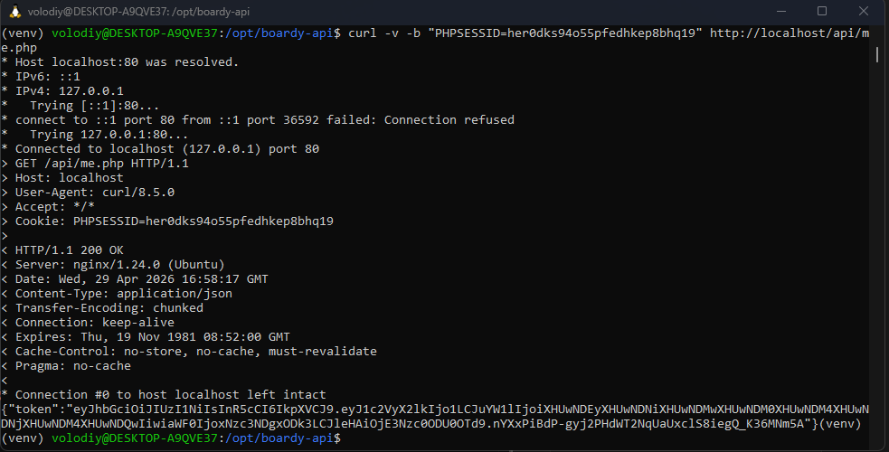

Логин/пароль не нужны - пользователь уже залогинен, кука `PHPSESSID` это и подтверждает.

---

### Задание 3. React получает JWT

В `comments.jsx` добавлен `useEffect` с `fetch('/api/me.php', { credentials: 'include' })`. Токен сохраняется в state и виден в Console.

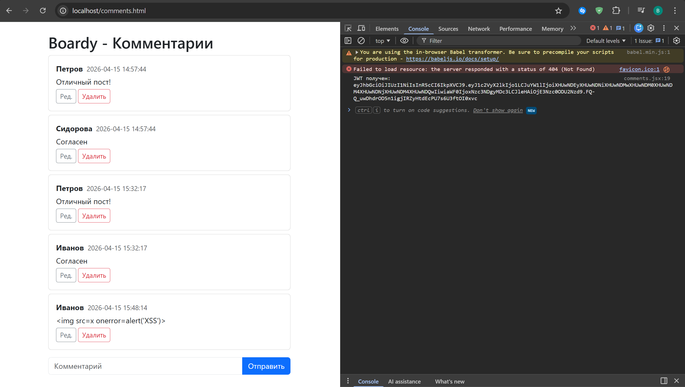

---

### Задание 4. Bearer в запросах

В POST/PUT/DELETE добавлен заголовок `Authorization: Bearer <jwt>`. В Network виден заголовок и статус 201.

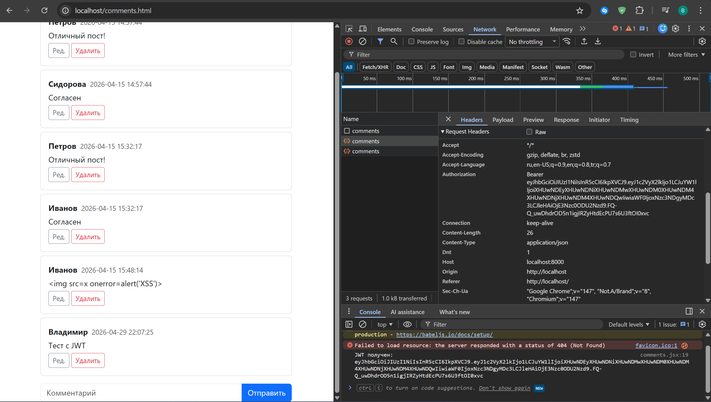

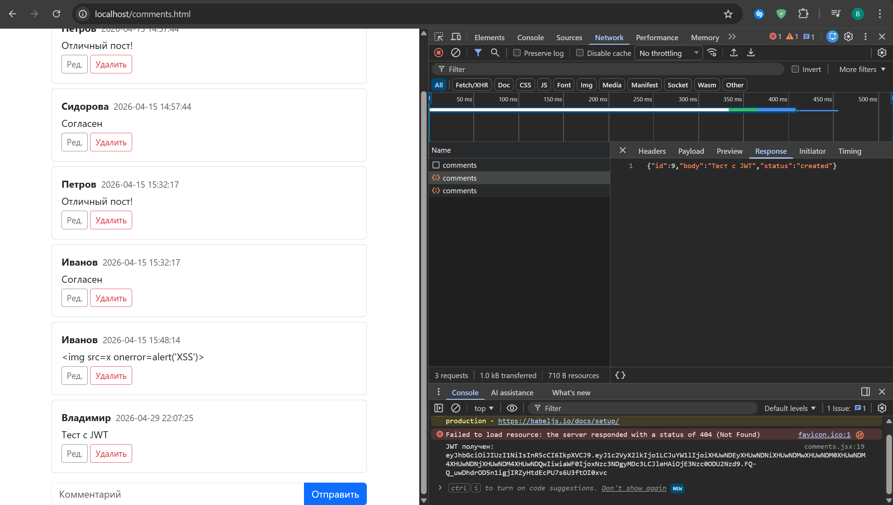

---

### Задание 5. jwt.io

Токен вставлен на jwt.io, секрет - `boardy-jwt-secret-2026-change-me-in-production`. Подпись валидна.

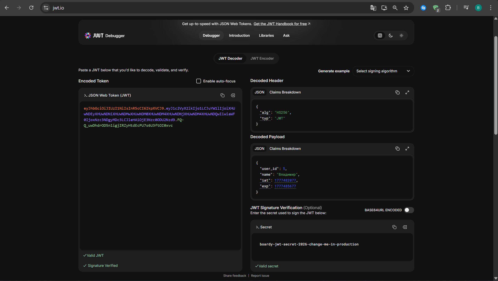

Payload **закодирован** (base64url), а не зашифрован - любой может его прочитать. Но изменить нельзя: подпись проверит сервер. Защищена не тайна, а целостность.

---

### Задание 6. Истёкший токен

`exp = time() + 5`, через 10 секунд POST возвращает 401 Token expired.

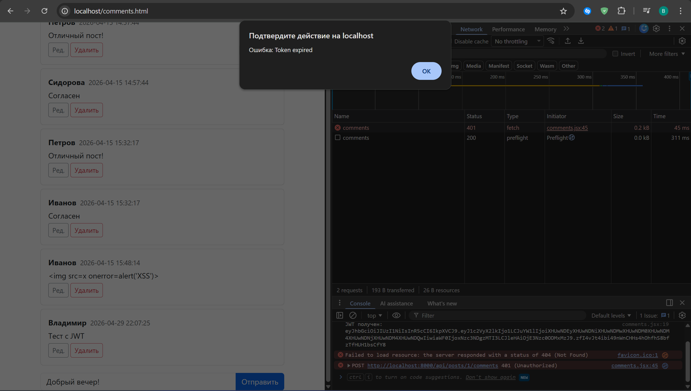

---

### Задание 7. Невалидный токен

curl с `Bearer abcdef.invalid.token` → 401 Invalid token.

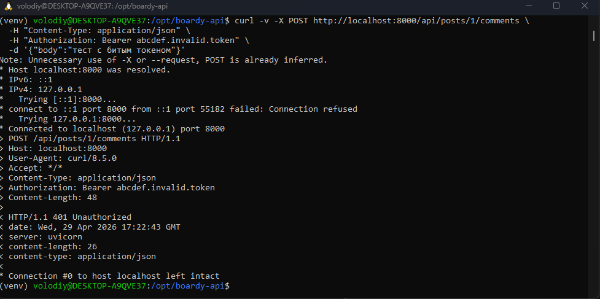

---

## Часть B. OAuth через GitHub

### Задание 8. OAuth App

Зарегистрировано приложение `Boardy (barsik)` на GitHub. Homepage `http://localhost`, callback `http://localhost/oauth-callback.php`.

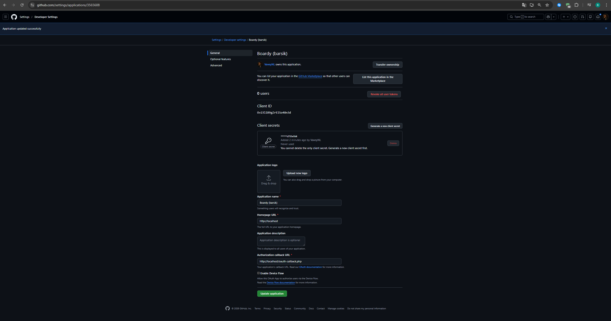

---

### Задание 9. Столбец github_id

```sql
ALTER TABLE users ADD COLUMN github_id VARCHAR(100) DEFAULT NULL;
```

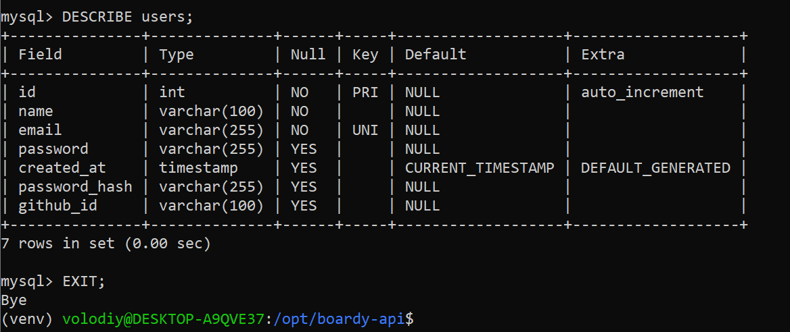

---

### Задание 10. Кнопка «Войти через GitHub»

В `nav.php` в гостевую ветку добавлена ссылка на `/oauth-github.php`.

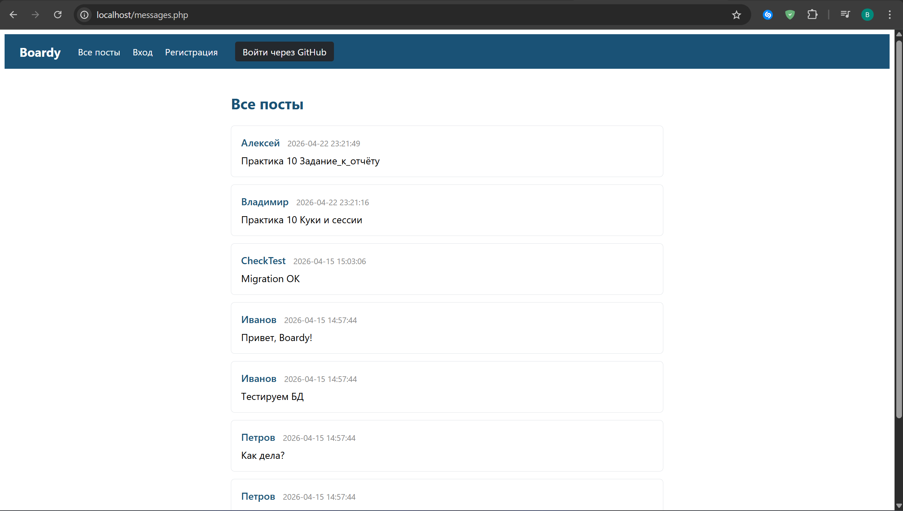

---

### Задание 11. OAuth flow

Клик → state в сессию → redirect на github.com/login/oauth/authorize → Authorize → callback → обмен code на access_token → запрос профиля → INSERT в users → сессия → редирект на messages.php.

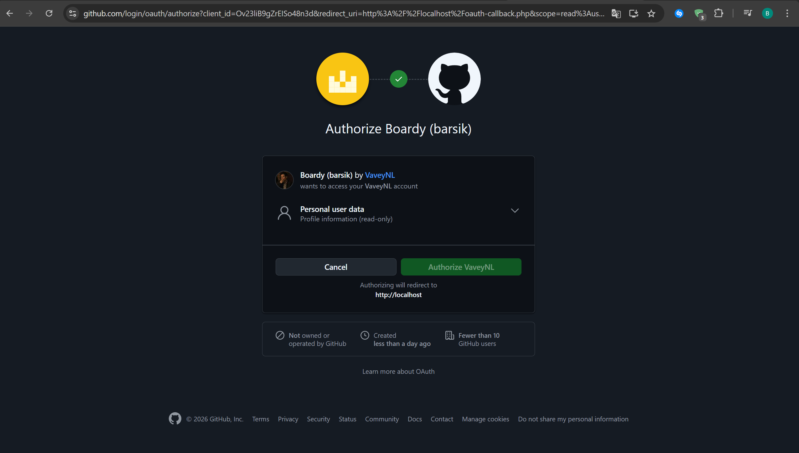

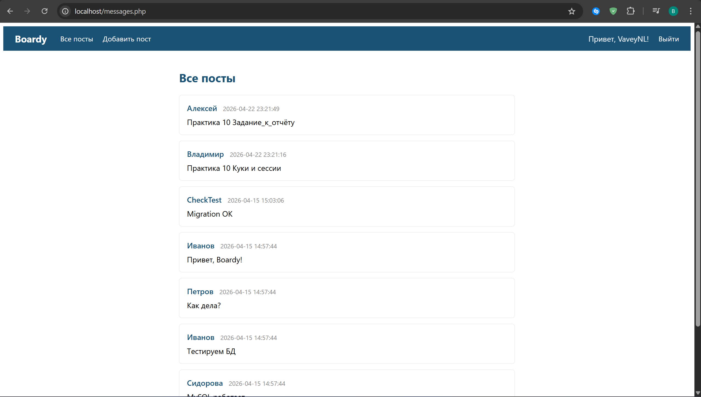

---

### Задание 12. github_id в базе

```sql
SELECT id, name, email, github_id FROM users;
```

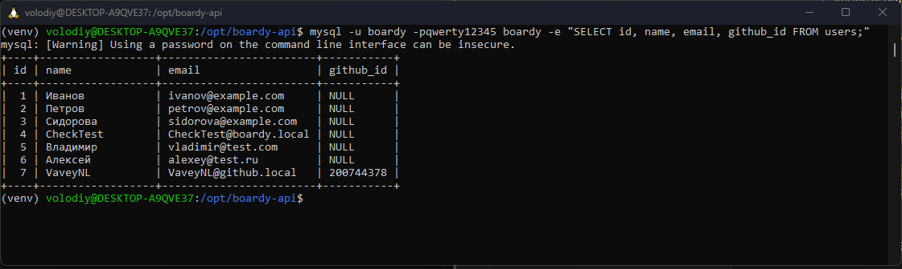

Ищем по `github_id`, а не по email, потому что email можно поменять, скрыть или вообще не верифицировать. `github_id` - постоянный числовой идентификатор, GitHub его никогда не меняет.

---

### Задание 13. OAuth → JWT → API

После OAuth React получает JWT с `user_id` нового OAuth-пользователя через me.php, отправляет POST с Bearer-токеном, FastAPI пишет комментарий с правильным автором.

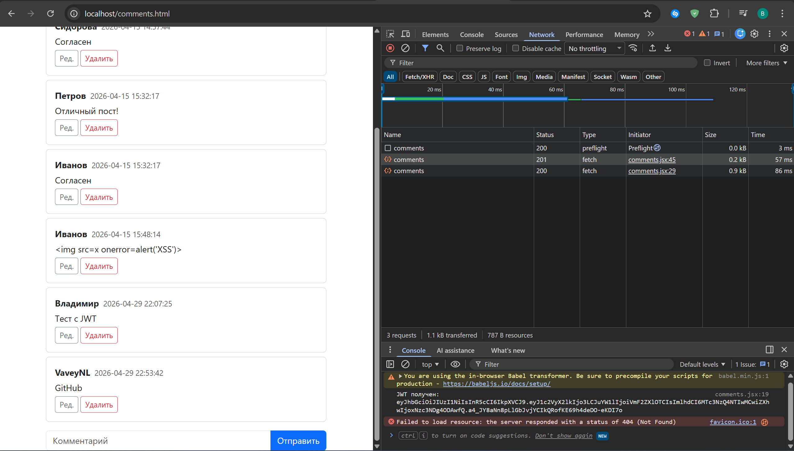

**Полный flow:**

```
Кнопка → oauth-github.php (state в сессию)
       → github.com/login/oauth/authorize
       → Authorize
       → oauth-callback.php (state, code → access_token → profile → users)
       → $_SESSION['user_id']
       → /messages.php
       → /comments.html
       → useEffect → fetch /api/me.php (PHPSESSID)
       → JWT
       → fetch FastAPI с Authorization: Bearer
       → auth.py: jwt.decode → user_id
       → INSERT comment с author_id из токена
       → 201 Created
```

---

### Задание 14. Параметр `state` и CSRF

`state` - случайная строка, сгенерированная клиентом перед redirect и сохранённая в сессии. Провайдер возвращает её обратно в callback, сервер сверяет с сессией. Без `state` возможна CSRF-атака:

1. Злоумышленник начинает OAuth-flow в Boardy под своим GitHub-аккаунтом и получает callback URL с `code=ABCDEF`, но не открывает его.
2. Подсовывает жертве этот URL (например, `` на стороннем сайте).
3. Браузер жертвы открывает callback. У жертвы уже есть открытая сессия Boardy.
4. Callback видит `code` злоумышленника, обменивает его на access_token, получает профиль злоумышленника.
5. Без проверки `state` callback привязывает GitHub-аккаунт злоумышленника к сессии жертвы - она работает в Boardy под чужим аккаунтом.

С `state` атака ломается на шаге 4: state в сессии жертвы другой → callback завершается ошибкой.

---

## Часть C. Анализ

### Задание 15. Три способа входа

```sql
SELECT id, name, email, password_hash IS NOT NULL AS has_pw, github_id FROM users;
```

В таблице видны три категории пользователей: с password_hash (форма), с github_id (OAuth), и старые seed-данные без того и другого.

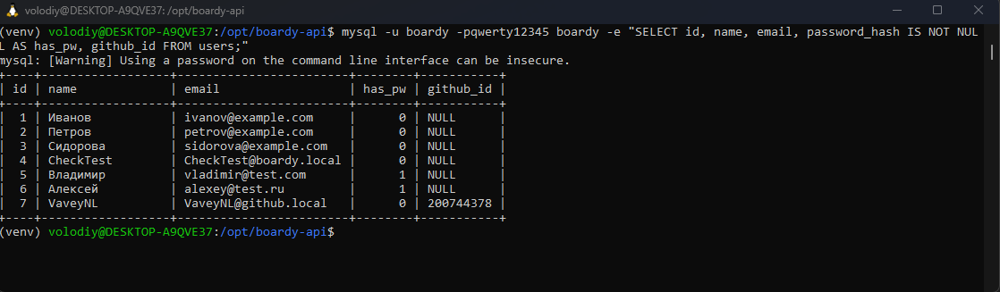

---

### Задание 16. Сравнение механизмов

| Вопрос                       | Куки + сессии              | JWT                                | OAuth                                       |
|-----------------------------|----------------------------|------------------------------------|---------------------------------------------|
| Где хранятся данные?         | На сервере, в куке только ID | На клиенте, на сервере ничего | У провайдера (GitHub), у нас - `github_id` |
| Кто прикрепляет к запросу?   | Браузер автоматически | JS руками (`Authorization: Bearer`) | Браузер через redirect |
| Для какого типа клиентов?    | Браузер на одном домене | Любой клиент | Браузер |
| Можно ли отозвать?           | Да - удалить файл сессии | Нет, действителен до `exp` | Да - отозвать grant у провайдера |
| Кросс-доменно работает?      | Нет | Да | Да |

---

### Задание 17. Три бага

1. **Секрет в коде.** `SECRET_KEY` в `auth.py` и `me.php`, при `git push` уйдёт в репозиторий, боты сканируют GitHub и за минуты найдут. Закрывает Passport: RSA-ключи в `storage/oauth-*.key`, в `.gitignore`.

2. **Нет refresh и отзыва.** JWT валиден до `exp`, заблокировать пользователя или «выйти со всех устройств» нельзя. Закрывает Passport: таблица `oauth_access_tokens` со статусом `revoked` + refresh-токены.

3. **Нет scopes.** Любой токен даёт полный доступ к API. Закрывает Passport: scope-ы (`comments:read`, `comments:write`) проверяются в `Depends`.

---

## Pull Request

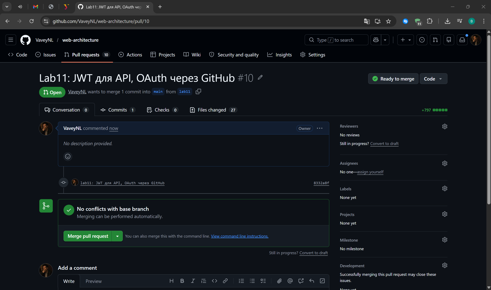
