# Практическая работа №12. Laravel + Breeze + Socialite

**Студент:** Казыханов Владимир
**Среда:** WSL (Ubuntu 24.04), локальная разработка
**Сайт:** `http://localhost`

---

## Часть A. Установка и переключение домена

### Задание 1. Composer и PHP-расширения

Установлен Composer 2.x. Поставлены расширения PHP 8.3: mbstring, xml, bcmath, curl, mysql, zip, gd, tokenizer.

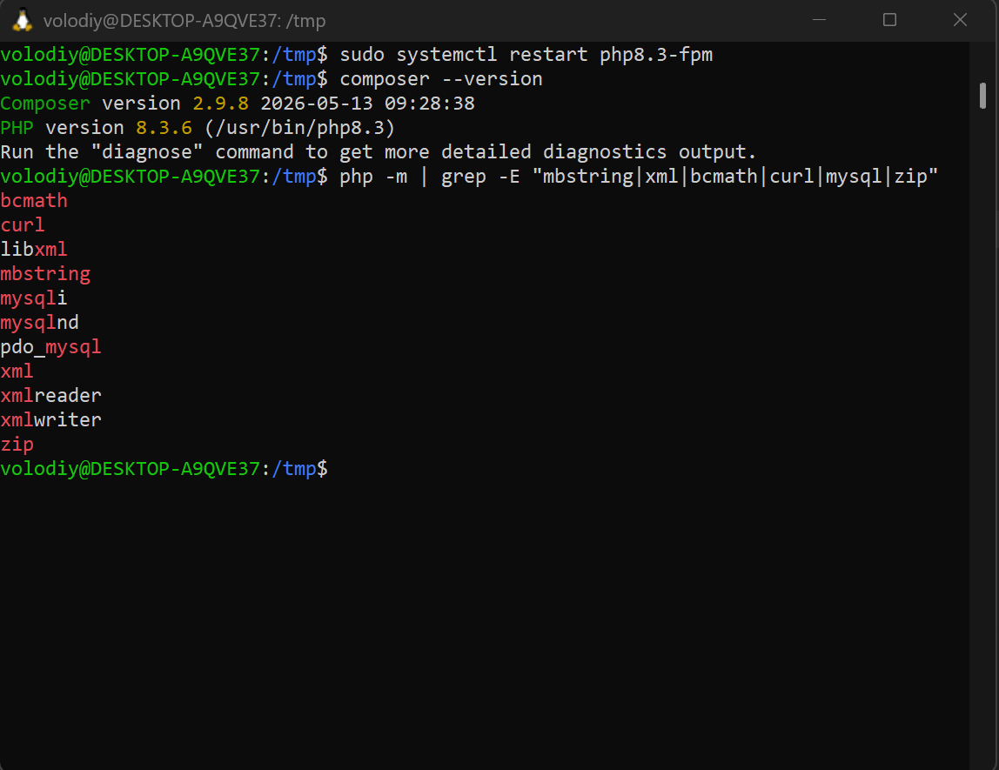

---

### Задание 2. Переезд папок

`/var/www/boardy` переименован в `/var/www/boardy-legacy`. На освободившееся место через `composer create-project laravel/laravel boardy` установлен Laravel 13.8.0 (актуальная версия на момент сдачи практики, ушёл вперёд от 11.x, заявленной в методичке).

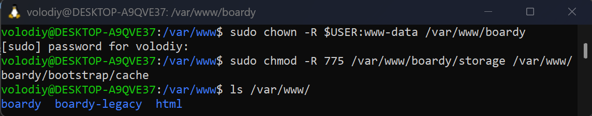

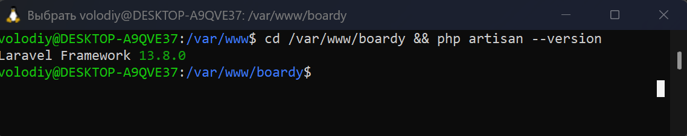

---

### Задание 3. Структура Laravel

- **`app/`** - код приложения: контроллеры, Eloquent-модели, политики, middleware.
- **`routes/`** - определение маршрутов: `web.php` (страницы), `api.php` (JSON API), `auth.php` (Breeze).
- **`resources/views/`** - Blade-шаблоны (HTML с директивами `@if`, `@foreach`, `{{ }}`).
- **`database/`** - миграции (схемы таблиц), фабрики, сидеры.
- **`public/`** - единственная папка, видимая снаружи через nginx; точка входа `index.php`, статика, собранные ассеты.

**Защитный вопрос: почему `document_root` nginx должен указывать на `public/`, а не на корень проекта?**

Laravel - single-entry-point фреймворк: все HTTP-запросы проходят через `public/index.php`. Папка `public/` содержит только то, что должно быть доступно из интернета: индексный скрипт, картинки, css/js. Всё остальное - закрыто.

Если указать `root /var/www/boardy/`, то по URL станут доступны:

- `/.env` - файл с паролями БД, Client Secret OAuth, ключом приложения APP_KEY. Это полный взлом.
- `/storage/logs/laravel.log` - логи с трейсами и SQL-запросами, в которых видны структура БД и иногда параметры.
- `/composer.json` и `/composer.lock` - список зависимостей с точными версиями. Атакующий по этому списку ищет известные CVE.
- `/database/migrations/*.php` - вся схема БД (имена таблиц, колонок, индексов).

Поэтому `public/` - обязательное правило архитектуры всех современных PHP-фреймворков (Laravel, Symfony, Yii). Корневая папка проекта в принципе не должна обслуживаться веб-сервером.

---

### Задание 4. Nginx-конфиг

Конфиг `/etc/nginx/sites-available/boardy` переписан: `root /var/www/boardy/public`, `index index.php`, директива `try_files $uri $uri/ /index.php?$query_string`. Сохранена секция `/phpmyadmin`. Удалены устаревшие location-блоки из Lab10-11.

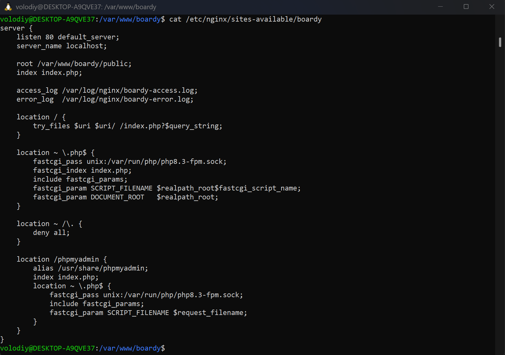

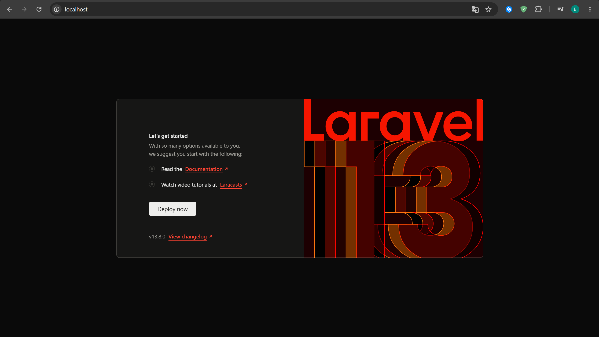

**Защитный вопрос: что делает `try_files $uri $uri/ /index.php?$query_string`? Что произойдёт без неё при заходе на `/posts/3`?**

Nginx последовательно пробует три варианта:

1. **`$uri`** - попытаться отдать файл по этому пути напрямую. Если есть `/css/style.css` - отдать как статику, PHP не дёргается.
2. **`$uri/`** - попытаться отдать индекс из директории (например `/about/index.html`).
3. **`/index.php?$query_string`** - если ни файла, ни папки не нашлось - передать управление в `index.php`, добавив исходные query-параметры.

Без этой директивы при заходе на `/posts/3` nginx ищет физический файл `/var/www/boardy/public/posts/3` или директорию `/posts/3/index.html`, не находит и возвращает 404. PHP-роутер Laravel вообще не вызывается, фреймворк ничего не знает о запросе.

С `try_files` третий шаг говорит «не нашёл - отдаю на `index.php`». Laravel ловит запрос, матчит маршрут `Route::resource('posts', PostController::class)` → `GET /posts/{post}` → `PostController::show(Post $post)`. Route Model Binding автоматически достаёт `Post::findOrFail(3)` (или отдаёт 404 если поста нет), и метод `show` возвращает Blade-шаблон.

То есть `try_files` - это мост между «URL как путь к файлу» (старая PHP-парадигма) и «URL как абстрактный маршрут» (фреймворковая парадигма).

---

## Часть B. БД, миграции, сидер

### Задание 5. Создание БД boardy_main

```sql
CREATE DATABASE boardy_main CHARACTER SET utf8mb4 COLLATE utf8mb4_unicode_ci;
GRANT ALL PRIVILEGES ON boardy_main.* TO 'boardy'@'localhost';
FLUSH PRIVILEGES;
```

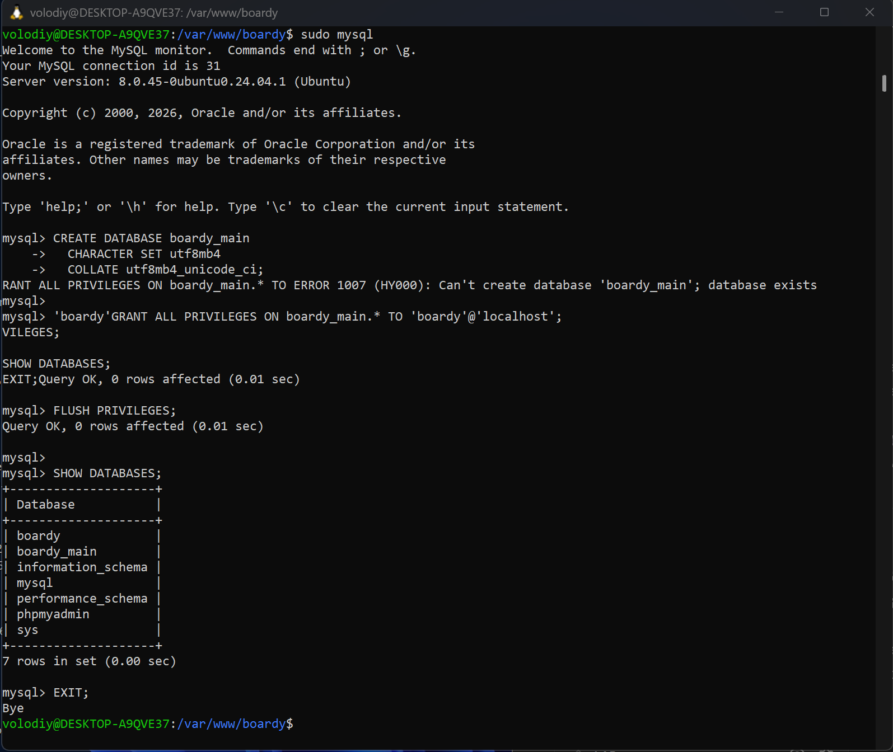

**Защитный вопрос: зачем мы создаём новую БД, а не подгоняем старую под Laravel?**

В старой БД `boardy` (Lab8-11) схема под чистый PHP: колонка `password_hash` вместо ожидаемого Laravel `password`, нет `email_verified_at`, нет `remember_token`, может не быть `created_at`/`updated_at` или они в другом формате. Laravel-конвенции (Eloquent, Auth-фасад, Breeze) жёстко завязаны на конкретные имена колонок. Подгонять старую схему - это десяток ALTER-миграций, плюс риск сломать FastAPI из Lab9-11, который читает старую БД.

Создать БД с нуля - одна команда + одна команда GRANT. Чистая схема под фреймворк, ноль рисков для legacy. Старая `boardy` остаётся как есть, продолжает обслуживать FastAPI до Lab13 (когда мы переведём всё на Passport и одну общую БД). Это и есть смысл двух БД: legacy и новая работают параллельно без конфликтов.

---

### Задание 6. Подключение Laravel к БД

В `.env` прописаны:

```
DB_CONNECTION=mysql
DB_HOST=127.0.0.1
DB_PORT=3306
DB_DATABASE=boardy_main
DB_USERNAME=boardy
DB_PASSWORD=qwerty12345
```

`php artisan tinker` → `DB::connection()->getPdo()` возвращает объект PDO с подключением к `boardy_main` без ошибки. По умолчанию Laravel 13 ставил `DB_CONNECTION=sqlite`, пришлось переключать на `mysql`.

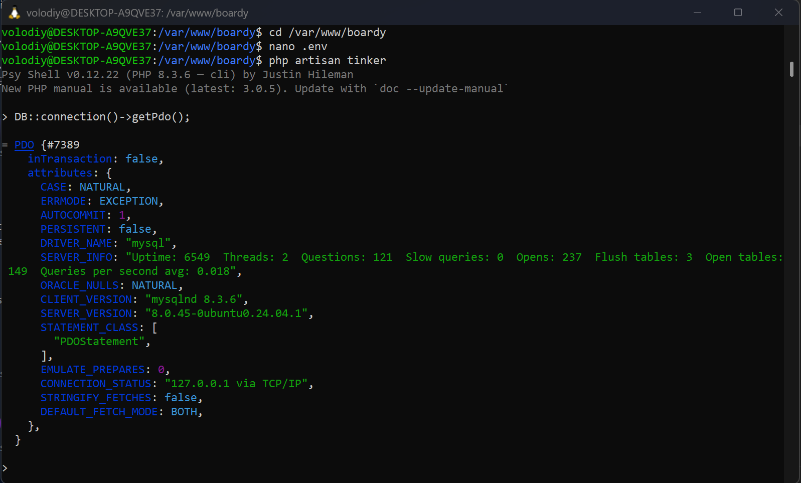

---

### Задание 7. Миграции posts и comments

Созданы две миграции:

- **`posts`**: `id`, `user_id` (foreignId с `onDelete('cascade')`), `title` (string, max 200), `body` (text), `timestamps`.
- **`comments`**: `id`, `post_id` (foreignId, cascade), `user_id` (foreignId, cascade), `body` (text), `timestamps`.

Дефолтные миграции Laravel (users, cache, jobs, sessions, password_reset_tokens) накатились без изменений. Накат: `php artisan migrate`.

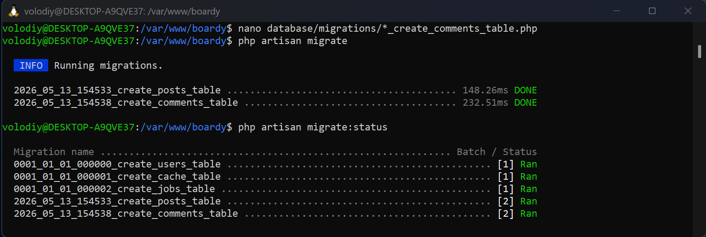

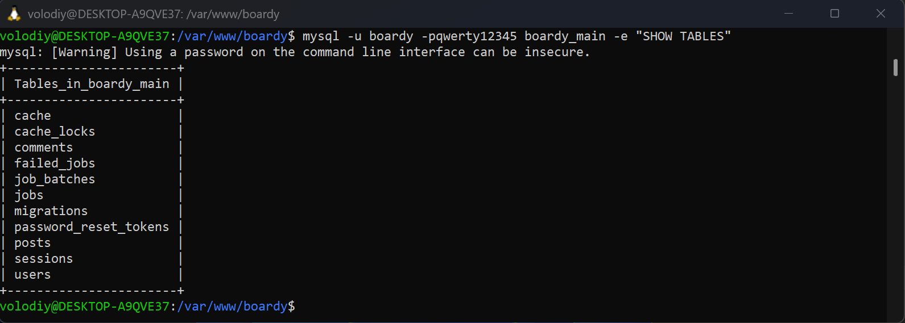

---

### Задание 8. Модели со связями

Связи:

- `User` → `hasMany(Post)`, `hasMany(Comment)`.
- `Post` → `belongsTo(User, 'user_id')` через метод `author()` (удобнее в шаблонах: `$post->author->name`), `hasMany(Comment)`.
- `Comment` → `belongsTo(User, 'user_id')` через `author()`, `belongsTo(Post)`.

Проверка в tinker: `Post::first()->author` возвращает объект `App\Models\User`. `Post::first()->comments` возвращает `Collection` с объектами `Comment`.

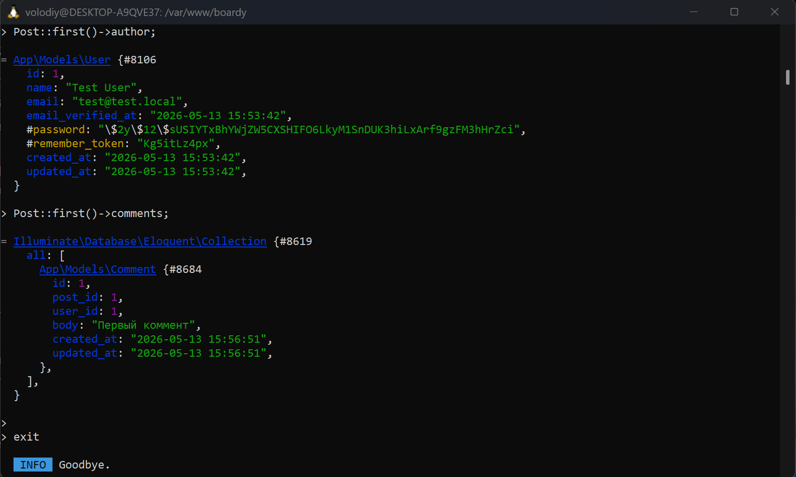

---

### Задание 9. Сидер

`DatabaseSeeder` создаёт:

- 1 тестового пользователя `test@boardy.local` / `password`.
- 4 случайных пользователя через `User::factory()->count(4)`.
- 10 постов через `PostFactory`, привязанных к случайным пользователям.
- 25 комментариев через `CommentFactory`, привязанных к случайным постам и пользователям.

Запуск: `php artisan migrate:fresh --seed`. Проверка: `User::count() = 5`, `Post::count() = 10`, `Comment::count() = 25`.

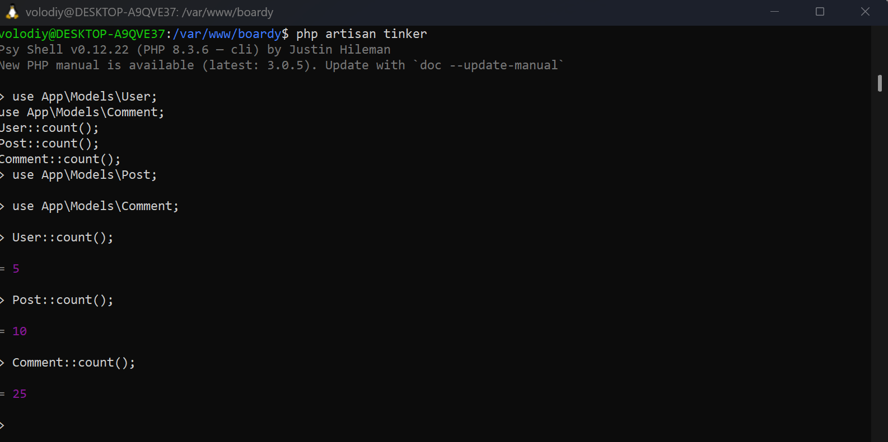

---

## Часть C. CRUD постов и комментариев

### Задание 10. Маршруты

`Route::resource('posts', PostController::class)` создаёт 7 CRUD-маршрутов одной строкой: index, create, store, show, edit, update, destroy. Маршрут `Route::post('/comments', [CommentController::class, 'store'])->middleware('auth')` для отправки комментария.

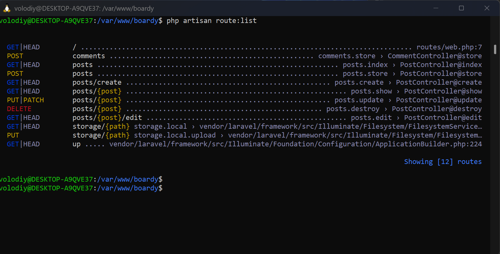

---

### Задание 11. Лента постов

`PostController::index` использует `Post::with('author')->latest()->paginate(10)` - eager loading автора одним JOIN'ом (избегает проблемы N+1), сортировка по `created_at DESC`, пагинация по 10 постов. Шаблон `posts/index.blade.php` через `@forelse` рендерит карточки с заголовком (ссылка на show), превью текста через `Str::limit($post->body, 200)`, автором и датой.

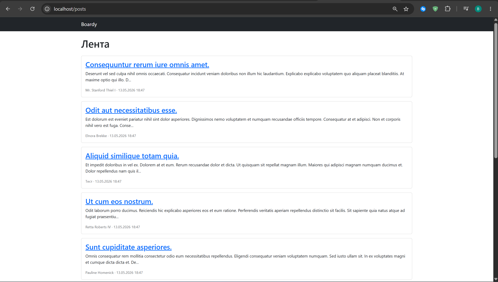

---

### Задание 12. Страница поста с комментариями

`PostController::show(Post $post)` использует Route Model Binding - Laravel сам делает `Post::findOrFail($id)` или 404. `$post->load('author', 'comments.author')` подгружает связи (включая авторов комментариев одним запросом). Шаблон рендерит пост, список комментариев и форму нового комментария для `@auth`.

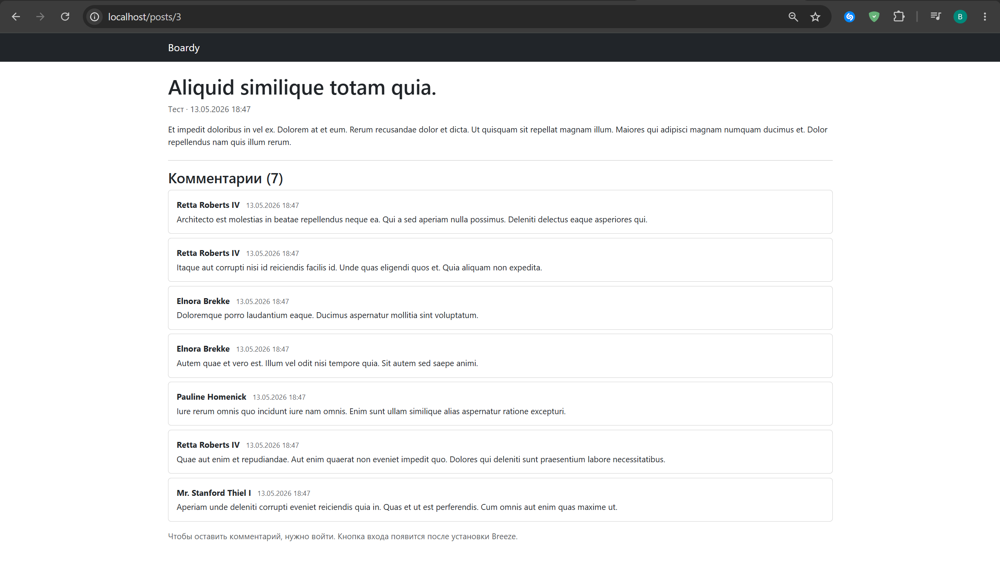

---

### Задание 13. Создание поста

Метод `create` рендерит форму, `store` валидирует (`title` required|string|max:200, `body` required|string|max:5000) и создаёт через `$request->user()->posts()->create($data)` - `user_id` подставляется автоматически из текущего залогиненного пользователя. Редирект на `posts.show` с flash-сообщением «Пост создан».

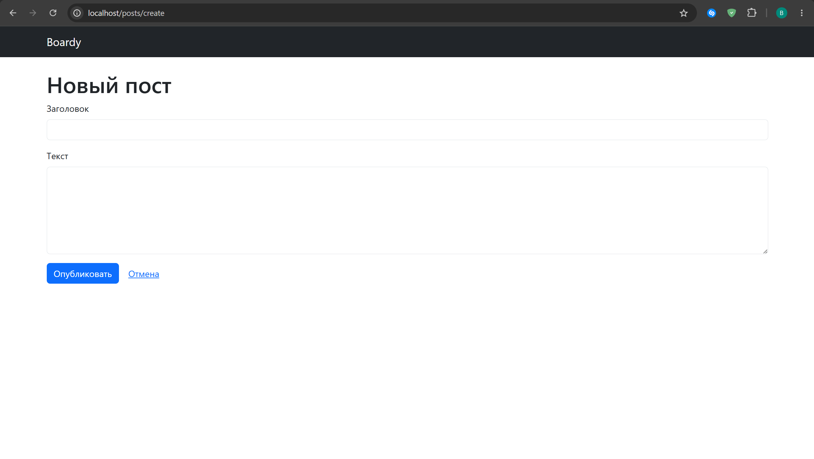

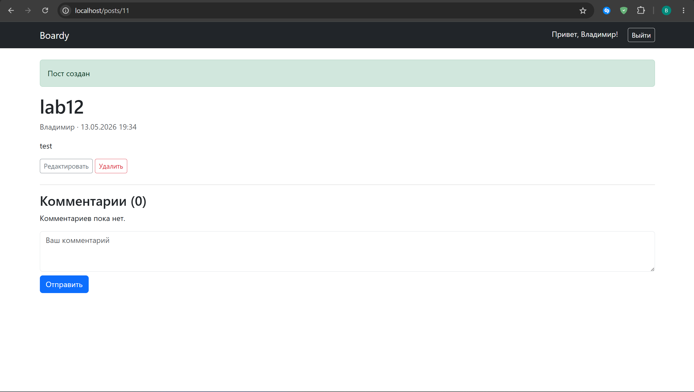

---

### Задание 14. Policy и редактирование

`PostPolicy::update` и `PostPolicy::delete` возвращают `$user->id === $post->user_id`. В контроллере в методах `edit`, `update`, `destroy` первой строкой `$this->authorize('update'|'delete', $post)` - при `false` Laravel сам отдаёт 403. В Blade-шаблоне `@can('update', $post) ... @endcan` показывает кнопки только своему автору.

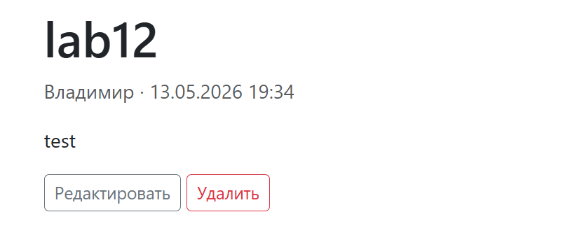

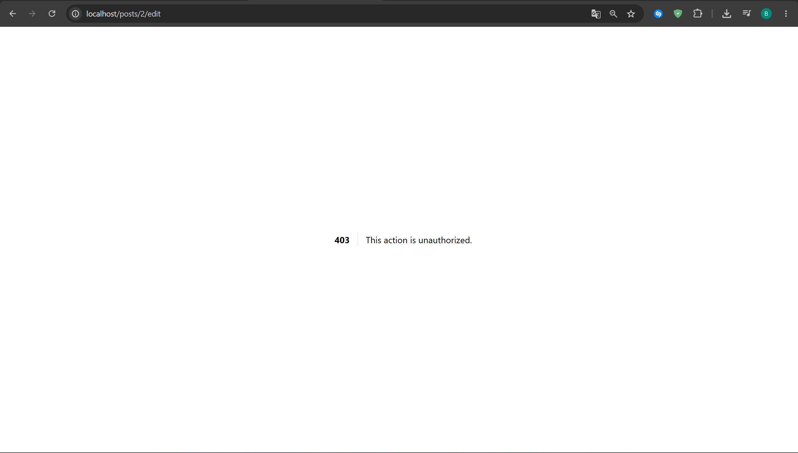

**Защитный вопрос: сравните Policy с тем, как авторизация была реализована в Lab10-11 на чистом PHP. Сколько строк кода ушло на тот же эффект?**

В Lab10-11 (чистый PHP) проверка прав была раскидана по контроллерам. На каждом защищённом действии:

```php
session_start();
if (!isset($_SESSION['user_id'])) {
    header('Location: /login.php');
    exit;
}
$stmt = $pdo->prepare('SELECT user_id FROM posts WHERE id = ?');
$stmt->execute([$_GET['id']]);
$post = $stmt->fetch();
if (!$post || $post['user_id'] !== $_SESSION['user_id']) {
    http_response_code(403);
    die('Forbidden');
}
```

Это **8 строк** на каждое защищённое действие. На update, edit, destroy - три раза по 8 = ~24 строки только защиты, не считая основной логики. Плюс в шаблоне:

```php
<?php if ($_SESSION['user_id'] === $post['user_id']): ?>
    <a href="edit.php?id=<?= $post['id'] ?>">Редактировать</a>
<?php endif; ?>
```

Итого ~30 строк рассредоточенного по проекту копипаста. Если меняется правило (например, добавился админ, который может редактировать всё) - нужно ходить по всем файлам.

В Laravel:

- `PostPolicy` - 30 строк типизированного класса в одном месте.
- В контроллере одна строка: `$this->authorize('update', $post)`.
- В шаблоне одна строка: `@can('update', $post) ... @endcan`.

**Сэкономлено ~70% кода**, и логика собрана в одном файле. Если правило меняется - правится один метод `update()` в `PostPolicy`. Это и есть DRY (Don't Repeat Yourself) на практике.

---

### Задание 15. Удаление поста

`PostController::destroy` проверяет `$this->authorize('delete', $post)`, затем `$post->delete()`. Благодаря `onDelete('cascade')` в миграции `comments`, при удалении поста MySQL автоматически удаляет все его комментарии. Редирект на `posts.index` с flash «Пост удалён».

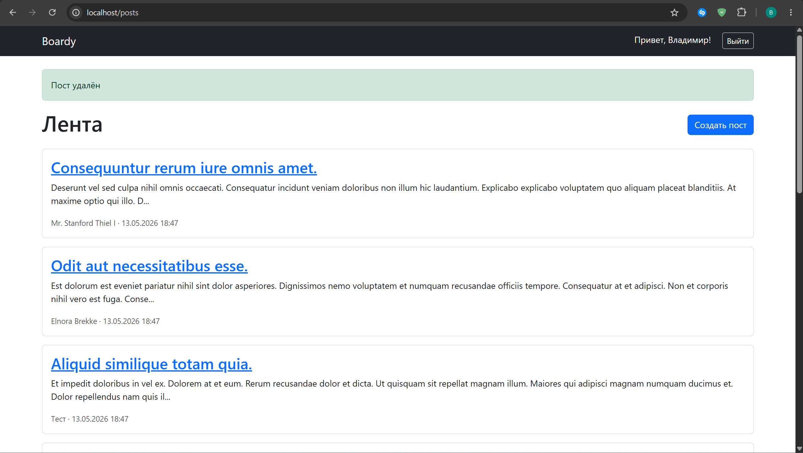

---

### Задание 16. Комментарий через Blade

`CommentController::store` валидирует `post_id` (через `exists:posts,id` - проверка, что такой ID реально существует в таблице posts), `body` (required|string|max:1000), создаёт через `$request->user()->comments()->create($data)`. `back()->with('success', ...)` редиректит на страницу поста, где новый комментарий уже виден.

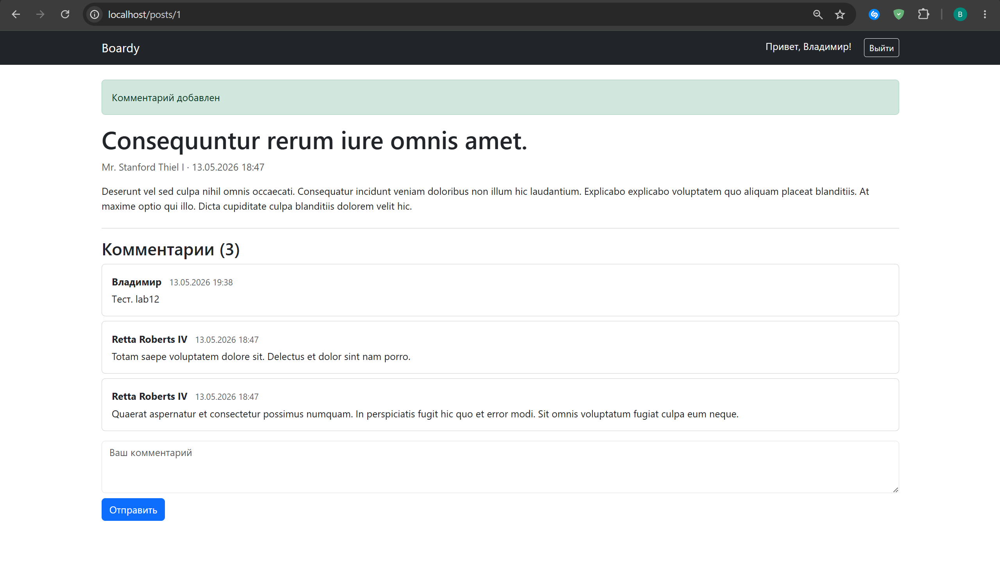

---

## Часть D. Breeze + Socialite

### Задание 17. Установка Breeze

```bash
composer require laravel/breeze --dev
php artisan breeze:install blade
```

Breeze сгенерировал контроллеры `Auth\AuthenticatedSessionController`, `RegisteredUserController`, `PasswordResetLinkController` и другие. Blade-шаблоны в `resources/views/auth/`. Маршруты в `routes/auth.php` (подключаются через `require __DIR__.'/auth.php'` в `web.php`).

`npm run build` упал из-за проблем со сборкой Vite в WSL (Windows-овский PATH перекрывал Linux-овский, плюс отсутствовал `resources/js/bootstrap.js`). Поэтому Tailwind-стили не собрались, и Breeze-шаблоны переписаны под Bootstrap 5 (CDN) - функционально полностью эквивалентно, страницы регистрации и логина работают.

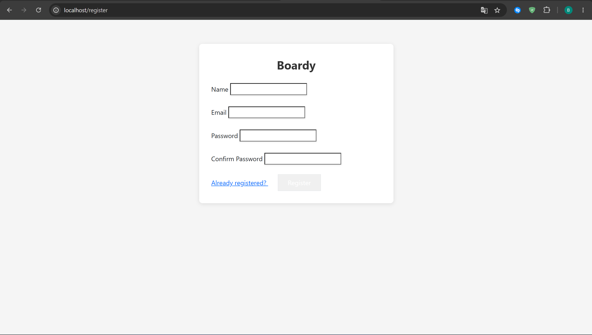

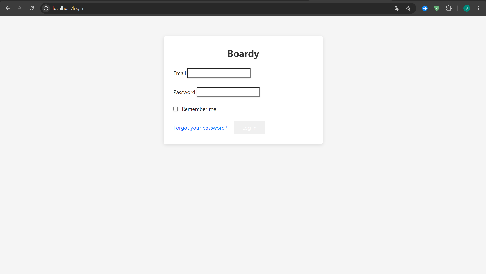

---

### Задание 18. Регистрация и вход

После регистрации (имя «Владимир», email `vladimir@boardy.local`) Breeze автоматически залогинивает пользователя. Дефолтный редирект на `route('dashboard')` заменён на `route('posts.index')` в файлах `AuthenticatedSessionController.php` и `RegisteredUserController.php`. В шапке layout видно имя через `Auth::user()->name`.

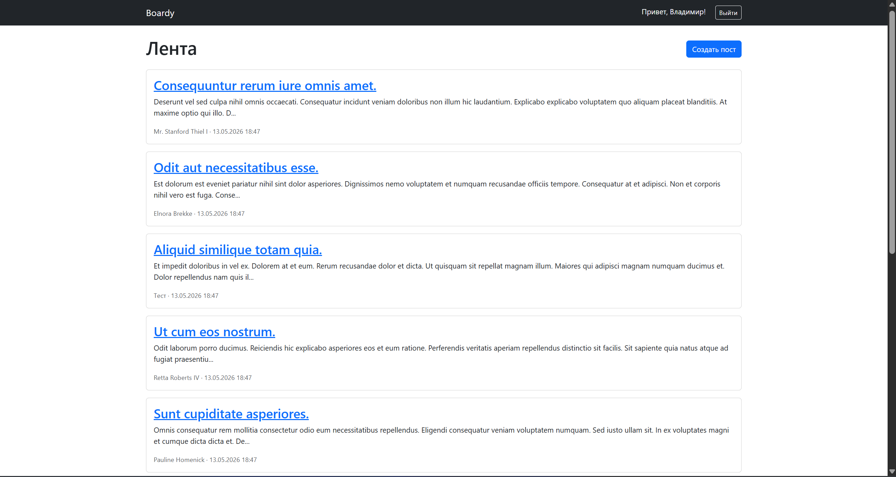

---

### Задание 19. GitHub OAuth-приложение

Зарегистрировано второе OAuth App на GitHub - `Boardy Laravel (barsik)` (первое, `Boardy (barsik)` из Lab11, оставлено для legacy PHP-кода). Callback URL: `http://localhost/auth/github/callback`. Получены Client ID и Client Secret. Это разделение приложений архитектурно правильно: каждое окружение/проект имеет свои OAuth-credentials, ротация секрета одного не ломает другое.

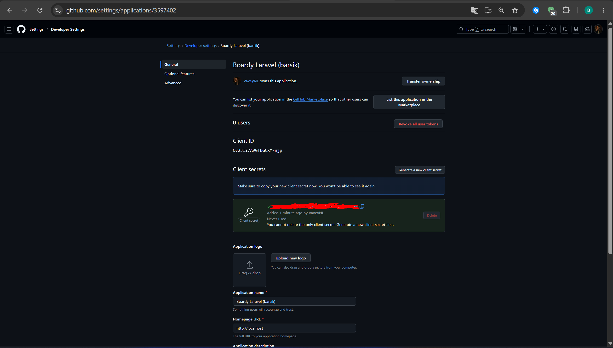

---

### Задание 20. Socialite

```bash
composer require laravel/socialite
```

Установлен Socialite v5.27.0. Создана миграция `add_github_id_to_users` (`$table->string('github_id')->nullable()->unique()->after('id')`). В `config/services.php` добавлена секция `github` с тремя env-переменными. В `.env` - `GITHUB_CLIENT_ID`, `GITHUB_CLIENT_SECRET`, `GITHUB_REDIRECT_URI`.

`GitHubController` с двумя методами:

- `redirect()` - `Socialite::driver('github')->redirect()`.
- `callback()` - `Socialite::driver('github')->user()` (внутри обмен code → token и запрос профиля), затем `User::updateOrCreate(['github_id' => ...], [...])` и `Auth::login($user)`.

Маршруты `GET /auth/github` (name `auth.github`) и `GET /auth/github/callback`. Кнопка «Войти через GitHub» добавлена в `resources/views/auth/login.blade.php`.

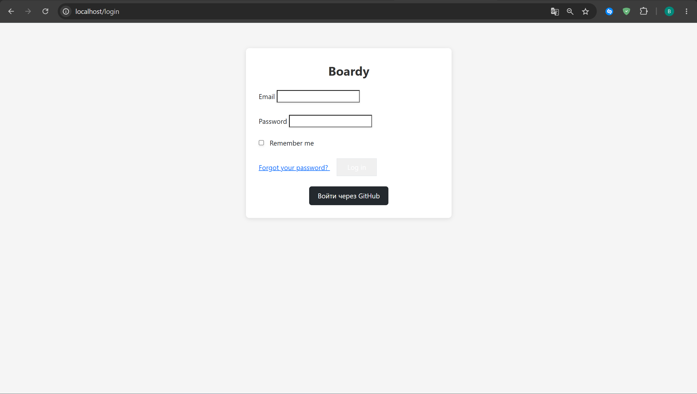

---

### Задание 21. Полный OAuth flow

Клик на кнопку → редирект на GitHub (Socialite формирует URL с client_id, state, callback). На GitHub - страница Authorize. После клика «Authorize» - редирект на `/auth/github/callback?code=...&state=...`. Socialite внутри `->user()` валидирует state, обменивает code на access_token (POST на GitHub с client_secret), запрашивает профиль (GET /user с Bearer-токеном). Возвращает объект GitHubUser с геттерами `getId()`, `getName()`, `getEmail()`, `getNickname()`. Через `User::updateOrCreate` создаётся новый пользователь (или находится существующий по `github_id`), `Auth::login` ставит куку сессии, редирект на `posts.index`.

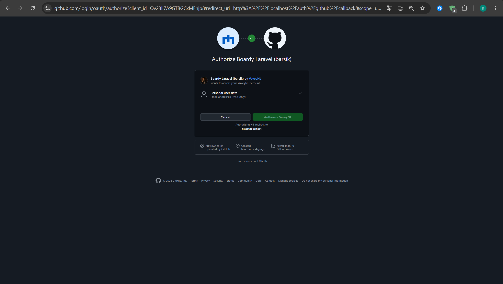

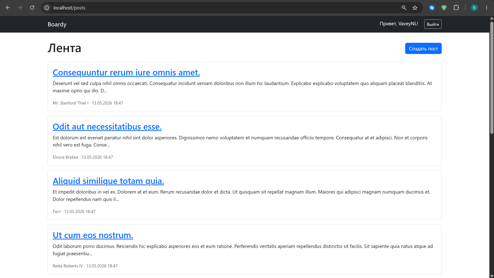

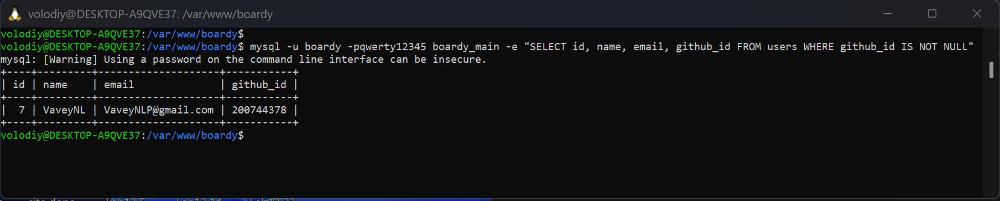

---

## Pull Request

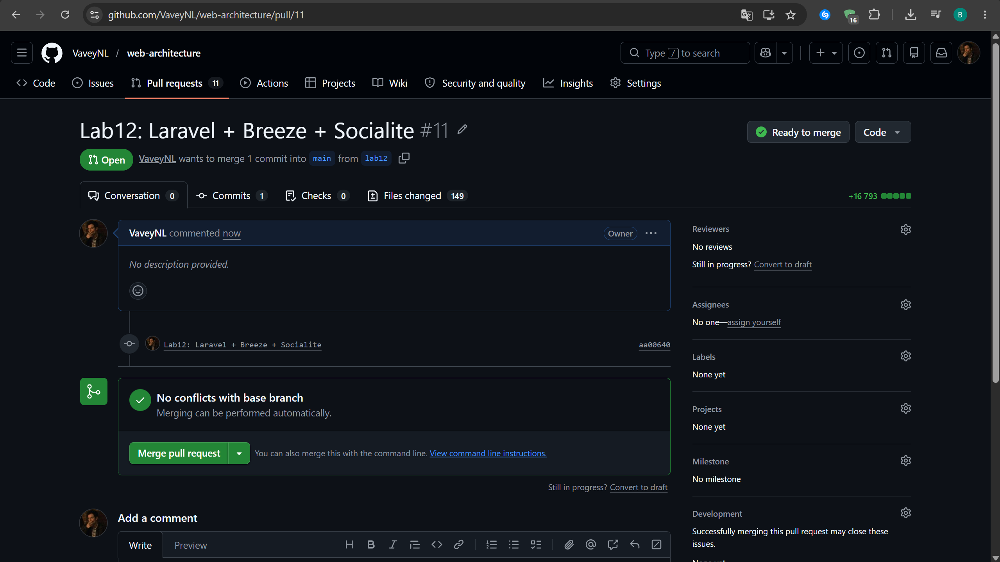

**Защитный вопрос: сравните количество строк кода Lab11 (ручной OAuth) и Lab12 (Socialite). Что сократилось и за счёт чего?**

**Lab11 (чистый PHP):**

- `oauth-github.php` - генерация state через `random_bytes(16)`, запись в сессию, формирование URL `https://github.com/login/oauth/authorize?client_id=...&redirect_uri=...&state=...&scope=...`, header Location (~25 строк).
- `oauth-callback.php` - валидация state из query vs сессии, обмен code → token через `curl_exec` с POST, парсинг JSON-ответа, GET `https://api.github.com/user` с Bearer-токеном, парсинг профиля, find-or-create в БД, `session_regenerate_id`, redirect (~80 строк).

**Итого ~105 строк ручного OAuth.**

**Lab12 (Socialite):**

- `GitHubController::redirect()` - 3 строки.
- `GitHubController::callback()` - ~15 строк (updateOrCreate, Auth::login, redirect).
- `config/services.php` - 5 строк.
- `.env` - 3 строки.
- Два `Route::get` - 2 строки.

**Итого ~25 строк.**

**Сокращение в 4 раза.** Что именно сократилось и за счёт чего:

1. **Генерация state и CSRF-защита** - Socialite делает сам через сессию Laravel, валидирует автоматически. В Lab11 я писал руками `bin2hex(random_bytes(16))`, сравнение через `hash_equals`.

2. **Обмен code → token** - в Lab11 это полстраницы curl-кода с заголовками, POST-телом, обработкой ошибок. В Socialite - часть метода `->user()` под капотом, использует Guzzle.

3. **Запрос профиля** - в Lab11 второй curl-запрос с User-Agent (GitHub без него отвечает 403) и Authorization-заголовком. В Socialite - тоже внутри `->user()`, возвращает типизированный объект `GitHubUser`.

4. **Обработка ошибок** - Lab11: ручные проверки HTTP-кодов и JSON-ответов через `curl_getinfo`. Socialite: единые исключения `Laravel\Socialite\Two\InvalidStateException`, `UnknownException` - можно ловить и обрабатывать единообразно.

5. **`updateOrCreate`** - вместо ручного `SELECT WHERE github_id` + `INSERT` или `UPDATE` (4-6 строк) - одна строка с двумя массивами.

Это и есть фреймворковая абстракция: типовая задача (OAuth-логин через любой провайдер) - типовое решение в 10 строк. Чтобы добавить вход через Google или Discord - те же 25 строк, только `driver('github')` поменять на `driver('google')` и в `config/services.php` добавить секцию. В Lab11-стиле каждый новый провайдер - это новые 100 строк curl-кода.

---

## Часть E. Архитектурные вопросы

### Задание 22. Что осталось от прошлых практик

На VPS остались:

- `/var/www/boardy-legacy/` - старый PHP-проект из Lab10-11 (10 файлов: login.php, register.php, oauth-callback.php и т.д.).
- БД `boardy` - старая схема под чистый PHP.
- FastAPI в `/opt/boardy-api/` - продолжает читать старую БД `boardy`.

**Зачем не удалили:**

- FastAPI из Lab9-11 продолжает работать на этой инфраструктуре. Удалить `boardy` БД - сломать FastAPI. В Lab12 трогать FastAPI нельзя по методичке.
- Скриншоты и отчёты Lab10-11 ссылаются на работающие `/login.php`, `/messages.php`. Если кто-то откроет старый отчёт, ссылки должны были бы работать.
- В Lab13 FastAPI переедет на новую архитектуру (Passport, общая БД с Laravel). До тех пор оба стека сосуществуют.

**Что произойдёт, если открыть `http://localhost/login.php`:**

Будет **404 Not Found** от Laravel-обработчика. Цепочка:

1. Запрос идёт в nginx.
2. nginx видит `root /var/www/boardy/public` - ищет файл `/var/www/boardy/public/login.php`. Не находит (там только `index.php`).
3. Срабатывает `try_files` третьей строкой - запрос уходит на `index.php`.
4. Laravel-роутер ищет маршрут `GET /login.php` среди зарегистрированных. Не находит (есть `GET /login` без `.php`).
5. Возвращается 404 от Laravel (со стандартной error-страницей фреймворка).

Физически `login.php` существует на диске в `/var/www/boardy-legacy/login.php`, но nginx его не видит, потому что `document_root` теперь `/var/www/boardy/public`. Чтобы старый код снова заработал, нужно либо вернуть document_root на `/var/www/boardy-legacy`, либо настроить отдельный server-блок nginx с другим server_name (например `legacy.localhost`) - в Lab12 этого не делаем.

---

### Задание 23. FastAPI и React

Сейчас FastAPI работает на `localhost:8000`, читает БД `boardy`. React-страницы (`comments.html`, `comments.jsx`) в `boardy-legacy/`, тоже работают со старой БД через FastAPI.

В Laravel-проекте Lab12 их не используем по трём причинам:

1. **Разные БД.** Laravel пишет в `boardy_main`, FastAPI читает `boardy`. Свежий пост, созданный через Laravel, не виден через FastAPI - они физически в разных таблицах разных баз. Один источник правды - это первое требование архитектуры; пока его нет, интеграция бессмысленна.

2. **Разная аутентификация.** Laravel + Breeze использует session-based auth: кука `boardy_session` с подписанным session ID, серверная сессия в таблице `sessions` БД `boardy_main`. FastAPI ожидает Bearer JWT, выписанный старым `me.php` подписью HS256 с конкретным секретом. Сейчас Laravel вообще не знает про JWT, не выпускает их.

3. **Нет общего секрета для подписи токенов.** Если бы Laravel начал выпускать JWT для FastAPI, нужен был бы общий ключ (или пара ключей для асимметричной подписи). У FastAPI ключ зашит в `auth.py` ещё с Lab11. Менять его - сломать существующие токены пользователей. Менять механизм с симметричной подписи (HMAC) на асимметричную (RSA, что Passport использует по умолчанию) - тем более.

**В Lab13 они пригодятся:**

- Поставим **Passport** в Laravel → Laravel станет OAuth Authorization Server (выпускает JWT с RS256-подписью).
- **FastAPI перепишем под BFF (Backend for Frontend)**: будет валидировать Bearer-токены от Passport через публичный ключ Passport (RS256, ключ доступен по `/oauth/jwks.json`), проксировать запросы в Laravel.
- Laravel начнёт publish-ить события в Redis (под Lab14).
- React-страницу комментариев вернём, но теперь она будет получать JWT от Laravel, ходить с Bearer в FastAPI, FastAPI - в Laravel API.

То есть FastAPI и React не уйдут в утиль, а станут полноценными частями новой архитектуры: Laravel (auth server + main backend) + FastAPI (BFF + websocket-gateway в Lab14) + React (SPA).

---

### Задание 24. Реалтайм

Сейчас новый комментарий виден только после `F5`, потому что HTTP - модель request/response: страница загрузилась один раз, потом просто отображается у пользователя, ничего не запрашивает, ничего не знает о новых данных на сервере. Это фундаментальное ограничение HTTP.

**Архитектурное решение для реалтайма - WebSocket:** двунаправленный канал между браузером и сервером. После установления соединения сервер может сам пушить данные клиенту, без явного запроса от него. Это уже не HTTP, а отдельный протокол поверх TCP, с собственным handshake.

**Два сервера-кандидата:**

1. **Redis (как Pub/Sub-брокер)** - хранит каналы (`channels`), по которым публикуются события. Когда Laravel создаёт новый комментарий, он делает `publish('comments.post-3', $payload)`. Любое количество подписчиков (worker'ов FastAPI) получают эту публикацию мгновенно.

2. **FastAPI (как WebSocket-gateway)** - держит открытые WebSocket-соединения с браузерами. Подписан на Redis-канал. При получении сообщения от Redis - пушит payload всем подключённым к этому каналу WebSocket-клиентам.

**Почему именно эти два:**

- **Redis** - потому что Laravel и FastAPI разные процессы, у них нет общей памяти. Redis - это межпроцессная шина сообщений (in-memory pub/sub). Альтернатива - дёргать FastAPI напрямую по HTTP при каждом новом комменте, но это связывает сервисы жёсткой зависимостью: упал FastAPI - Laravel начинает таймаутить на каждом сохранении коммента. Redis же fire-and-forget: Laravel опубликовал и забыл, нет подписчиков - сообщение просто никуда не ушло, но сам Laravel работает.

- **FastAPI/Uvicorn** - потому что он построен на asyncio (event loop), который изначально предназначен для держания многих одновременных соединений «в воздухе». Одно WebSocket-соединение занимает килобайты памяти и не блокирует другие. PHP-FPM так не умеет: его модель - «один воркер на один HTTP-запрос», воркер не может «висеть» с открытым соединением - он сразу занят им целиком. Делать на PHP-FPM 1000 одновременных WS-клиентов - это 1000 воркеров, что нереально. Поэтому WebSocket-gateway отдельно от Laravel, на async-стеке.

В Lab14 эта архитектура и будет реализована: Laravel → Redis (publish) → FastAPI (subscribe) → WebSocket → браузер.
