# Практическая работа №13. WebSocket: реалтайм-лента

**Студент:** Казыханов Владимир
**Среда:** WSL (Ubuntu 24.04), локальная разработка
**Сайт:** `http://localhost/posts`
**API:** `http://localhost:8000`
**Стек:** Laravel 13.8.0 + FastAPI (uvicorn) + WebSocket + Nginx

---

## Часть A. WebSocket в FastAPI

### Задание 1. ConnectionManager

Создан `routers/ws.py` с классом `ConnectionManager` (хранит активные WS-соединения в памяти процесса) и эндпоинтом `/ws`. В `main.py` подключён роутер. Подключение через `websocat ws://127.0.0.1:8000/ws` - в логах uvicorn появляются `WebSocket /ws [accepted]` и `connection open`.

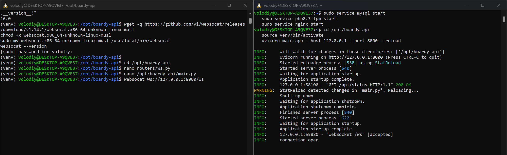

`self.active` - обычный Python-список в памяти процесса uvicorn. БД сюда не нужна: WebSocket-соединение это **открытый TCP-сокет**, его нельзя сериализовать в БД и восстановить. При перезапуске uvicorn все соединения разрываются, клиенты получают `onclose` и должны переподключиться (как и продемонстрировано в Задании 9). Любое хранилище в БД не даст результата - соединения существуют только в RAM. Для устойчивости к перезапускам добавляют второй контур через Redis Pub/Sub (Lab14): Redis помнит канал, а WebSocket-соединения после рестарта пересоздаются клиентами и заново подписываются.

---

### Задание 2. /internal/broadcast

Эндпоинт `/internal/broadcast` в `main.py` принимает JSON и через `ws.manager.broadcast()` рассылает всем активным WS-клиентам. Проверка: `curl POST` → websocat получил JSON `{"type":"new_post", "post": {...}}`.

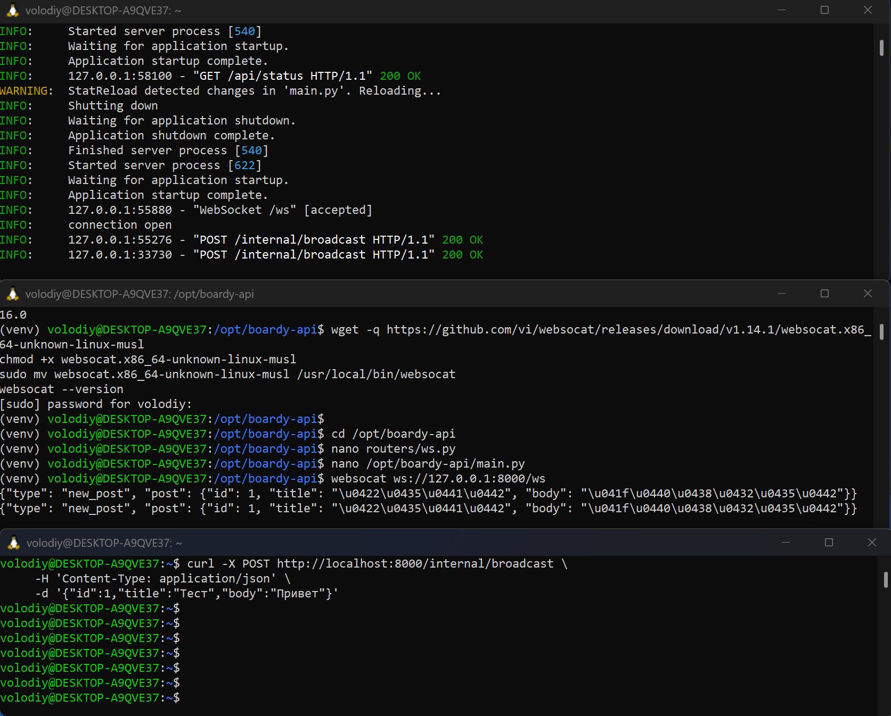

Эндпоинт без JWT-авторизации, потому что его дёргает только Laravel со **своего же сервера** (`localhost → localhost`). Авторизация между двумя локальными процессами - лишняя сложность. Риск: открытый снаружи `/internal/broadcast` позволяет любому слать в ленту фейковые посты или DoS-ить уведомлениями. Закрывает Nginx через `allow 127.0.0.1; deny all;` (задание 11).

---

### Задание 3. Два клиента

Подключены два websocat'а к `/ws`, отправлен один POST на `/internal/broadcast` с JSON `{"id":2,"title":"Two clients","body":"Hello both"}`. **Оба** websocat'а получили одинаковый JSON одновременно.

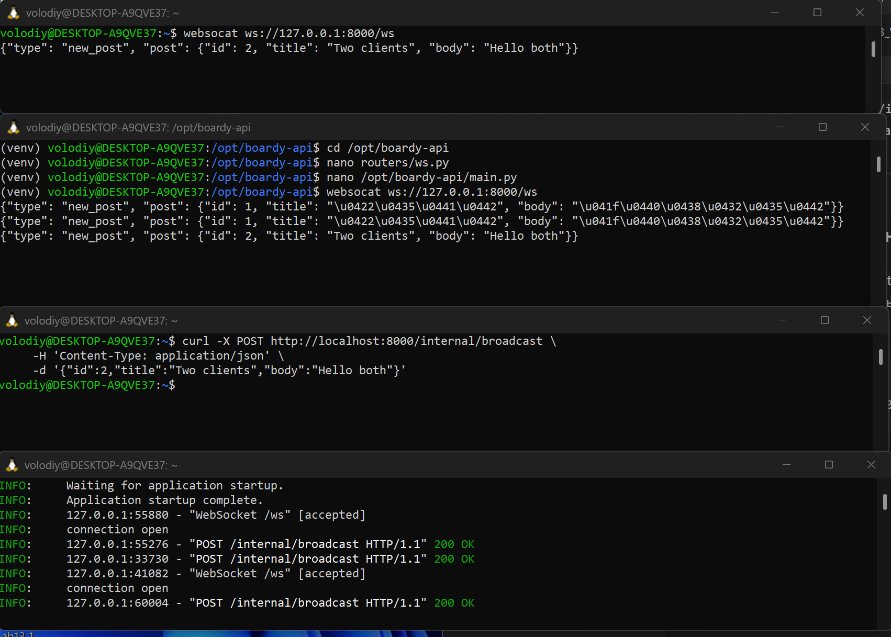

Если клиент отключился во время цикла broadcast, `ws.send_text()` бросает исключение (`ConnectionClosedError`). Перехват в `try/except` ловит его и добавляет «мёртвое» соединение в локальный список `dead`. После прохода по всем активным мёртвые удаляются из `self.active`. Удалять во время самой итерации нельзя - Python кидает `RuntimeError: list changed size during iteration`.

---

## Часть B. Laravel: HTTP-callback

### Задание 4. PostController::store()

В `PostController::store()` после `Post::create()` добавлен вызов FastAPI:

```php
Http::timeout(2)->post('http://localhost:8000/internal/broadcast', [...]);
```

в `try/catch`. Создано несколько постов через форму - в `laravel.log` **ни одной** строки `WS broadcast failed` (FastAPI работает, callback проходит успешно).

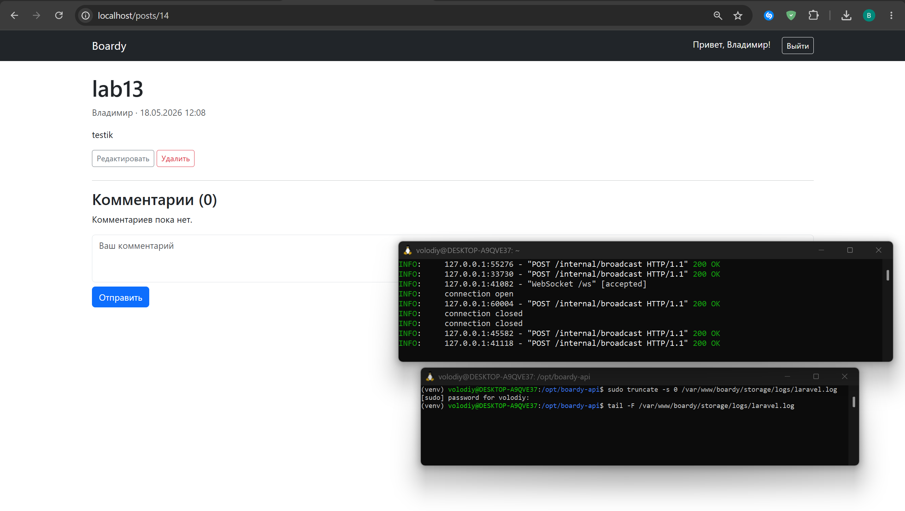

`Http::timeout(2)` ограничивает максимальное время ожидания ответа от FastAPI двумя секундами. Без таймаута Guzzle (HTTP-клиент под капотом фасада `Http`) использует дефолт - очень долгий, фактически бесконечный. Если FastAPI лежит и таймаут не указан, форма «создать пост» зависнет на десятки секунд: пользователь нажал «Сохранить», страница спиннит, потом таймаут - UX-катастрофа. С `timeout(2)` пост сохраняется быстро, попытка broadcast длится максимум 2 секунды и тихо падает в лог через `catch` - основной flow остаётся живым.

---

### Задание 5. Проверка callback

Создан пост `lab13 callback` через форму Laravel. В логах uvicorn в этот же момент появилась строка `POST /internal/broadcast HTTP/1.1 200 OK` - FastAPI получил событие.

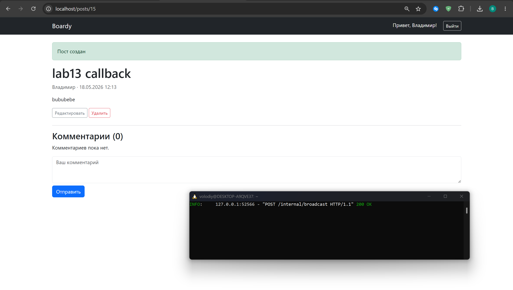

HTTP-callback из Laravel в FastAPI работает, но это **архитектурный костыль**. Три конкретных проблемы:

1. **Жёсткая связность.** Если FastAPI временно недоступен, Laravel это знает (через `try/catch`), но событие потеряно навсегда - никто его не повторит. Redis Pub/Sub хотя бы кладёт событие в очередь канала.
2. **Не масштабируется.** При запуске двух uvicorn-воркеров (для отказоустойчивости) они держат **разные** `ConnectionManager`-ы - клиент, подключённый к первому, не увидит событие, пришедшее во второй. Redis решает это: оба воркера подписаны на один канал.
3. **Синхронность.** Laravel ждёт ответа от FastAPI 2 секунды на каждый пост. С Redis достаточно `Redis::publish()` - это микросекунды, потому что брокер только принимает сообщение в очередь, не ждёт доставки.

---

## Часть C. JS-клиент

### Задание 6. WebSocket в Blade

В `index.blade.php` лента обёрнута в `<div id="posts-feed">`, добавлен `<script>` с подключением к `ws://localhost:8000/ws`, обработчиком `onmessage` (вызывает `prependPost`), функцией `escapeHtml` для защиты от XSS и автопереподключением через `setTimeout` на `onclose`.

В DevTools → Network → WS видно соединение со статусом **101 Switching Protocols**, заголовки `Upgrade: websocket`, `Server: uvicorn`. В Console - сообщение `WS connected`.

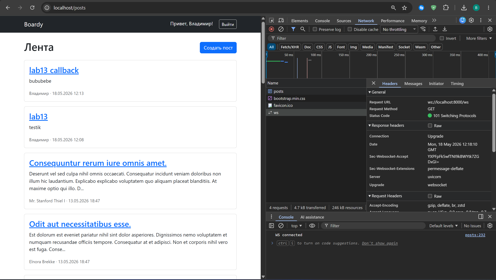

На локалке используется `ws://` потому что нет TLS: Nginx слушает на 80-м порту без сертификата. `wss://` - это WebSocket поверх TLS (аналог `https://`). Если на локалке попытаться использовать `wss://localhost:8000/ws`, браузер начнёт TLS-рукопожатие, не получит сертификата (uvicorn слушает чистый TCP) и упадёт с `ERR_SSL_PROTOCOL_ERROR`. На проде с certbot страница загружена по `https://`, и браузер запрещает `ws://` (mixed content) - поэтому там обязательно `wss://`.

---

### Задание 7. Два браузера

Открыты два окна на `/posts`: обычный Chrome и Chrome-инкогнито (под одним пользователем). В инкогнито создан пост `Lab13`. В обычном Chrome пост **сам появился сверху ленты** с подписью «только что», без F5.

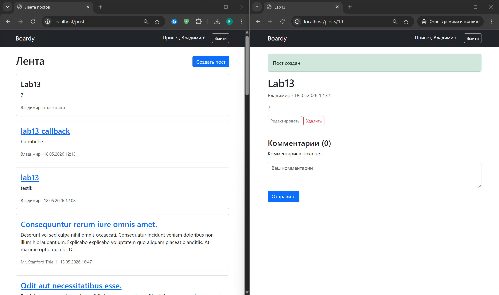

В DevTools → Network → WS → Messages - входящий JSON-фрейм:

```json
{"type": "new_post", "post": {"id": 20, "title": "lab13", "body": "8", "author": "..."}}
```

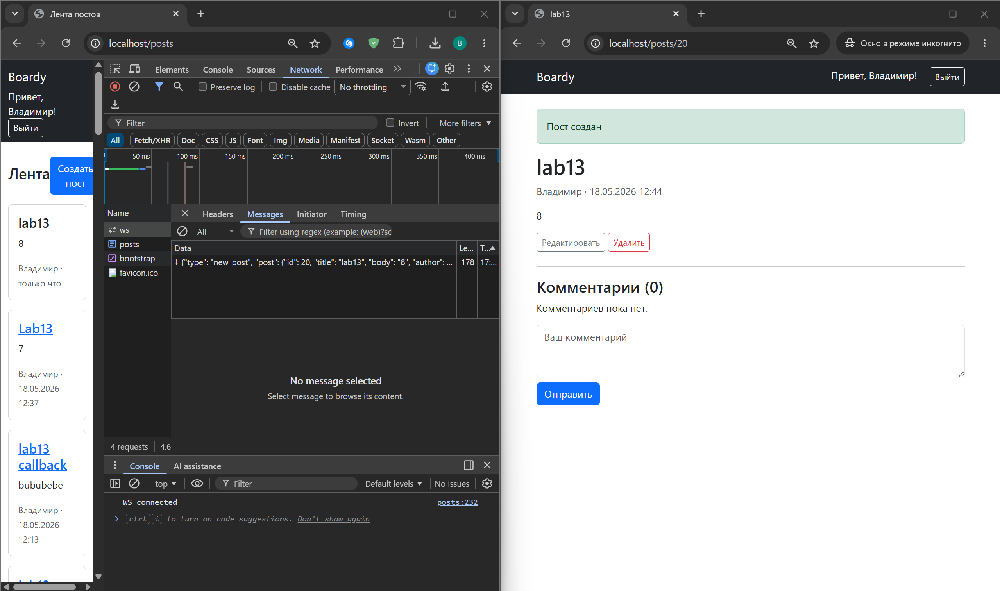

---

### Задание 8. XSS

Создан пост с телом `<script>alert('xss')</script>`. В ленте отображён как **обычный текст** - `<script>alert('xss')</script>` написано буквально, alert не сработал.

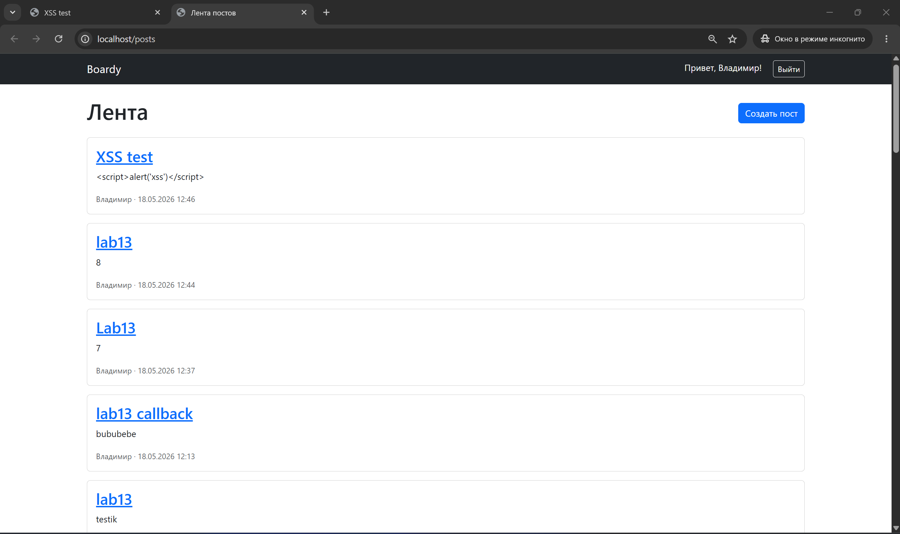

`escapeHtml()` использует приём: создаёт временный `<div>`, кладёт строку в `textContent` (это safe-присваивание, браузер не парсит HTML), а затем читает обратно через `innerHTML`. В результате символы `<`, `>`, `&`, `"`, `'` превращаются в HTML-сущности (`&lt;`, `&gt;` и т.д.). Если бы данные вставлялись напрямую через `innerHTML = post.body` без экранирования, любой `<script>` в теле поста выполнился бы в браузерах **всех** пользователей ленты - это классический Stored XSS. Один пост со зловредным JS - и у любого читателя в фоне крадётся `document.cookie` или дёргается левый API под его сессией.

---

### Задание 9. Переподключение

Остановлен uvicorn (`Ctrl+C`). В DevTools → Network видно множество неудачных соединений `ws` (каждые 3 секунды - попытки реконнекта), в Console - `WS closed, reconnecting in 3s...`, `WebSocket connection to 'ws://localhost:8000/ws' failed`, `WS error`. После запуска uvicorn - последнее соединение со статусом **101 Switching Protocols** и `WS connected` в Console.

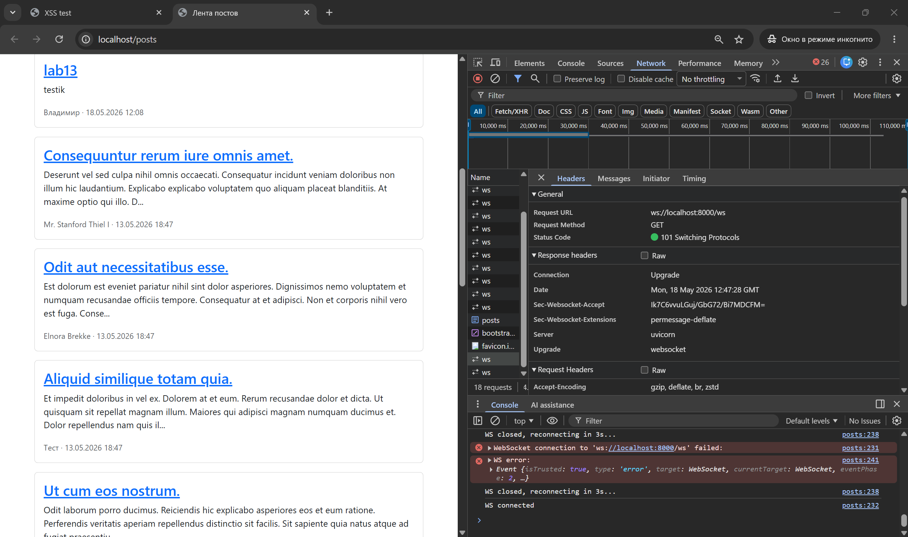

Реконнект полностью на стороне JS: `ws.onclose = () => setTimeout(connect, 3000)`. Это значит, что любое разрыв соединения (рестарт сервера, сбой сети, перезагрузка nginx) обрабатывается автоматически - пользователю не нужно ничего делать.

---

## Часть D. Nginx

### Задание 10. WS-проксирование

В `/etc/nginx/sites-available/boardy` между `location /` и `location ~ \.php$` добавлен блок `location /ws` с четырьмя обязательными директивами. После `nginx -t` (syntax OK) и `systemctl reload nginx` websocat подключается к `ws://localhost/ws` (без порта 8000, через Nginx) и получает broadcast от `POST /internal/broadcast`. В логах uvicorn видны `WebSocket /ws [accepted]` (три подключения от websocat) и `POST /internal/broadcast 200 OK`.

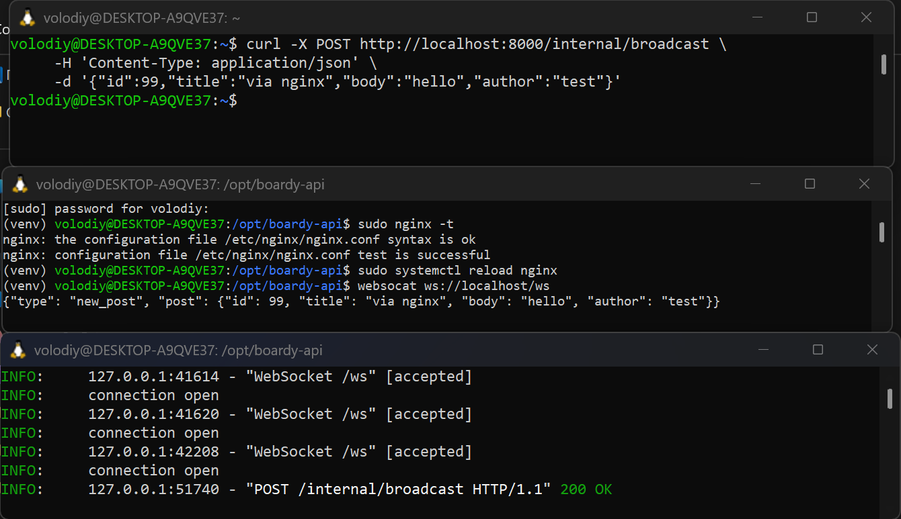

Что сломается, если убрать каждую строку:

| Без чего | Что произойдёт |
|---|---|
| `proxy_http_version 1.1` | Nginx идёт в апстрим по HTTP/1.0, который не поддерживает заголовок `Upgrade`. Браузер увидит ответ `200` вместо `101 Switching Protocols`, WS-соединение не установится. |
| `proxy_set_header Upgrade $http_upgrade` | uvicorn получает запрос без `Upgrade: websocket`, обрабатывает его как обычный HTTP-запрос и отдаёт `404` (роутер `/ws` - WebSocket-only) или `400`. |
| `proxy_set_header Connection "upgrade"` | Аналогично - без `Connection: upgrade` апстрим не интерпретирует запрос как WebSocket-апгрейд. |
| `proxy_read_timeout 86400` | Nginx закрывает соединение через дефолтные 60 секунд тишины (для WS это нормальное состояние - никаких сообщений может не быть). JS уходит в бесконечный цикл реконнектов каждую минуту. |

---

### Задание 11. Закрыть /internal

В Nginx добавлен блок `location /internal { allow 127.0.0.1; deny all; }`. Запрос с IP WSL-интерфейса (`172.30.238.39`) на `http://172.30.238.39/internal/broadcast` возвращает `403 Forbidden`. Запросы с `127.0.0.1` от самого Laravel - проходят (Задание 5).

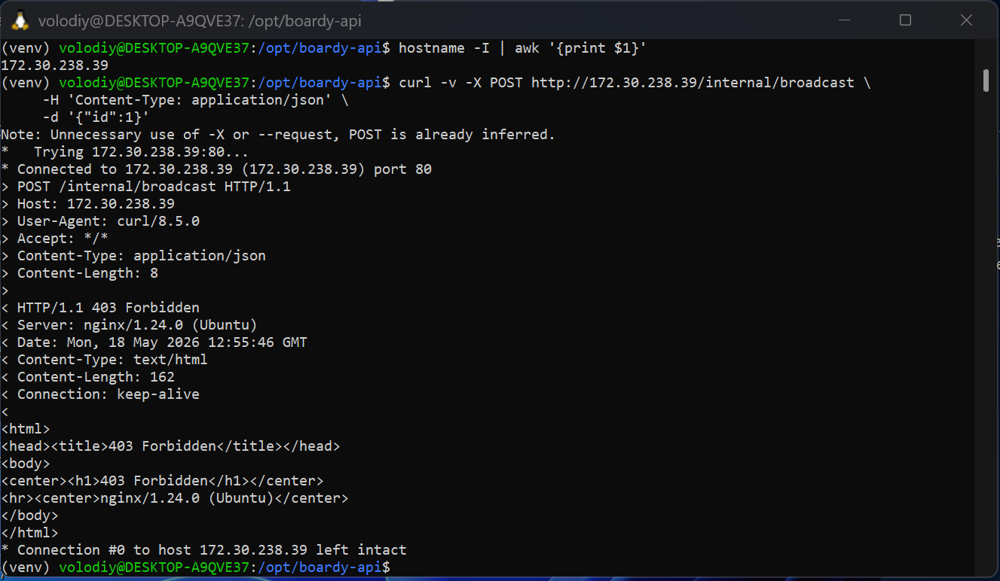

Без ограничения любой клиент в сети может слать `POST /internal/broadcast` извне с произвольным JSON, и FastAPI разошлёт это всем подключённым браузерам как «новый пост». Сценарии атаки: спам ленты фейковыми постами, флуд уведомлениями (DoS клиентов), попытки XSS через тело поста (даже с `escapeHtml` на клиенте остаётся риск, если где-то его забыли). `allow 127.0.0.1; deny all;` гарантирует, что broadcast могут вызывать только процессы на этом же сервере - то есть только Laravel.

---

## Pull Request

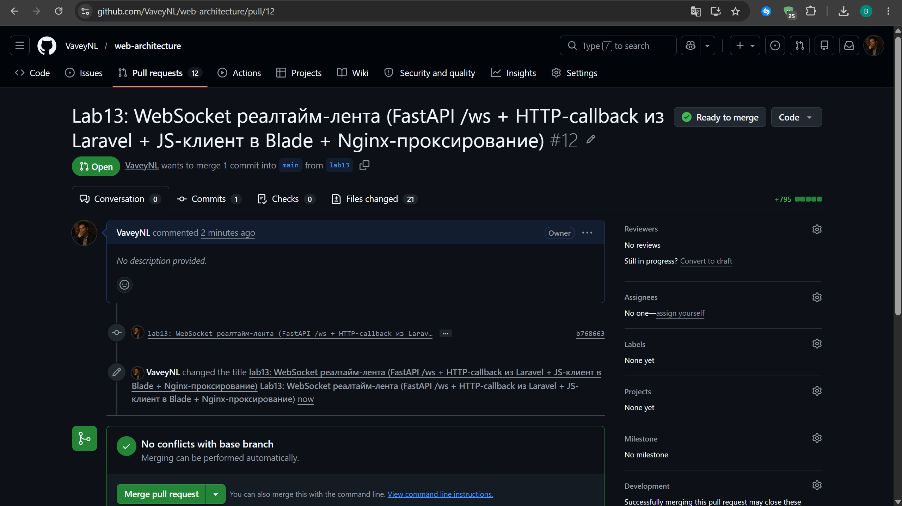
