# Практическая работа №14. Финальная микросервисная архитектура

**Студент:** Казыханов Владимир
**Среда:** WSL (Ubuntu 24.04), локальная разработка
**Стек:** Laravel 13 + Passport (OAuth 2.1 / PKCE), FastAPI (RS256), две БД MySQL, Redis Pub/Sub
**Сайт:** `http://localhost`
**API:** uvicorn на `127.0.0.1:8000`, проксируется Nginx на `/api/` и `/ws`

---

## Часть A. Passport и OAuth 2.1

### Задание 1. Установка Passport и public-клиент

Установлен `laravel/passport`, выполнены миграции - появились пять таблиц `oauth_*`, сгенерированы RSA-ключи `storage/oauth-private.key` и `storage/oauth-public.key`. Приватный ключ с правами `-rw-------` (только владелец), оба ключа в `.gitignore`.

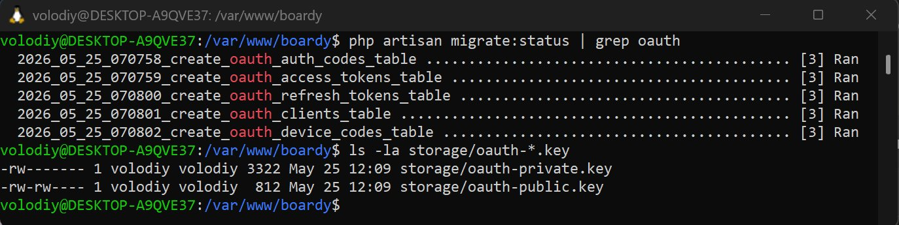

Создан публичный клиент `Boardy SPA` командой `passport:client --public` с `redirect_uri` на `/oauth/callback`. Client ID - `019e5df8-ad10-73c6-a47f-802511349a1b`, device flow отключён.

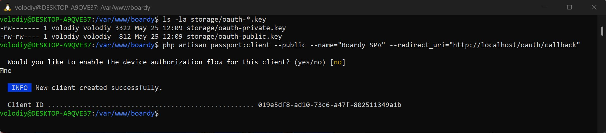

Публичный клиент - без `client_secret`, потому что React-приложение работает в браузере: любой секрет, зашитый в JS, виден через DevTools, его невозможно сохранить в тайне. PKCE (Proof Key for Code Exchange) заменяет секрет одноразовой парой `code_verifier` / `code_challenge`. Клиент генерирует случайный `code_verifier`, отправляет в `/authorize` его SHA-256-хэш (`code_challenge`), а при обмене `code` на токен предъявляет сам `code_verifier`. Сервер сверяет: `SHA256(verifier) == challenge`. Это защищает от authorization code interception attack - даже если злоумышленник перехватит `code`, без `code_verifier` (который никогда не покидал браузер легитимного клиента) обменять его на токен нельзя.

---

### Задание 2. Время жизни токенов

В `AppServiceProvider::boot()` настроено время жизни: access-токен - 15 минут, refresh-токен - 30 дней.

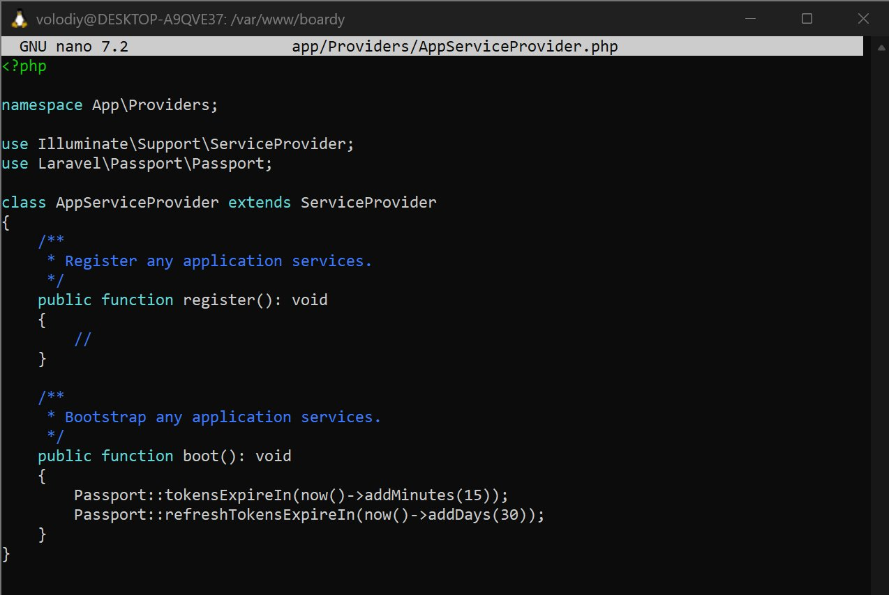

Access-токен короткий (15 минут), потому что он передаётся в каждом запросе к API и хранится на клиенте в `sessionStorage` - если он утечёт (XSS, перехват), окно атаки ограничено 15 минутами, дальше токен протухает. Refresh-токен длинный (30 дней), но он лежит в HttpOnly cookie - JavaScript его прочитать не может, поэтому XSS его не украдёт; он используется только чтобы тихо получить новый access-токен. Если сделать access-токен на 24 часа: украденный токен даёт злоумышленнику сутки полного доступа к API от имени пользователя, и отозвать его на лету нельзя (JWT проверяется по подписи, без обращения к БД) - это резко увеличивает ущерб от любой утечки.

---

### Задание 3. Обмен code на токены (curl)

Поток Authorization Code + PKCE проверен вручную через curl: запрос на `/oauth/token` с `grant_type=authorization_code`, `code` и `code_verifier`. Passport вернул JSON с `access_token`, `refresh_token` и `expires_in: 900` (15 минут).

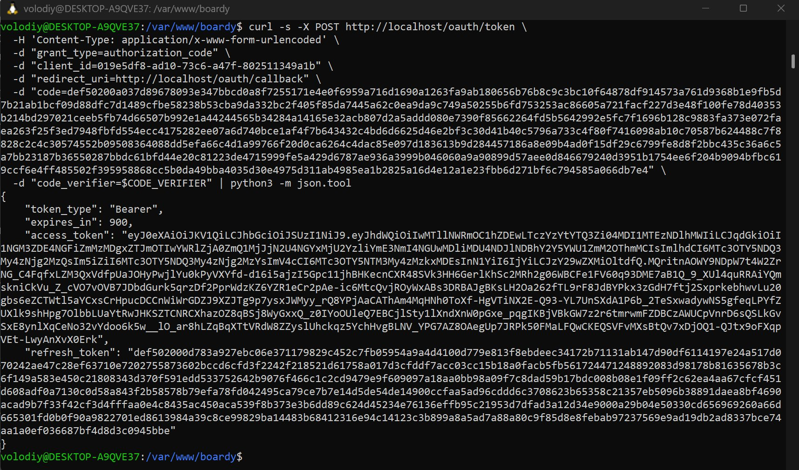

Этот запрос - шаг Token Request потока Authorization Code + PKCE. До него: клиент сгенерировал `code_verifier` и `code_challenge`; запрос `/oauth/authorize` с `code_challenge` - пользователь аутентифицировался и подтвердил доступ; Passport вернул одноразовый `code` на `redirect_uri`. Финальный шаг - обмен: клиент шлёт `code` + `code_verifier` на `/oauth/token`, Passport проверяет `SHA256(verifier) == challenge`, сохранённый на шаге authorize, и, если совпало, выдаёт `access_token` (RS256 JWT) и `refresh_token`.

---

## Часть B. Вторая база данных и FastAPI

### Задание 4. Отдельная БД для API

Создана вторая база `boardy_api` - в ней живёт сервис FastAPI. Laravel остаётся на `boardy_main`.

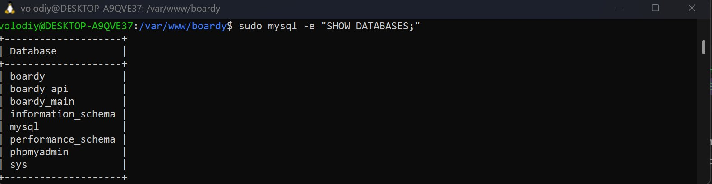

В таблице `comments` нет внешних ключей на `posts` и `users`, зато есть денормализованный столбец `author_name`.

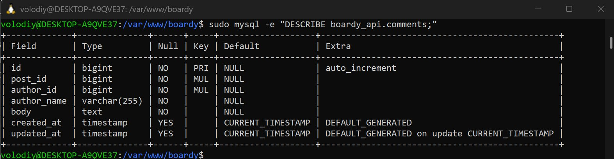

В `comments` нет FOREIGN KEY на `posts` и `users`, потому что эти таблицы лежат в другой базе данных (`boardy_main`), принадлежащей другому сервису - Laravel. Внешний ключ работает только внутри одной БД; более того, сама идея микросервисов запрещает одному сервису лезть в чужую БД. `comments` - это БД сервиса FastAPI, `posts`/`users` - БД сервиса Laravel. Целостность данных между сервисами поддерживается не СУБД, а приложением через события: имя автора денормализовано (скопировано) в `comments.author_name` в момент создания комментария, а при изменении имени Laravel публикует событие `user.renamed` в Redis, и FastAPI обновляет `author_name` у себя. Это eventual consistency - согласованность достигается не мгновенно, а спустя короткое время после события.

---

### Задание 5. CRUD комментариев на FastAPI

Сервис FastAPI пишет и читает комментарии в своей базе `boardy_api`. Проверка через curl: два POST-запроса создают комментарии, `SELECT` подтверждает запись с корректными `author_id` и `author_name`.

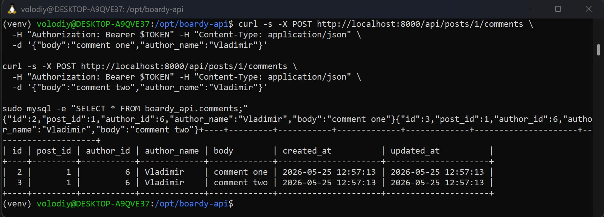

---

### Задание 6. RS256: проверка подписи Passport

FastAPI проверяет JWT от Passport публичным ключом по алгоритму RS256. Запрос с настоящим токеном Passport проходит - `HTTP 201`.

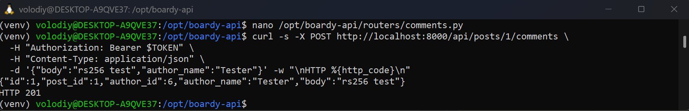

Запрос с испорченным токеном (`${TOKEN}xxxxBROKEN`) отклонён - `HTTP 401`, `Invalid token`.

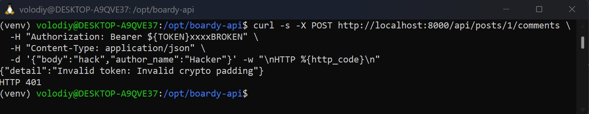

HS256 использует один общий секрет и для подписи, и для проверки токена. В распределённой системе это значит, что секрет должен быть и у Laravel (он подписывает), и у FastAPI (он проверяет) - секрет копируется между сервисами, и если он утечёт хоть у одного, злоумышленник сможет подделывать токены. RS256 - асимметричный: Passport подписывает приватным ключом, который не покидает Laravel; FastAPI проверяет публичным ключом. Публичный ключ не секретен - его утечка ничем не грозит, подделать токен им нельзя. Чем больше сервисов проверяют токены, тем важнее это: каждому раздаётся только публичный ключ, право выпускать токены остаётся у одного Passport.

---

### Задание 7. Полный CRUD и автор из токена

GET, PUT и DELETE комментариев работают через FastAPI: список отдаётся с `count`, PUT меняет тело, DELETE возвращает `ok:true` и `HTTP 200`.

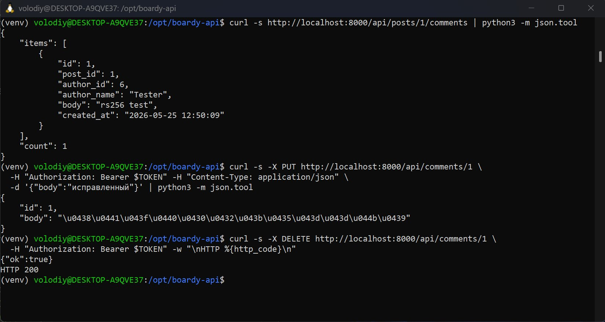

`author_name` передаётся в payload запроса, а не извлекается из токена, потому что это бизнес-данные конкретного запроса, а не данные аутентификации. React уже знает имя пользователя - оно отрисовано на странице. Токен отвечает на вопрос «кто ты» (`sub` = id), а не «как тебя зовут». Если зашить имя в JWT как custom claim - оно «замёрзнет» на момент выпуска токена: пользователь сменит имя, но в течение 15 минут (TTL токена) новые комментарии будут создаваться со старым именем, пока токен не обновится. Имя - изменяемое поле, его нельзя кэшировать в подписанном токене. `sub` (id) неизменен - его кэшировать в токене правильно.

---

### Задание 8. Проверка владельца (owner check)

В FastAPI добавлена проверка владельца: чужой комментарий редактировать нельзя. PUT с токеном другого пользователя возвращает `HTTP 403`, `Not your comment`.

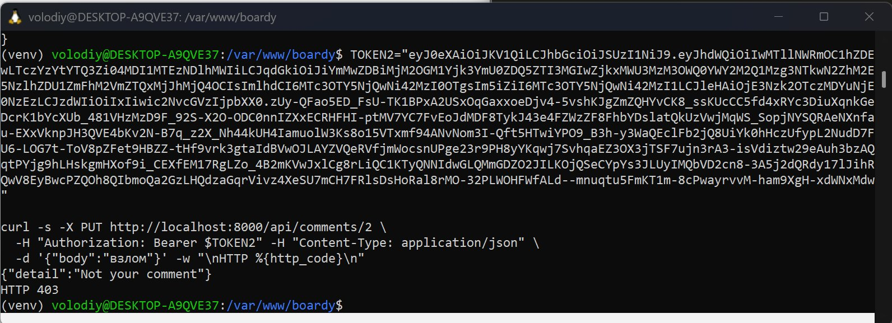

Владелец проверяется в `routers/comments.py` в функциях `update_comment` и `delete_comment`: сначала комментарий достаётся из БД (`SELECT ... WHERE id=%s`), затем сравнивается `existing['author_id']` с `int(user['sub'])` - id из проверенного JWT. Не совпало - `HTTPException(403)`. Если убрать эту проверку - любой залогиненный пользователь сможет редактировать и удалять чужие комментарии: токен подтверждает только что ты вообще кто-то (аутентификация), но не даёт права на конкретный ресурс (авторизация). Аутентификация без авторизации на уровне объекта - типичная дыра IDOR (Insecure Direct Object Reference).

---

### Задание 9. CORS для FastAPI

В `main.py` настроен `CORSMiddleware` с конкретным origin `http://localhost` и `allow_credentials=True`.

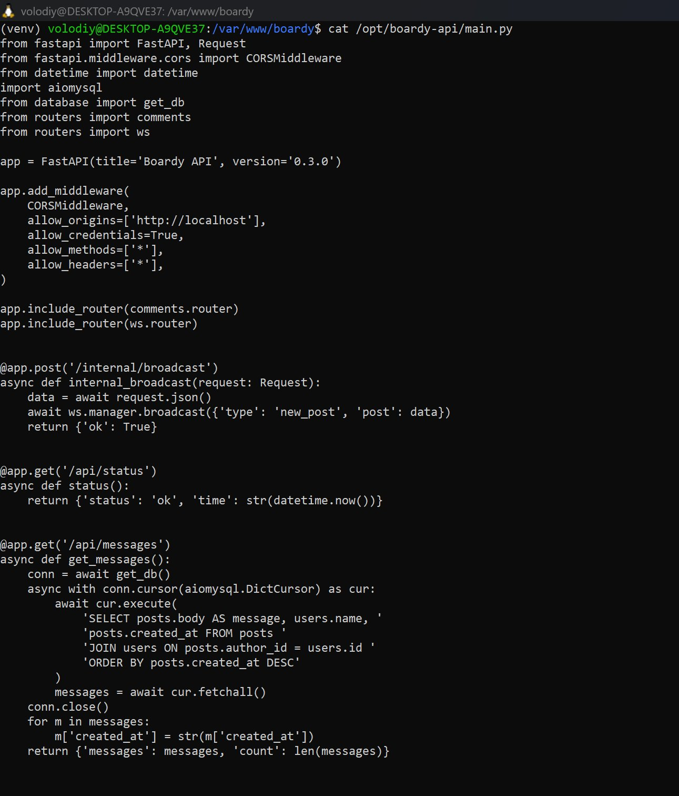

Браузер запрещает комбинацию `allow_origins=['*']` + `allow_credentials=True` намеренно. `credentials: true` означает, что вместе с кросс-доменным запросом полетят куки и заголовки авторизации пользователя. `allow_origins=['*']` означает «любой сайт в интернете». Разрешить любому сайту слать запросы с куками жертвы - это готовая CSRF-дыра: вредоносный сайт `evil.com` мог бы дёргать наш API от имени залогиненного пользователя, и браузер приложил бы его куки. Поэтому спецификация CORS прямо запрещает `*` вместе с credentials - origin обязан быть конкретным.

---

## Часть В. PKCE-flow в браузере

### Задание 10. Утилиты PKCE

В `pkce.js` реализованы `generateVerifier`, `generateChallenge` и `generateState`. Проверка в консоли: `verifier`, `challenge` и `state` генерируются.

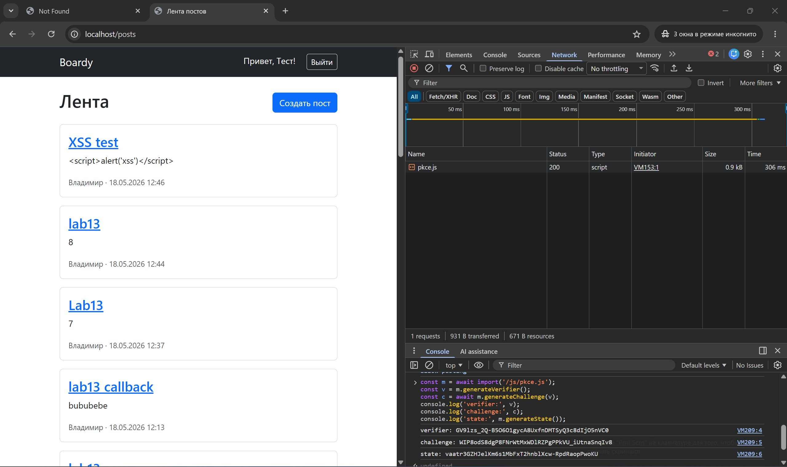

`code_challenge` передаётся в `/authorize`, а `code_verifier` - в `/token`, потому что это две разные фазы и они защищают канал между ними. На шаге `/authorize` запрос идёт через редирект браузера - он может быть залогирован, виден в истории, перехвачен; поэтому туда отправляется только необратимый хэш (`challenge = SHA256(verifier)`). Сам `verifier` хранится приватно в браузере и предъявляется только на прямом шаге `/token`. Если перепутать местами - отправить `verifier` в `/authorize` - он окажется в редирект-URL, его сможет перехватить злоумышленник, и вся защита PKCE рухнет.

---

### Задание 11. Login flow: редирект и callback

`auth.js` начинает поток: генерирует `verifier`/`challenge`/`state` и редиректит на `/oauth/authorize`. В URL запроса видны `code_challenge`, `code_challenge_method=S256` и `state`; Passport отдаёт экран согласия «Boardy SPA запрашивает доступ».

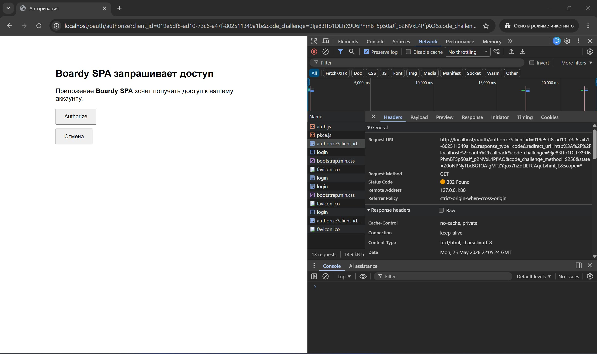

После нажатия «Authorize» Passport редиректит на `/oauth/callback?code=...&state=...` - запрос завершается `200 OK`, пользователь залогинен.

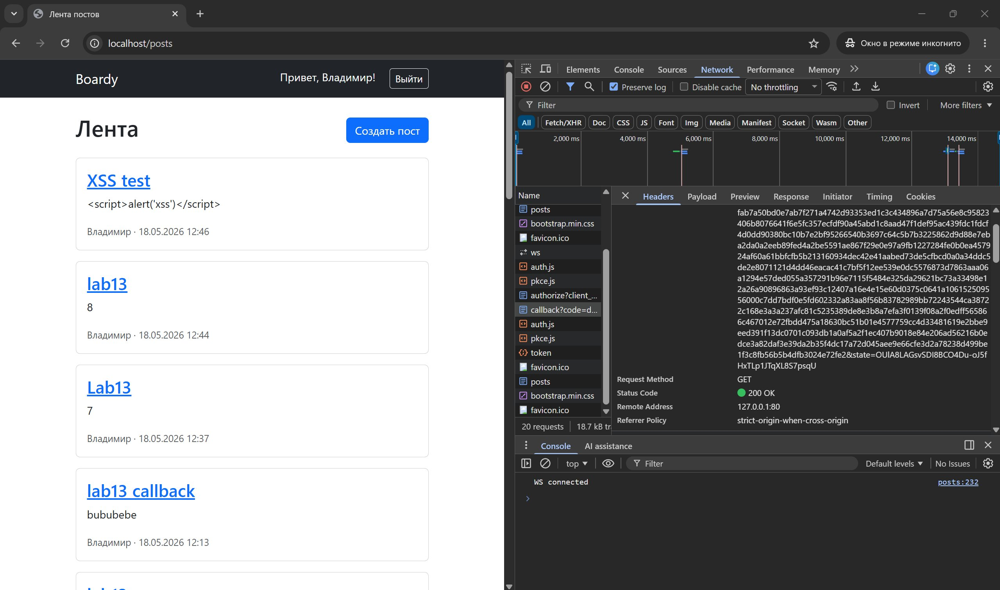

---

### Задание 12. Обмен code на токены и проверка state

`callback` обменивает `code` на токены через POST `/oauth/token`. В ответе сервер ставит `refresh_token` в HttpOnly cookie (`Set-Cookie`).

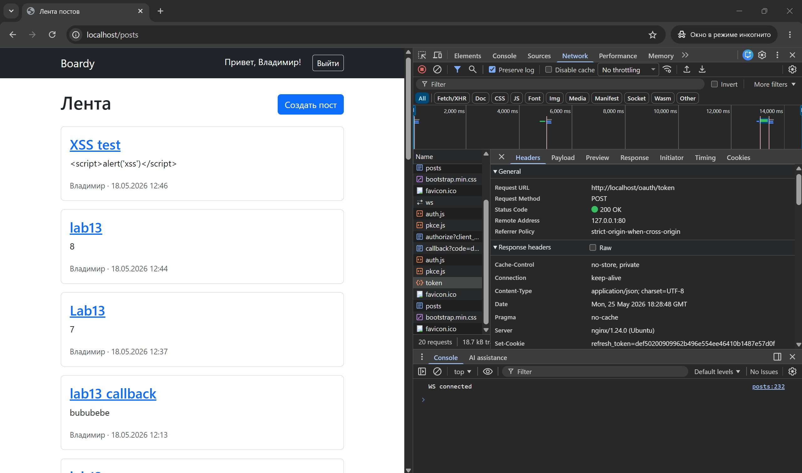

Если убрать проверку `state` - возможна CSRF-атака на OAuth (login CSRF / code injection). `state` - случайная строка, сгенерированная клиентом перед редиректом и сохранённая в `sessionStorage`; провайдер обязан вернуть её обратно в callback. Без сверки злоумышленник может инициировать свой OAuth-flow, получить свой `code` и подсунуть жертве ссылку `/oauth/callback?code=ЕГО_CODE`. Браузер жертвы выполнит callback, обменяет чужой `code` - и жертва окажется залогинена под аккаунтом злоумышленника. Сверка `state` ломает атаку: `state` в `sessionStorage` жертвы не совпадёт с подсунутым.

---

### Задание 13. Refresh-токен в HttpOnly cookie

`refresh_token` хранится в cookie с флагами HttpOnly и Secure - в DevTools → Application видно, что JS до неё не дотянется. Access-токен лежит в `sessionStorage`.

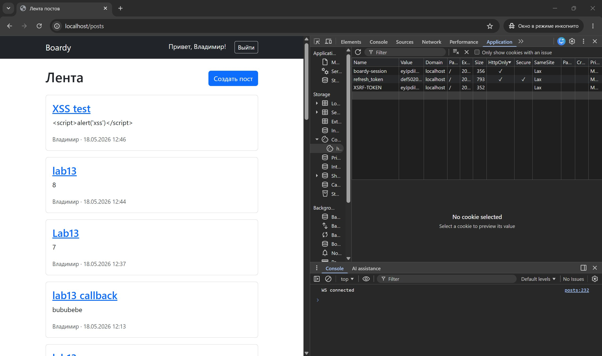

Если положить `refresh_token` в `localStorage` и на сайте найдётся XSS - злоумышленник украдёт refresh-токен одной строкой `localStorage.getItem('refresh_token')`. Refresh-токен живёт 30 дней и позволяет бесконечно выпускать новые access-токены - то есть атакующий получит месяц полного доступа к аккаунту, даже после того как жертва закроет вкладку. HttpOnly cookie принципиально недоступна JavaScript (`document.cookie` её не видит) - даже при наличии XSS скрипт не сможет прочитать refresh-токен. Access-токен в `sessionStorage` при XSS тоже уязвим, но он живёт 15 минут - ущерб ограничен.

---

### Задание 14. Silent refresh

При истёкшем access-токене POST к API возвращает `401`. `comments.jsx` перехватывает это, тихо дёргает серверный роут `/auth/refresh`, получает новый токен и повторяет запрос - в Network видна цепочка `comments 401 → refresh 200 → comments 201`. Пользователь ничего не замечает.

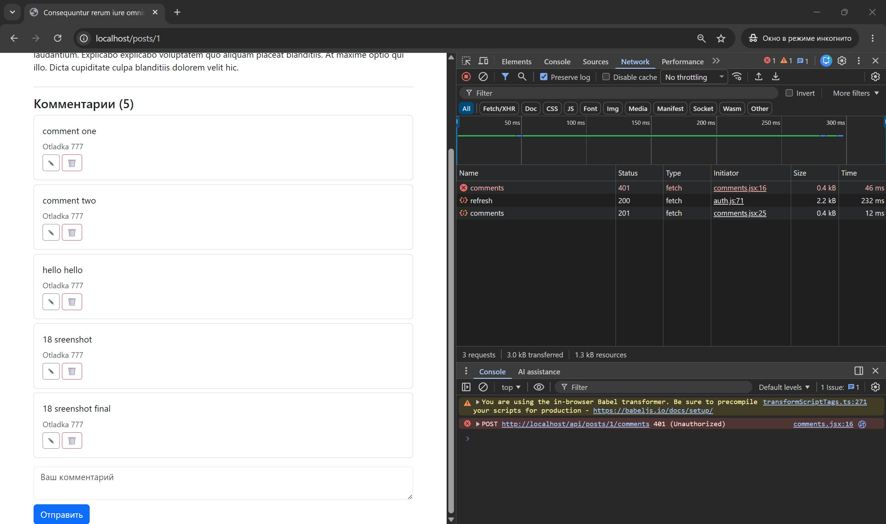

---

## Часть Г. Redis Pub/Sub и реалтайм

### Задание 15. Проверка Redis

Redis установлен и отвечает: `redis-cli ping` → `PONG`. Привязан только к `127.0.0.1` - снаружи недоступен.

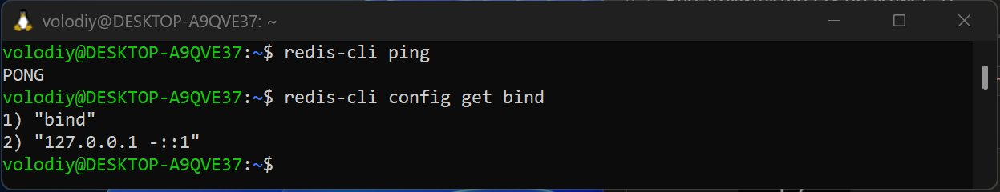

---

### Задание 16. Laravel публикует события в Redis

Установлен `predis/predis`, в `.env` задан пустой `REDIS_PREFIX` (иначе имена каналов у Laravel и FastAPI не совпадают), конфиг очищен.

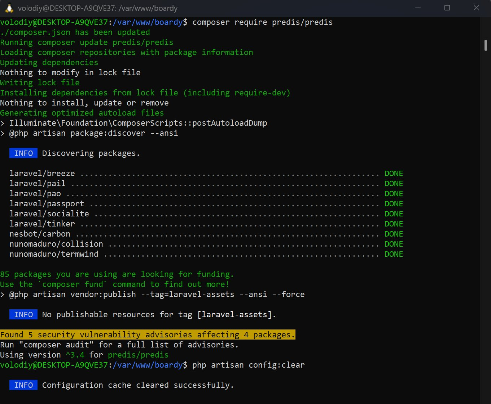

`Redis::publish` архитектурно лучше `Http::post()` к FastAPI по трём причинам. Слабая связанность: при `Http::post` Laravel должен знать адрес FastAPI и ждать его ответа - если FastAPI лежит, запрос падает; при `publish` Laravel шлёт событие в Redis и сразу забывает, ему всё равно, кто и когда его прочитает. Асинхронность: `Http::post` синхронный - пользователь ждёт ответа FastAPI при создании поста; `publish` - это запись в очередь за микросекунды. Масштабируемость: на одно событие в Redis может быть подписано сколько угодно потребителей (несколько инстансов FastAPI, логгер, аналитика) - публикующий код не меняется, HTTP-callback пришлось бы дёргать каждого получателя вручную.

---

### Задание 17. FastAPI-подписчик и broadcast

FastAPI при старте поднимает Redis-подписчика на каналы `new_post` и `user.renamed` - в логах uvicorn видно `[redis] subscriber запущен`.

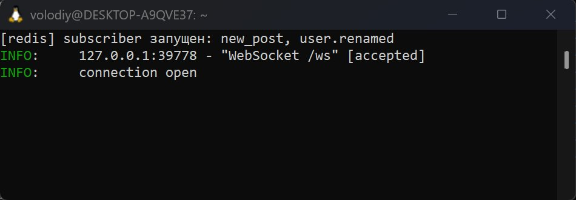

Полный поток реального времени: Laravel публикует `new_post` в Redis → FastAPI-подписчик принимает событие → рассылает его по WebSocket всем подключённым браузерам. Новый пост появляется в ленте без перезагрузки.

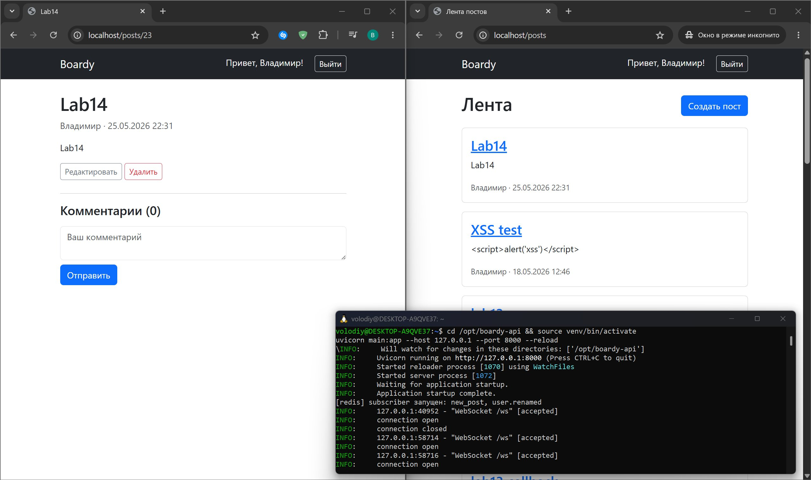

---

### Задание 18. UserObserver: автопубликация при смене имени

`UserObserver` подписан на модель `User`. При смене имени через `tinker` он автоматически публикует `user.renamed` в Redis - `redis-cli monitor` показывает `PUBLISH "user.renamed"` с `id` и `new_name`.

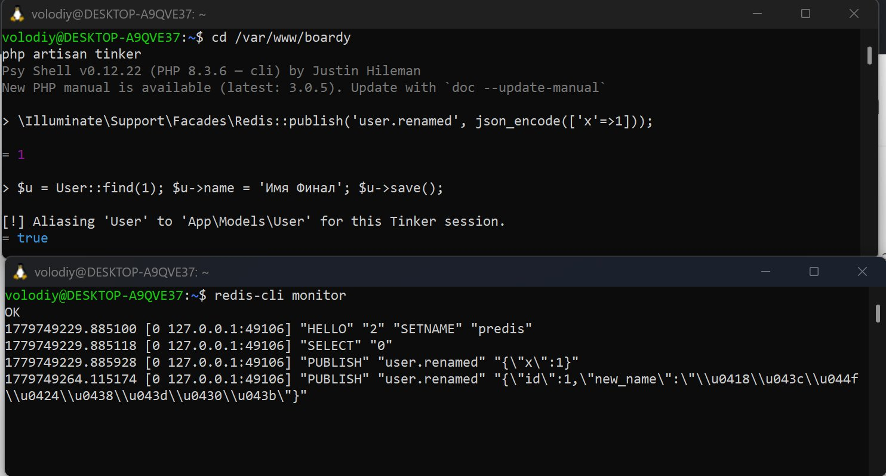

`UserObserver` вызывается автоматически благодаря системе событий моделей Eloquent. Каждая модель при операциях (`creating`, `updated`, `deleted` и др.) генерирует события. `User::observe(UserObserver::class)` в `boot()` подписывает класс-наблюдатель: Laravel при любом `$user->save()`, изменившем запись, сам вызовет метод `updated()`. «Магия» - внутри метода `save()` Eloquent-модели: после записи в БД он диспатчит соответствующее событие через сервис-контейнер, а зарегистрированные observers получают вызов. Разработчику не нужно вручную звать observer - достаточно один раз зарегистрировать его.

---

### Задание 19. Денормализация и eventual consistency

До смены имени `author_name` в комментариях - одно значение.

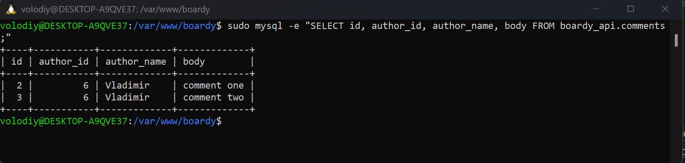

После смены имени FastAPI ловит событие `user.renamed` и обновляет `author_name` во всех комментариях автора - копия в `boardy_api` снова согласована с `boardy_main`.

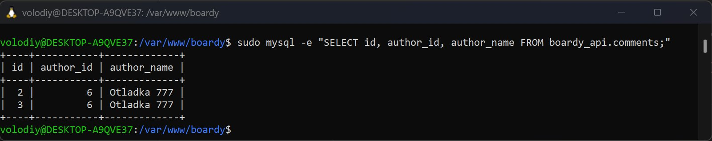

Eventual consistency (согласованность в конечном счёте) - модель, при которой данные в распределённой системе становятся согласованными не мгновенно, а спустя короткое время после изменения. Имя пользователя - «источник истины» в `boardy_main.users` (Laravel). В `boardy_api.comments` оно хранится денормализованно, копией. В момент смены имени эти две копии расходятся; через цепочку «Laravel publish - Redis - FastAPI subscribe - UPDATE» они снова сходятся. Задержка возможна, если: Redis недоступен в момент публикации (событие потеряно), FastAPI-подписчик не запущен (Pub/Sub не буферизует - кто не слушал, тот пропустил) либо подписчик обрабатывает большую очередь. На это время старые комментарии показывают прежнее имя - допустимый компромисс ради слабой связанности сервисов.

---

## Часть Д. Проверка реального времени

### Задание 20. Новый пост в двух браузерах

Два браузера открыты на ленте. Пост, созданный в одном окне, мгновенно появляется во втором без `F5` - сработала цепочка `new_post` → Redis → WebSocket.

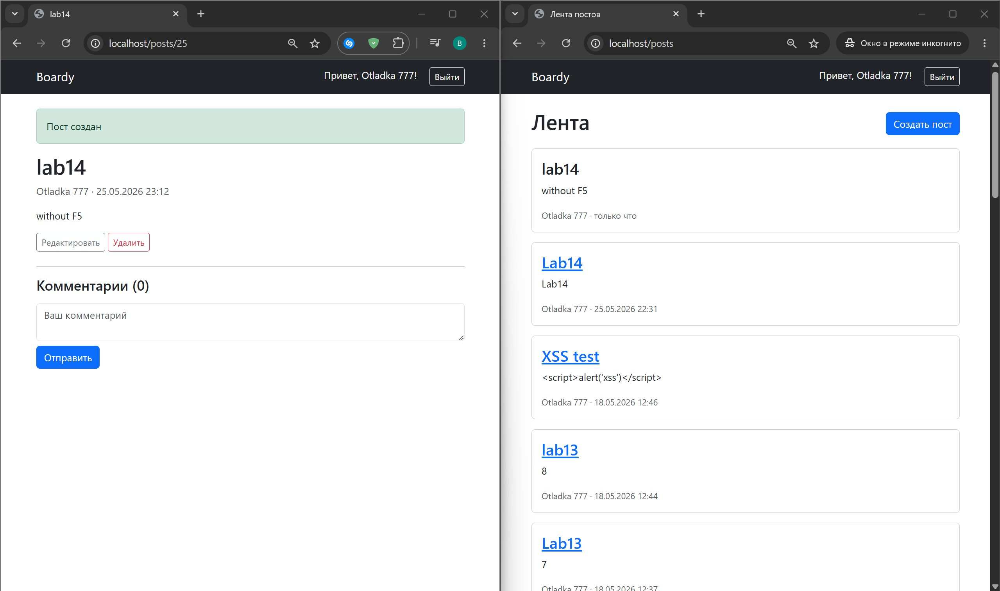

---

### Задание 21. Комментарии в двух браузерах

Тот же пост открыт в двух браузерах: список комментариев синхронен в обоих окнах.

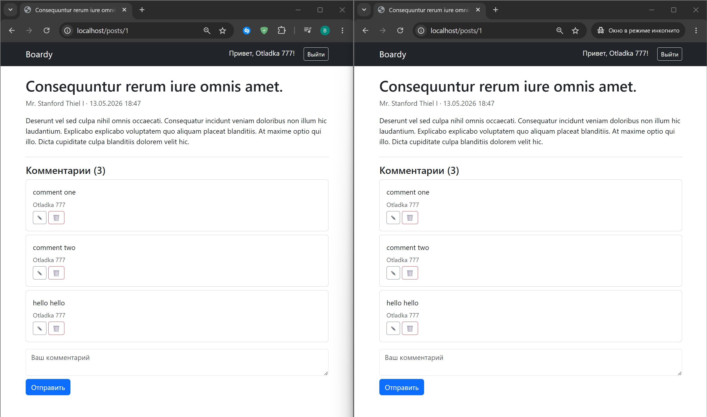

---

## Часть Е. Очистка архитектуры

### Задание 22. Удаление HTTP-callback и эндпоинта /internal

HTTP-callback между Laravel и FastAPI убран - связь идёт только через Redis. `grep` по `app/` не находит ни одного `Http::`; единственное обращение через HTTP осталось в роуте `/auth/refresh`, и оно идёт к собственному Passport, а не к FastAPI.

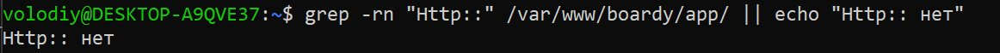

Из конфигурации Nginx убран служебный `location /internal` - наружу торчат только `/` (Laravel), `/api/` и `/ws` (проксируются на FastAPI). Эндпоинт `/internal/broadcast` в `main.py` тоже удалён: он был нужен для старого HTTP-callback, теперь рассылку запускает Redis-подписчик.

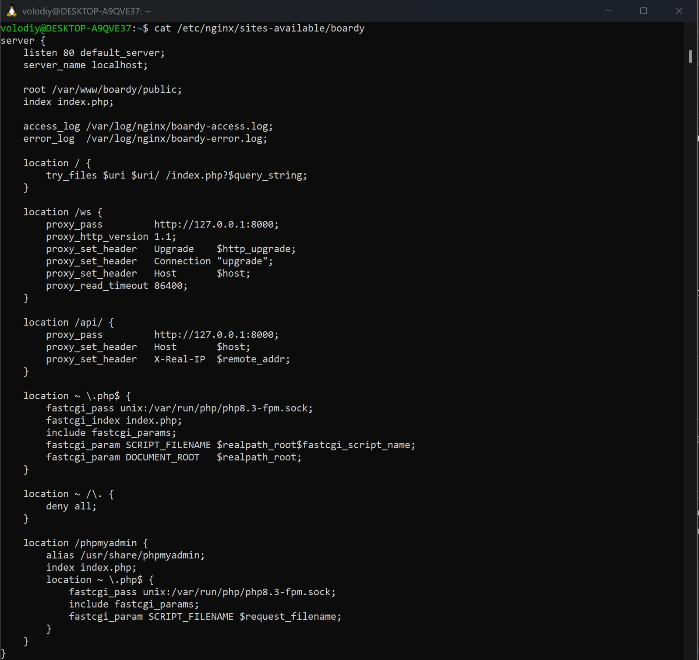

---

## Pull Request

Ветка `lab14` отправлена в `github.com/VaveyNL/web-architecture`, открыт Pull Request в `main`.

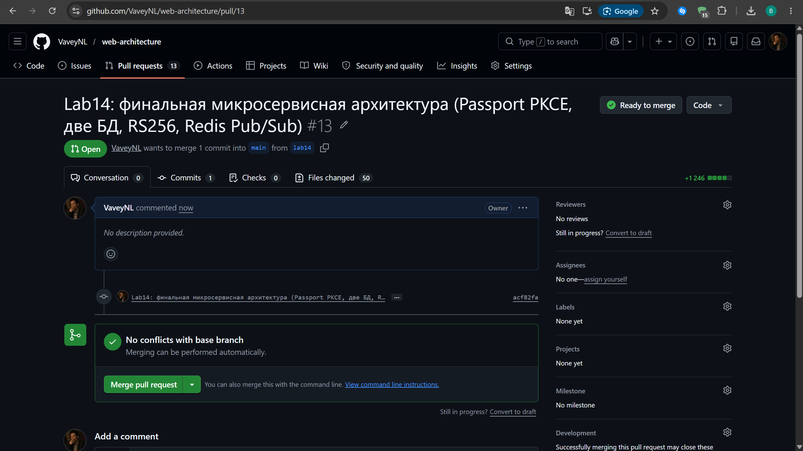
