# Практическая работа №15. Docker и Docker Compose

**Студент:** Казыханов Владимир
**Среда:** WSL (Ubuntu 24.04), Docker Engine 29.5, Docker Compose v5.1
**Репозиторий:** `github.com/VaveyNL/web-architecture`, ветка `lab15`

## Цель и архитектура

Упаковать стек Boardy (Nginx, Laravel/PHP-FPM, FastAPI, MySQL, Redis) в Docker так, чтобы `docker compose up` поднимал всё приложение на чистой машине. Пять контейнеров в общей сети `boardy_net`:

- **nginx** (`nginx:alpine`) - единственная точка входа, порт 80 наружу
- **laravel** (`php:8.2-fpm`) - SSR, Passport (OAuth 2.1 / PKCE), порт 9000 внутри сети
- **fastapi** (`python:3.11-slim`) - REST API комментариев, WebSocket, порт 8000 внутри
- **mysql** (`mysql:8`) - две БД, `boardy_main` и `boardy_api`
- **redis** (`redis:7-alpine`) - шина событий Pub/Sub

Volumes: `mysql_data`, `redis_data`, `laravel_storage`.

---

## Часть A. Dockerfile для Laravel

### Задание 1. PHP-FPM с расширениями

Написан `Dockerfile` для Laravel на базе `php:8.3-fpm` с установкой расширений `pdo_mysql`, `mbstring`, `zip`, `opcache`, `redis` (через `pecl`), копированием composer и `composer install --no-dev`. Финальный образ - 868 MB.

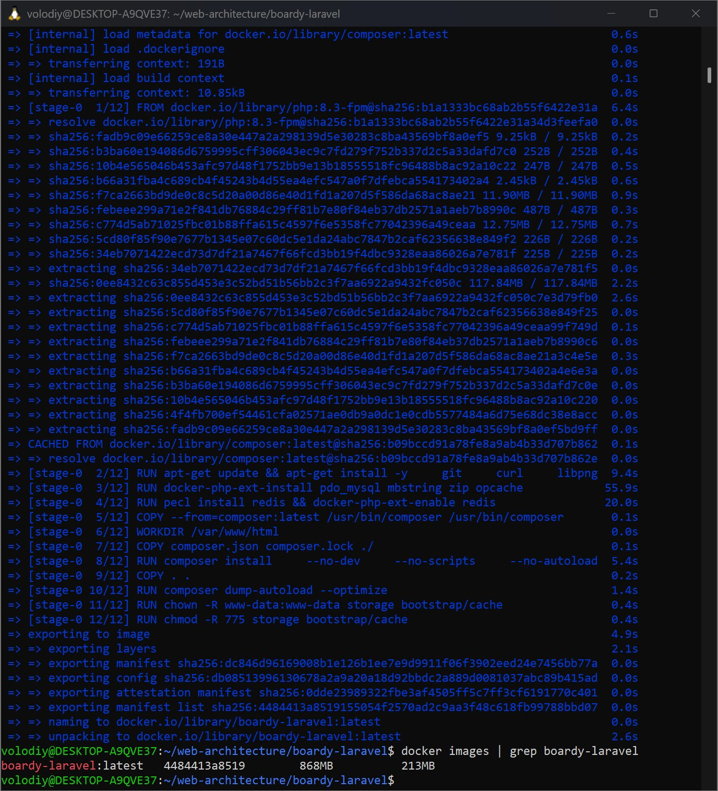

PHP-FPM в Docker вместо связки Apache+PHP - это разделение ответственности. PHP-FPM делает одно: исполняет PHP-код. Раздачей статики, маршрутизацией и проксированием занимается отдельный контейнер Nginx. Архитектурное преимущество: контейнеры можно масштабировать независимо (например, поднять 3 контейнера PHP-FPM за одним Nginx), каждый образ меньше и проще, а замена или обновление веб-сервера не затрагивает PHP. Apache+PHP в одном контейнере нарушил бы принцип «один контейнер - один процесс / одна задача».

---

### Задание 2. Кеширование composer-зависимостей

В Dockerfile `COPY composer.json composer.lock` и `composer install` стоят **до** `COPY . .`. Проверка - повторный `docker build` без изменений в коде: слой `composer install` помечен `CACHED`, сборка проходит за секунды.

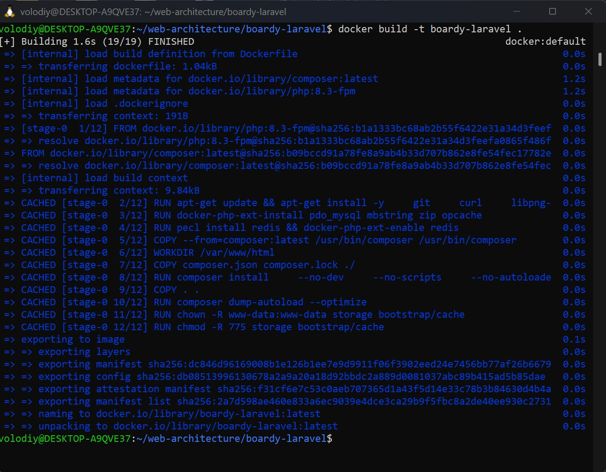

Docker собирает образ по слоям - каждая инструкция Dockerfile создаёт слой. Слой пересобирается, только если изменилось то, что в него входит; иначе берётся из кеша. `composer install` зависит лишь от `composer.json` и `composer.lock`. Если скопировать сначала только эти два файла, а `composer install` поставить до `COPY . .`, то при изменении любого PHP-файла проекта слой `composer install` останется в кеше - зависимости не скачиваются заново, сборка быстрая. Если сделать `COPY . .` (весь проект) ДО `composer install`, то любое изменение хоть одного файла кода инвалидирует слой, и `composer install` будет выполняться при каждой сборке заново, скачивая все пакеты - сборка станет медленной.

---

### Задание 3. .dockerignore

Создан `boardy-laravel/.dockerignore`: исключены `node_modules`, `vendor`, `.env`, `.git`, кеш и логи `storage/`, документация и сам `Dockerfile`.

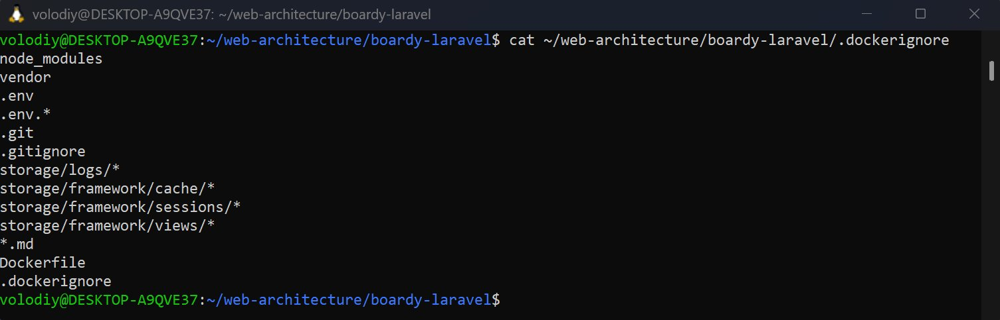

Если не исключить `.env` из образа - в собранный Docker-образ попадут все секреты приложения: пароль БД, `APP_KEY` (ключ шифрования сессий и куки), секрет GitHub OAuth. Образ - это артефакт, который пушится в реестры, передаётся между машинами, его слои легко распаковать (`docker history`, `docker save`). Любой, кто получит образ, получит и секреты. Поэтому `.env` исключают из образа, а переменные окружения передают в контейнер в момент запуска - через `env_file` или `environment` в `docker-compose.yml`. Так секреты живут только в рантайме конкретного развёртывания, а не внутри переносимого образа.

---

## Часть Б. Dockerfile для FastAPI

### Задание 4. requirements.txt

Все зависимости зафиксированы по версиям. Вместо устаревшего `aioredis` (заброшен на Python 3.12) используется `redis==5.0.1` - актуальный пакет с подмодулем `redis.asyncio`, под который написан `main.py` с Lab14.

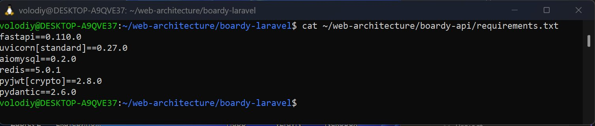

Версии фиксируют, чтобы сборка была воспроизводимой. `latest` означает «самая свежая на момент сборки» - две сборки одного и того же Dockerfile в разные дни могут получить разные версии пакетов. Через год без фиксации `pip install fastapi` поставит мажорно новую версию, в которой могут быть несовместимые изменения API - код, написанный сегодня, просто перестанет работать или поведёт себя иначе. Фиксированные версии гарантируют, что образ, собранный сегодня и через год, содержит ровно те же зависимости, на которых приложение протестировано.

---

### Задание 5. Сборка образа FastAPI

Перед сборкой код FastAPI (`database.py`, `main.py`, `auth.py`) переписан под чтение хостов из переменных окружения - в Docker адреса сервисов это имена контейнеров (`mysql`, `redis`), а не `127.0.0.1`. Dockerfile на базе `python:3.11-slim`, образ собирается за ~46 секунд.

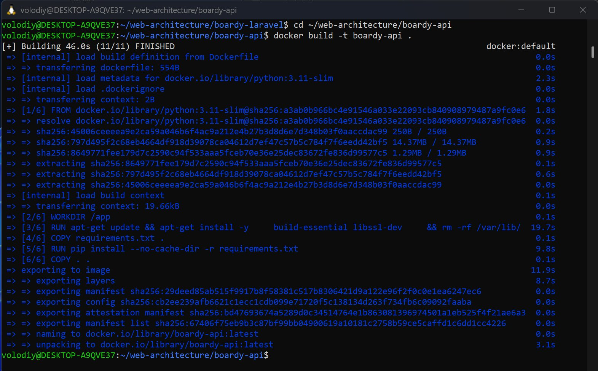

---

### Задание 6. CMD с правильным host

В Dockerfile последняя строка - `CMD ["uvicorn", "main:app", "--host", "0.0.0.0", "--port", "8000"]`.

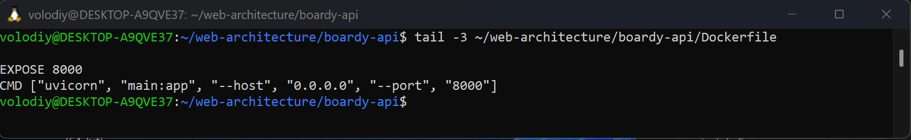

`--host 0.0.0.0` означает «слушать на всех сетевых интерфейсах контейнера». `127.0.0.1` (loopback) - это «слушать только локальные обращения внутри самого контейнера». Контейнеры в Docker общаются друг с другом по виртуальной сети: Nginx обращается к FastAPI как к `fastapi:8000`, то есть приходит на сетевой интерфейс контейнера снаружи. Если uvicorn слушает только `127.0.0.1`, он отвергнет такие обращения - для него это «не локальный» трафик, и Nginx получит `connection refused`. С `0.0.0.0` uvicorn принимает обращения с любого интерфейса, в том числе из docker-сети.

---

## Часть В. Конфиг Nginx

### Задание 7. docker/nginx/default.conf

Написан конфиг Nginx для контейнера: `location /ws` проксирует на `fastapi:8000` с WebSocket-апгрейдом, `location /api/` - на тот же `fastapi:8000`, всё остальное идёт в Laravel через `fastcgi_pass laravel:9000`.

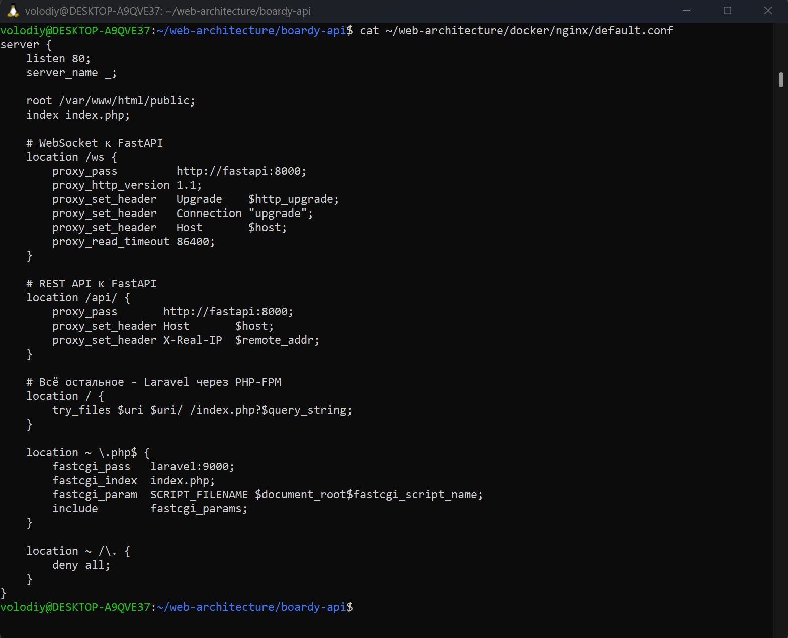

`laravel:9000` вместо `127.0.0.1:9000` - потому что PHP-FPM работает в отдельном контейнере, а не на том же хосте, что Nginx. `127.0.0.1` внутри контейнера Nginx указывал бы на сам контейнер Nginx, где PHP-FPM нет. Docker поднимает для каждой compose-сети встроенный DNS-резолвер: имя сервиса из `docker-compose.yml` (`laravel`, `fastapi`, `mysql`, `redis`) автоматически резолвится в IP-адрес соответствующего контейнера. Поэтому Nginx обращается к PHP-FPM по имени `laravel`, а к API - по имени `fastapi`, и Docker сам подставляет нужные адреса.

---

### Задание 8. WebSocket location

Блок `location /ws` содержит три обязательные строки для апгрейда HTTP до WebSocket (`proxy_http_version 1.1`, заголовки `Upgrade` и `Connection`) и `proxy_read_timeout 86400` - сутки, чтобы долгое WS-соединение не рвалось по таймауту.

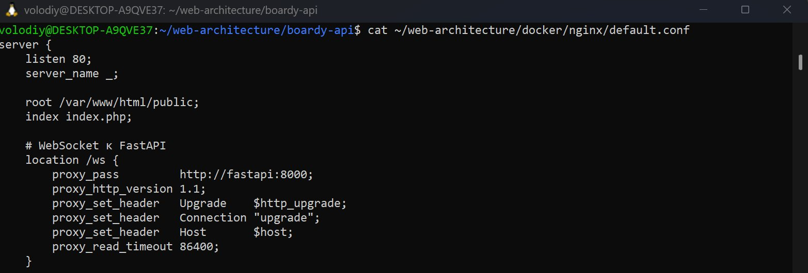

---

## Часть Г. docker-compose.yml

### Задание 9. Пять сервисов

Написан `docker-compose.yml` с пятью сервисами в общей сети `boardy_net`. Nginx собран из официального образа, у Laravel и FastAPI указано `build:` на их Dockerfile, MySQL и Redis - официальные образы с проверками здоровья.

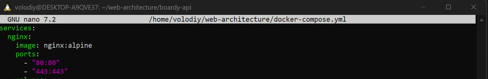

---

### Задание 10. Volumes

Три именованных volume: `mysql_data` (данные БД), `redis_data` (snapshot Redis), `laravel_storage` (RSA-ключи Passport, кеш, логи Laravel). Конфиг Nginx подключён bind-mount`ом из `./docker/nginx/default.conf`.

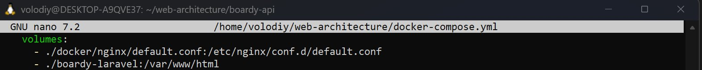

Если убрать volume `mysql_data`, то файлы БД будут лежать внутри слоя контейнера. При `docker compose down` контейнер удаляется - вместе с ним пропадают все данные: пользователи, посты, комментарии. С именованным volume `mysql_data` данные хранятся отдельно от контейнера, в области, которой управляет Docker; контейнер можно пересоздавать сколько угодно, данные остаются.

Разница именованного volume и bind-mount: **bind-mount** привязывает конкретную папку хоста к пути в контейнере (`./docker/nginx/default.conf:/etc/nginx/...`) - удобно для кода и конфигов, которые правишь на хосте. **Именованный volume** (`mysql_data`) - область хранения, которой полностью управляет Docker; путь на хосте не важен и не фиксирован, volume переносим и не зависит от структуры папок хоста - подходит для данных БД, которые не нужно редактировать руками.

---

### Задание 11. Healthcheck для MySQL и Redis

У `mysql` healthcheck выполняет `mysqladmin ping`, у `redis` - `redis-cli ping`. Сервисы `laravel` и `fastapi` зависят от обоих через `depends_on` с `condition: service_healthy` - они стартуют только после того, как БД и Redis ответили живые.

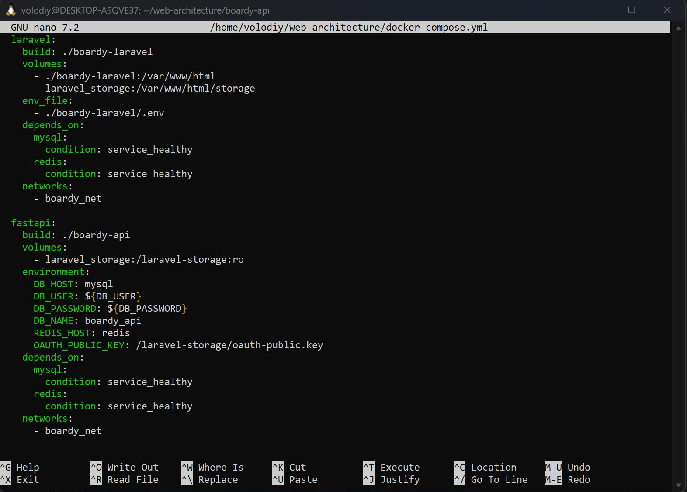

`depends_on` без healthcheck гарантирует только порядок запуска контейнеров - Docker запустит `mysql` раньше `laravel`. Но «контейнер запущен» не равно «сервис внутри готов принимать соединения»: MySQL стартует процесс за доли секунды, а инициализация БД и готовность к запросам занимает несколько секунд. Возникает race condition: `laravel` стартует, сразу пытается подключиться к ещё не готовому MySQL и падает с ошибкой соединения. `healthcheck` периодически проверяет реальную готовность (`mysqladmin ping`, `redis-cli ping`), а `condition: service_healthy` заставляет `laravel` и `fastapi` ждать, пока проверка не станет успешной - только тогда они стартуют.

---

### Задание 12. init.sql для двух БД

Создан `docker/mysql/init.sql`: создаёт обе базы (`boardy_main` и `boardy_api`), выдаёт пользователю `boardy` права на обе и делает `FLUSH PRIVILEGES`. Скрипт подключён в `docker-compose.yml` как bind-mount в `/docker-entrypoint-initdb.d/`.

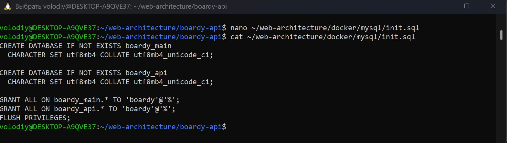

После первого `docker compose up` обе базы созданы автоматически:

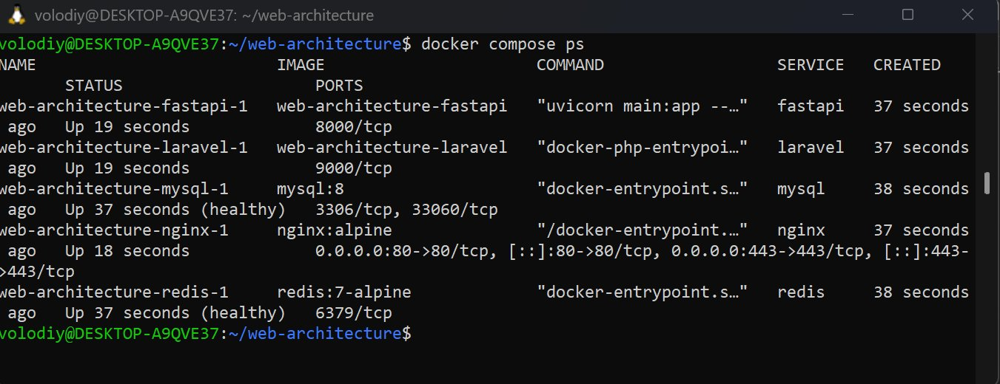

MySQL-образ выполняет скрипты из `/docker-entrypoint-initdb.d/` только когда каталог с данными пустой - то есть при самом первом старте контейнера, когда volume `mysql_data` ещё не инициализирован. При последующих стартах данные уже на месте, и entrypoint пропускает инициализацию, чтобы не затереть существующую БД. Поэтому если изменить `init.sql` после первого запуска, изменения не применятся - volume уже инициализирован. Чтобы новый `init.sql` сработал, нужно удалить volume (`docker compose down -v`) и запустить заново - тогда инициализация пройдёт с нуля.

---

### Задание 13. Два .env файла

Корневой `.env` - для Docker Compose: `MYSQL_ROOT_PASSWORD`, `DB_USER`, `DB_PASSWORD`. Подставляется в `docker-compose.yml` через `${...}`. В git не коммитим, в репо `.env.example`.

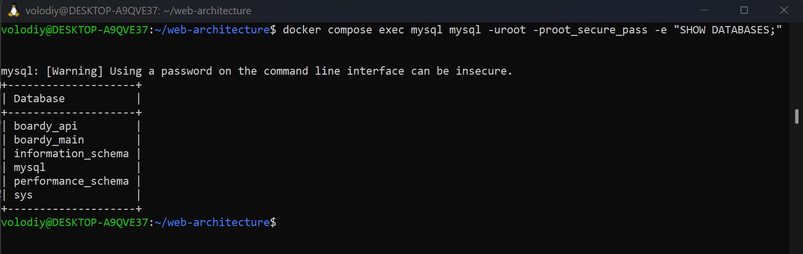

`.env` Laravel - настройки самого приложения: `DB_HOST=mysql`, `REDIS_HOST=redis`, `REDIS_CLIENT=predis`, `REDIS_PREFIX=` (пустой - иначе каналы Pub/Sub Laravel и FastAPI не совпадают).

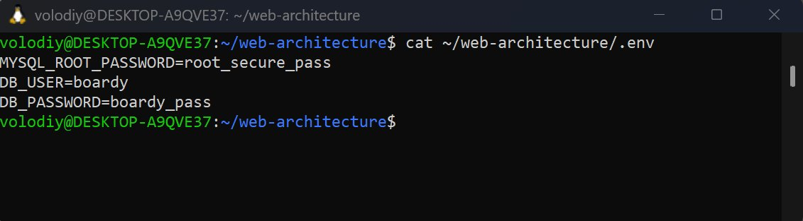

Два `.env` потому, что это настройки для двух разных программ. Корневой `.env` читает Docker Compose: значения оттуда подставляются в `docker-compose.yml` через `${...}` - пароль root MySQL, имя и пароль пользователя БД. `.env` в `boardy-laravel/` читает само приложение Laravel - там настройки фреймворка: подключение к БД, Redis, ключ приложения, почта. Это разные слои: Compose оркеструет контейнеры, Laravel работает внутри своего контейнера.

`DB_HOST=mysql`, а не `127.0.0.1` - потому что MySQL работает в отдельном контейнере. `127.0.0.1` внутри контейнера Laravel указывал бы на сам контейнер Laravel, где MySQL нет. `mysql` - имя сервиса из `docker-compose.yml`, которое встроенный DNS Docker резолвит в адрес контейнера с базой.

---

## Часть Д. Запуск и проверка

### Задание 14. docker compose up

Хостовые Nginx, MySQL, PHP-FPM, Redis остановлены. Запуск:

```bash
docker compose up -d --build
```

Все пять контейнеров поднялись, `mysql` и `redis` со статусом `(healthy)`:

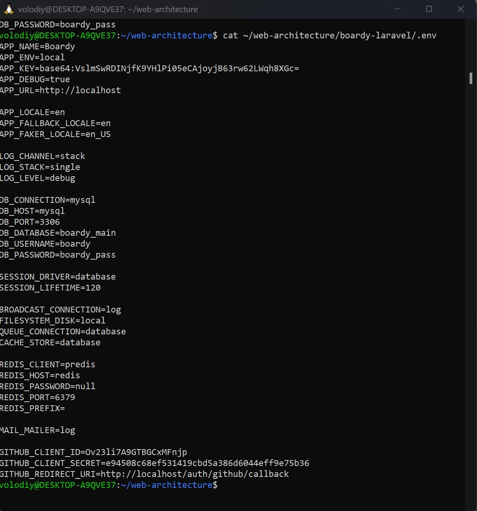

---

### Задание 15. Миграции в контейнере

Внутри контейнера Laravel прогнаны миграции и сгенерированы RSA-ключи Passport:

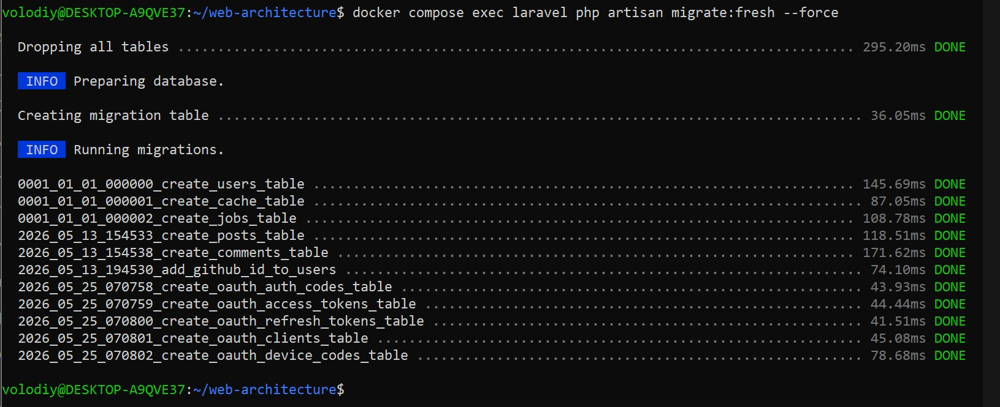

Создан публичный PKCE-клиент - получен новый Client ID:

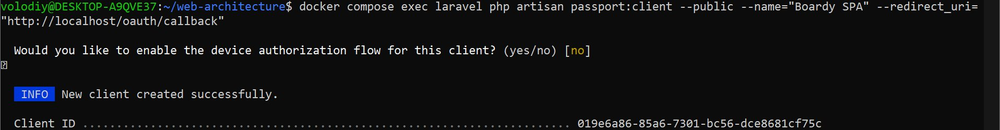

`docker compose exec` выполняет команду в уже запущенном контейнере - аналог входа на работающий сервер по SSH и запуска там команды. `docker compose run` создаёт для команды новый, отдельный контейнер из образа сервиса (и по умолчанию удаляет его после). `exec` нужен, когда сервис уже работает и надо что-то сделать «внутри» него (миграции на живом приложении); `run` - когда нужен разовый запуск в чистом окружении образа, не трогая основной контейнер.

---

### Задание 16. Приложение работает

`http://localhost` - открывается лента постов, всё через контейнерный Nginx:

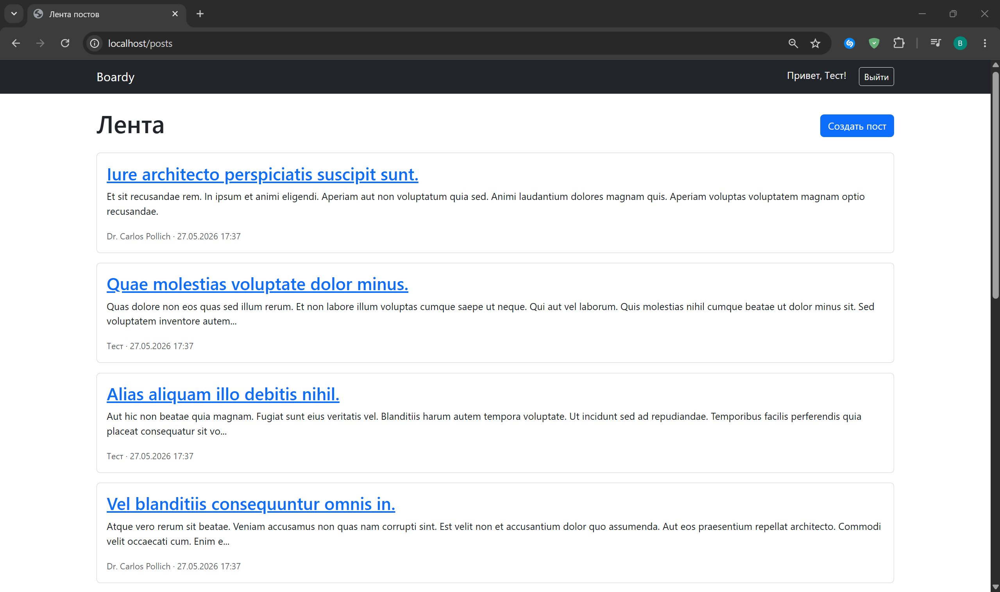

Создан пост, открыта его страница, через React добавлен комментарий через FastAPI (`POST /api/posts/12/comments`):

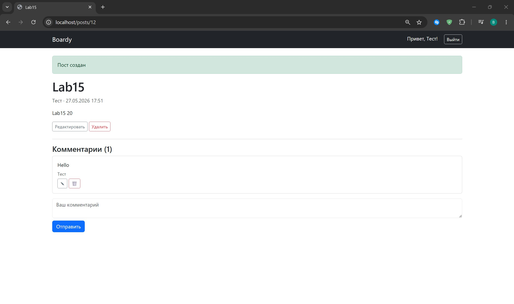

---

### Задание 17. Реалтайм работает

Два браузера на ленте. Пост, созданный в одном окне, мгновенно появляется во втором без `F5` - сработала цепочка Laravel `Redis::publish('new_post')` → Redis → FastAPI-подписчик → WebSocket → оба клиента.

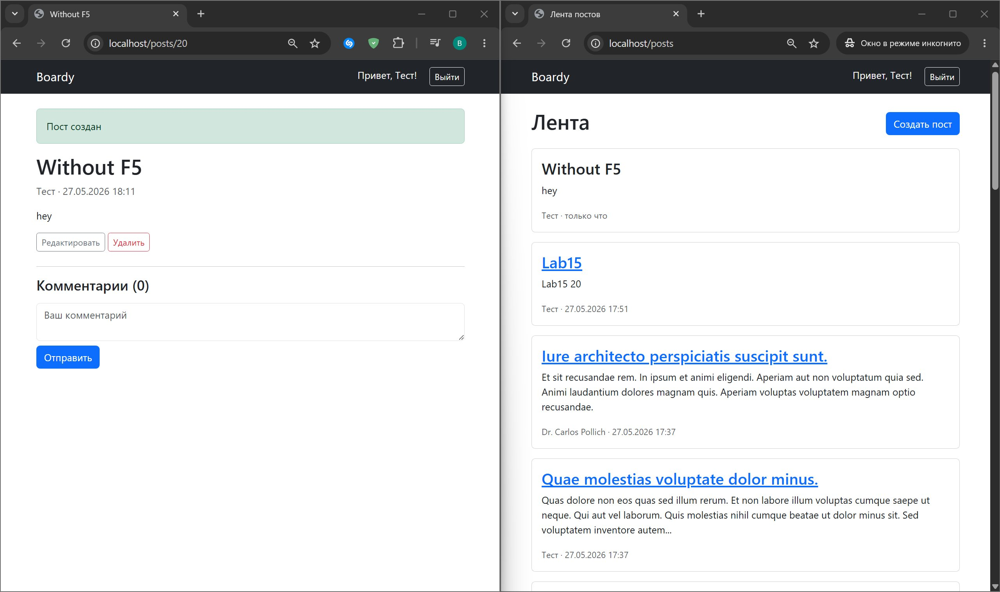

Тот же пост открыт в двух окнах, комментарий синхронизирован:

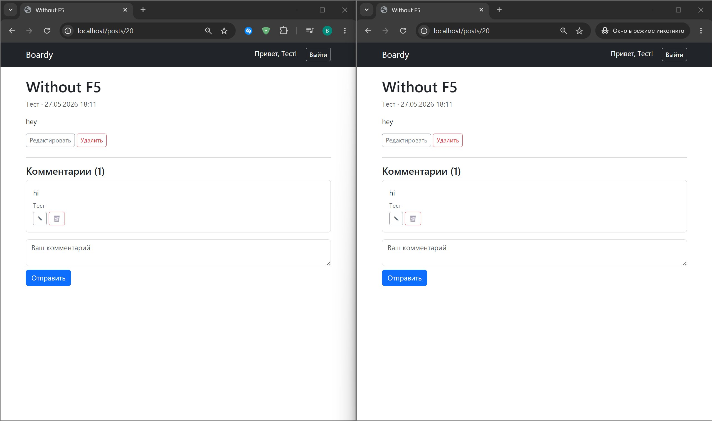

---

### Задание 18. Данные переживают перезапуск

`docker compose down` удаляет контейнеры, но volumes остаются. После `docker compose up -d` приложение поднимается с теми же данными - лента, посты, пользователи на месте:

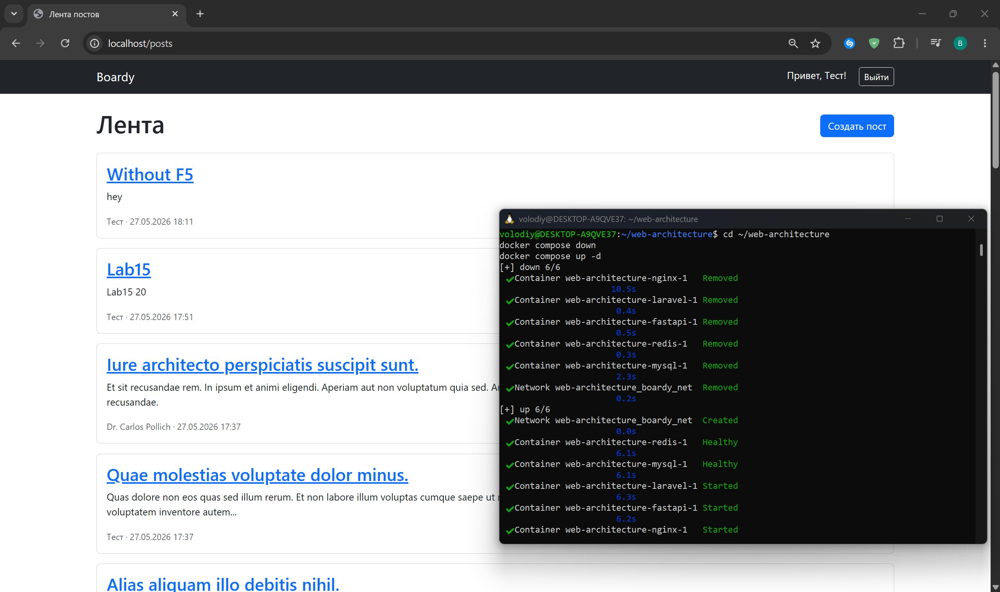

`docker compose down -v` удаляет не только контейнеры, но и volumes (флаг `-v` = volumes). Вместе с volume `mysql_data` пропадает вся база - все пользователи, посты, комментарии. Опасность флага `-v` в том, что это необратимо: после `down -v` данные восстановить нельзя, следующий `up` поднимет пустую БД и заново выполнит `init.sql`. Поэтому для обычной остановки используют `docker compose down` (без `-v`) - контейнеры удаляются, данные в volumes сохраняются. `-v` применяют сознательно, когда нужно именно сбросить всё начисто.

---

### Задание 19. Централизованные логи

`docker compose logs --tail=50` показывает логи всех контейнеров одним потоком, с префиксами `laravel-1 |`, `fastapi-1 |`, `mysql-1 |`, `nginx-1 |`. В логах FastAPI видна строка `[redis] subscriber запущен`, в логах nginx - запуск с конфигом, в логах MySQL - выполнение `init.sql`.

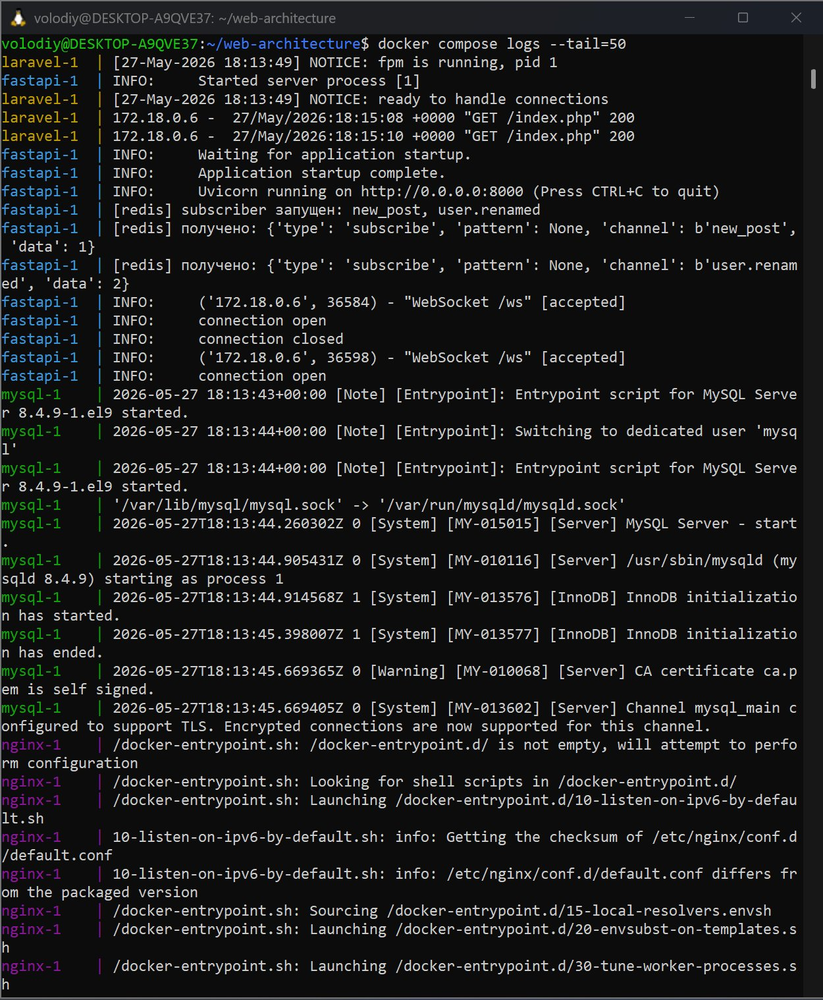

Централизованные логи Docker против `tail -f /var/log/*` на хосте: все сервисы пишут в единый интерфейс `docker compose logs`, каждая строка помечена именем контейнера - видно всю систему сразу, в одном потоке, в хронологическом порядке. Не нужно знать, где какой сервис хранит логи и в каком формате. Можно фильтровать по сервису (`docker compose logs laravel`), смотреть живой поток (`-f`), ограничивать объём (`--tail`). При `tail -f /var/log/*` на хосте логи разрозненны: у Nginx свой путь, у PHP-FPM свой, у MySQL свой, часть сервисов вообще может не писать в файлы; сопоставлять события между сервисами вручную тяжело. Docker же собирает stdout/stderr каждого контейнера единообразно.

---

### Задание 20. Чистая машина

Симуляция развёртывания с нуля: `docker compose down -v` удаляет всё, включая volumes - база пустая. Затем `docker compose up -d --build`, `migrate`, `passport:keys`, `passport:client` - и приложение снова работает, лента наполнена свежими данными от seeder`а:

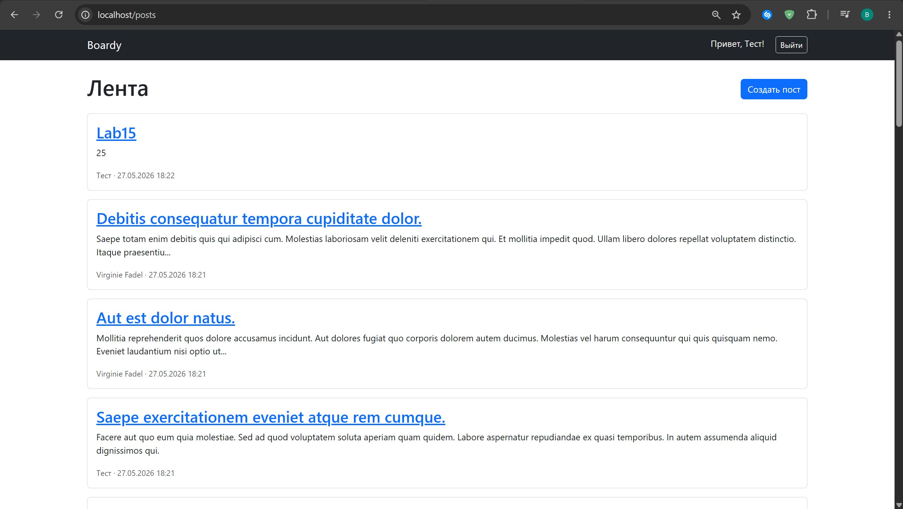

От клона репозитория до рабочего приложения на новой машине нужно всего:

```
git clone <репозиторий>
cd <папка>
cp .env.example .env        # заполнить пароли
docker compose up -d --build
docker compose exec laravel php artisan migrate --force
docker compose exec laravel php artisan passport:keys
docker compose exec laravel php artisan passport:client --public --name="Boardy SPA" --redirect_uri="http://localhost/oauth/callback"
```

Никаких ручных установок Nginx, MySQL, Redis, PHP, Python на хост - всё внутри контейнеров. Это и есть главный результат практики: окружение описано кодом и воспроизводится одной командой.

---

## Адаптации под систему

- БД Laravel называется `boardy_main` (не `boardy_laravel` как в методичке) - так с Lab14.
- В `requirements.txt` пакет `redis` вместо устаревшего `aioredis` - `main.py` использует `redis.asyncio`.
- Код FastAPI (`database.py`, `main.py`, `auth.py`) переписан на чтение хостов и пути к ключу из переменных окружения - в Docker адреса сервисов это имена контейнеров.
- `auth.py` читает публичный ключ лениво (при первом запросе), а не на старте - ключ генерируется в контейнере Laravel уже после того, как FastAPI стартует.
- `REDIS_PREFIX` пустой - иначе каналы Pub/Sub Laravel и FastAPI не совпадают (та же причина, что в Lab14).

---

## Pull Request

Ветка `lab15` запушена, открыт Pull Request в `main`.

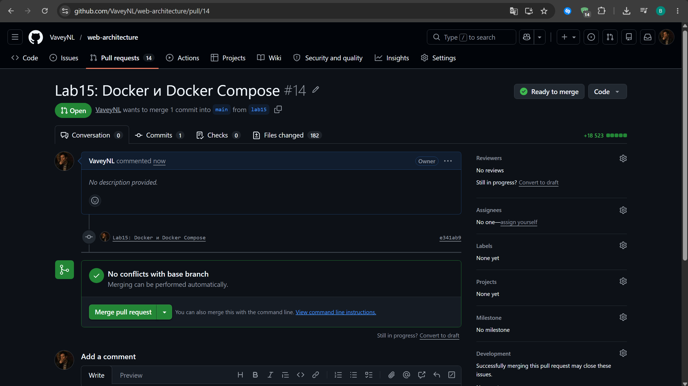
