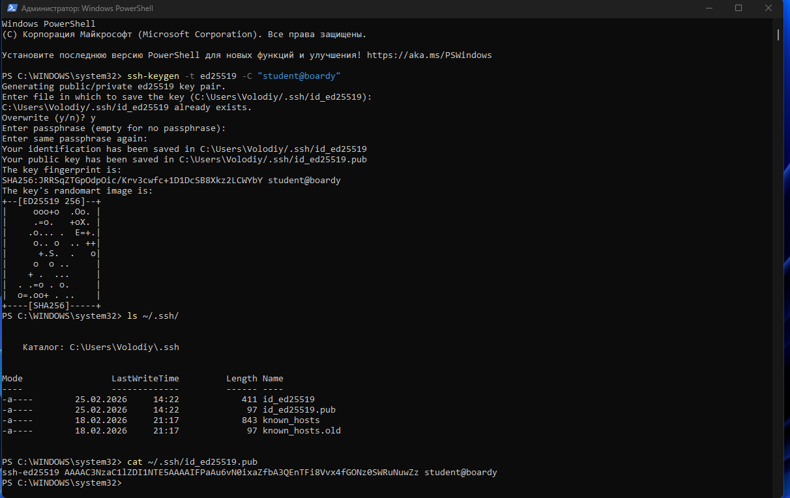
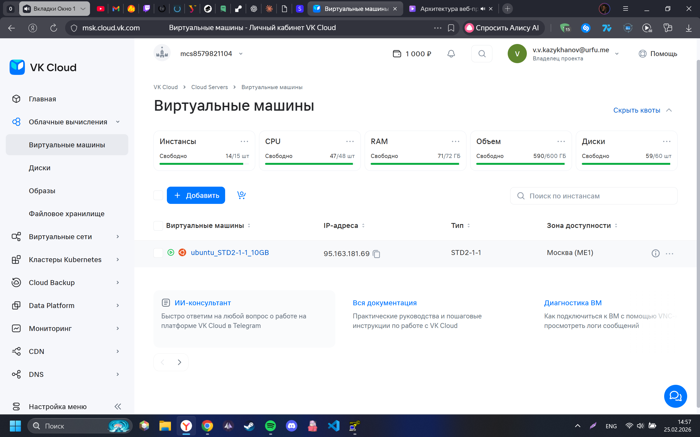
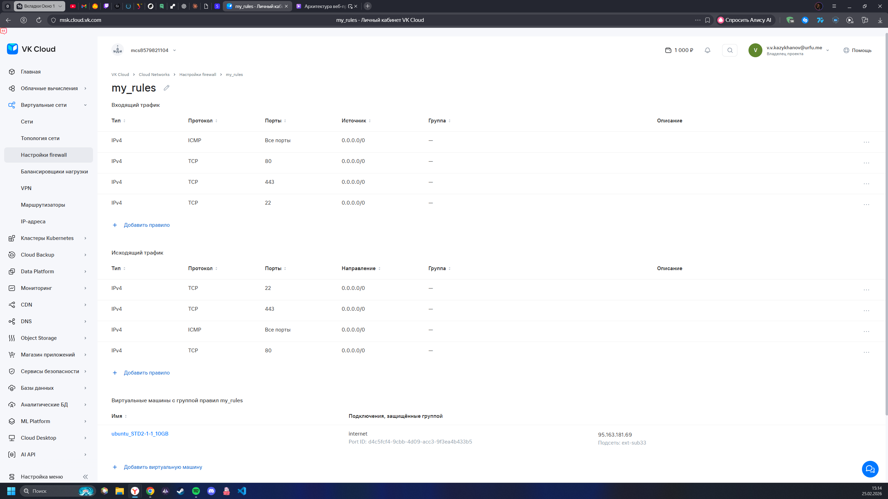
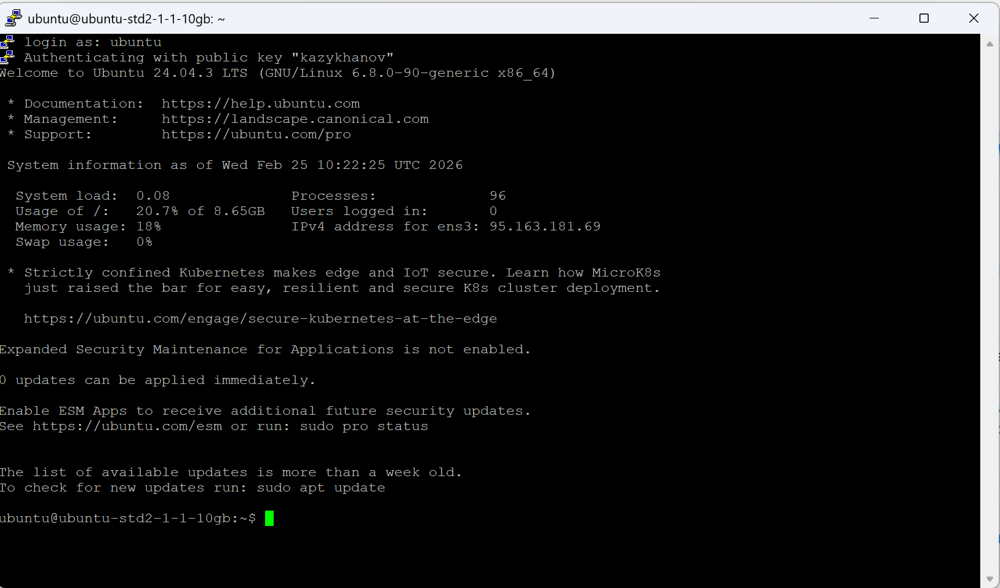
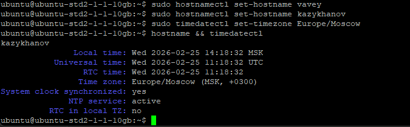
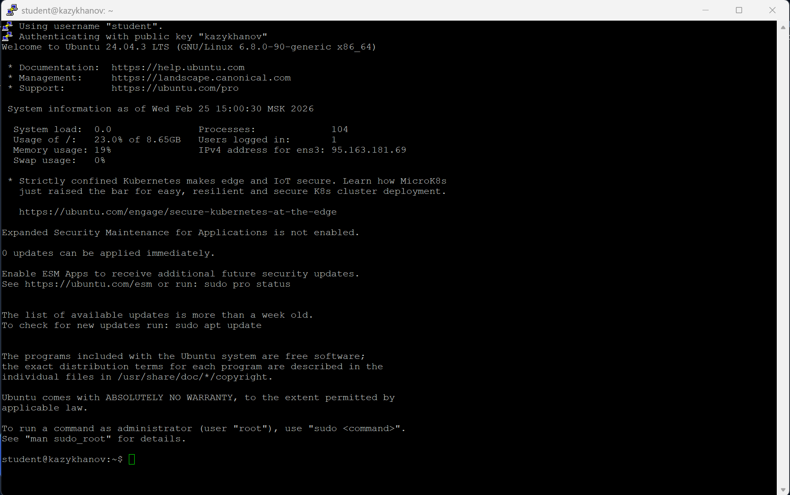
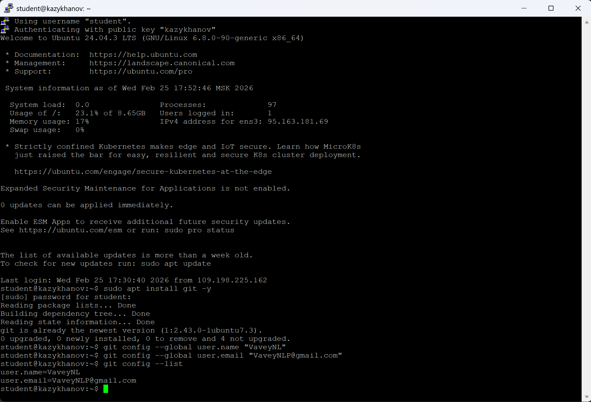
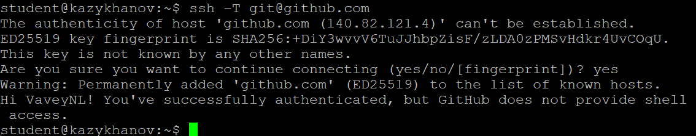
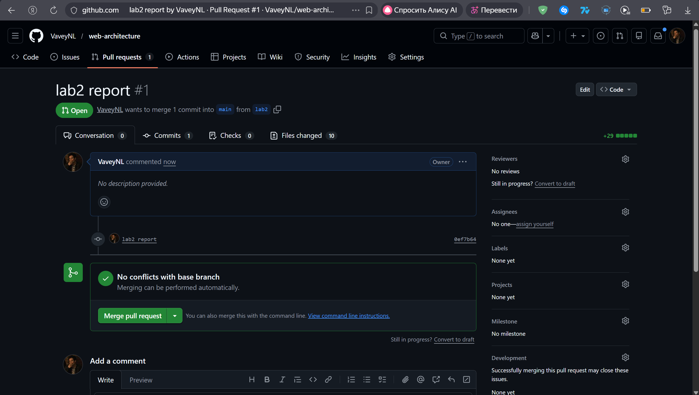

# Практика 2 — SSH, VPS, Git

## Задание 1. SSH-ключ
Сгенерирован SSH-ключ ed25519.

## Задание 2. VPS и файрвол
Создана VPS в VK Cloud, настроен файрвол.

## Задание 3. Подключение PuTTY

## Задание 4. Настройка сервера

## Задание 5. Пользователь student

## Задание 6. Git и SSH

## Задание 7. Репозиторий и структура

## Задание 8. Pull Request

