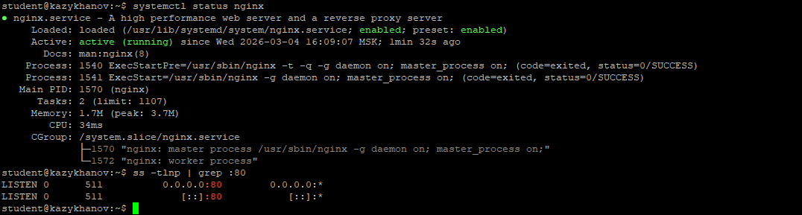
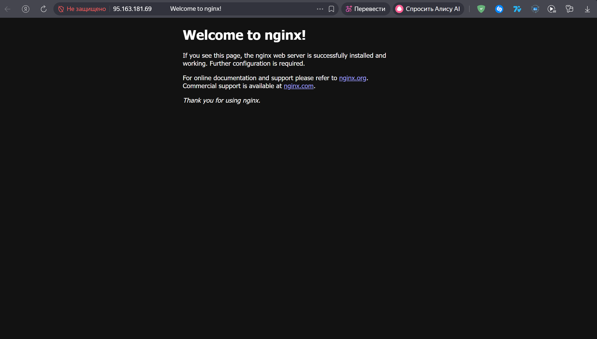
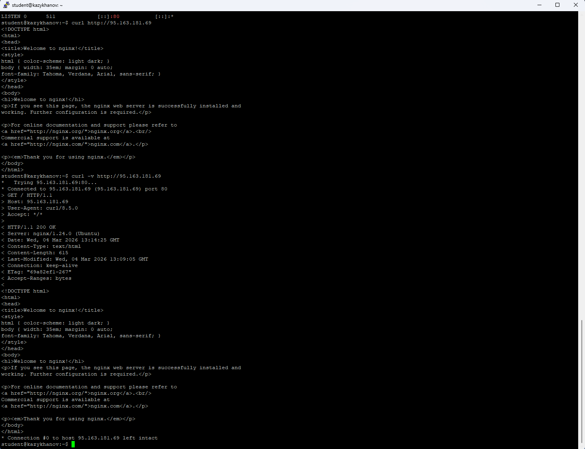
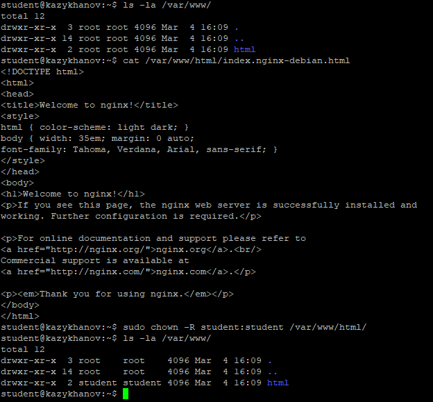
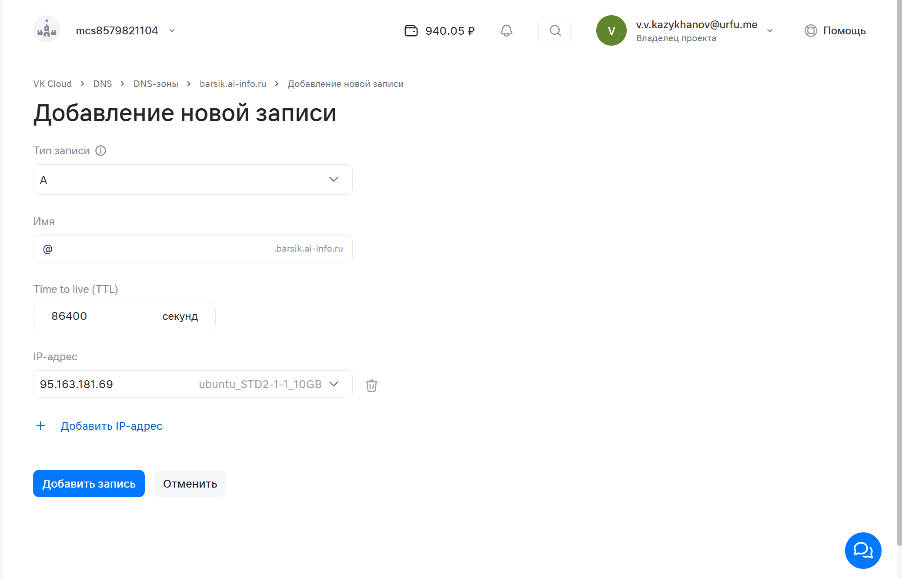
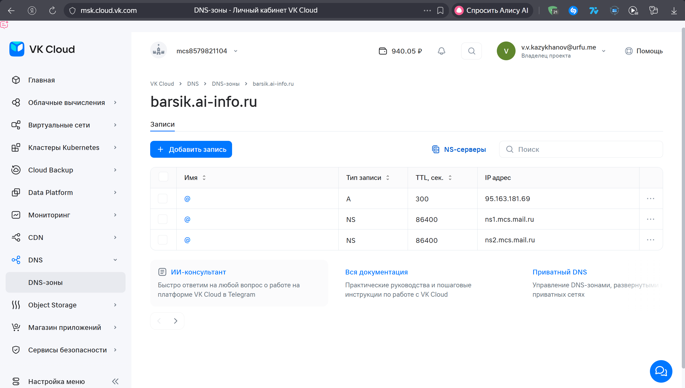
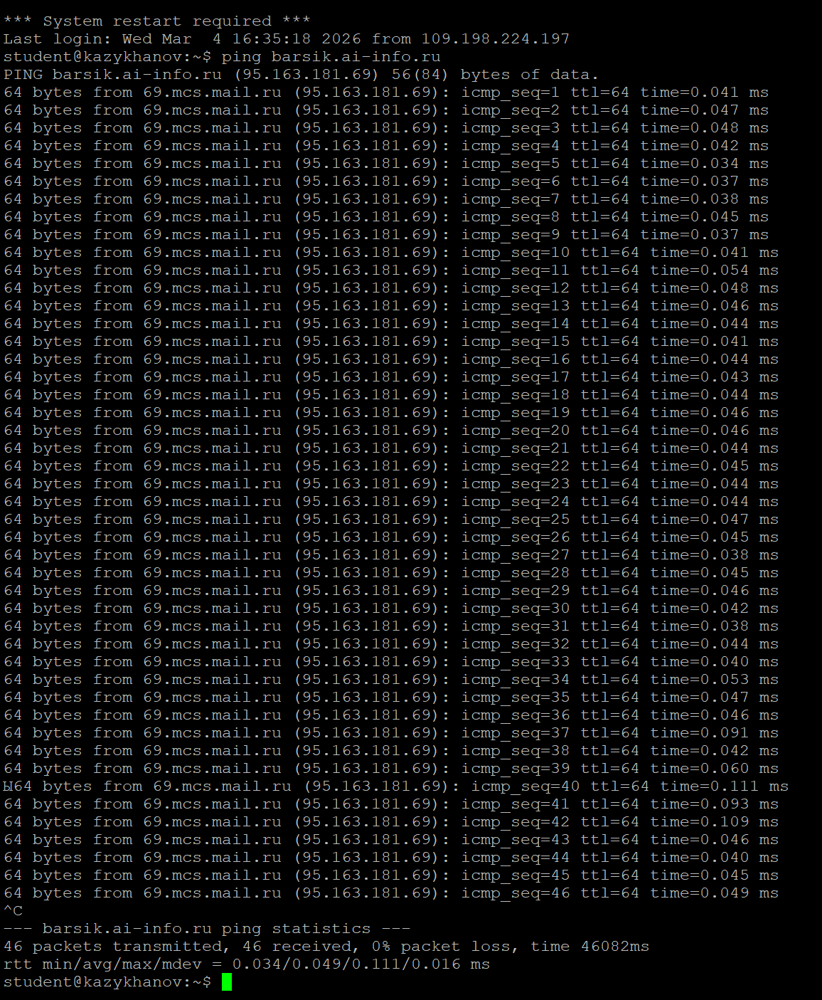
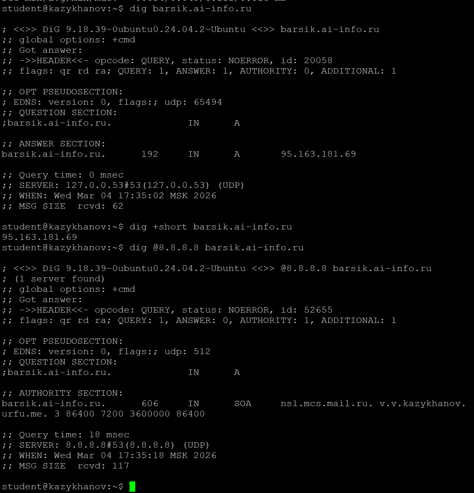
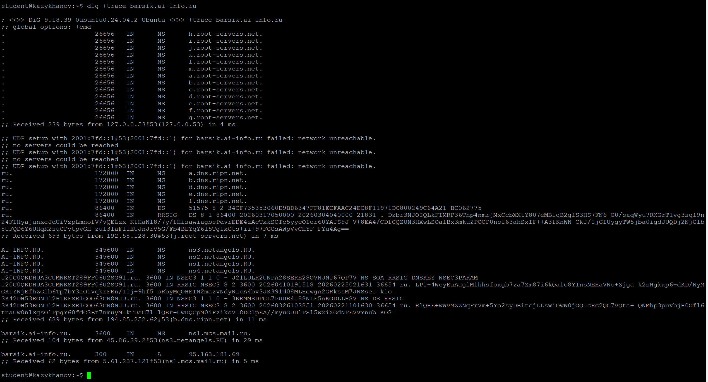
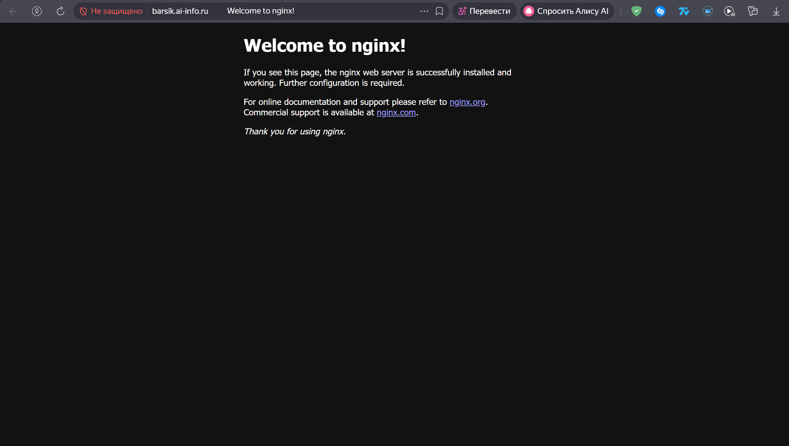

# Практическая работа №3. Nginx, DNS

**Студент:** Казыханов Владимир  
**VPS:** Ubuntu 22.04, VK Cloud  
**IP VPS:** `95.163.181.69`  
**Домен:** `barsik.ai-info.ru`

---

## Часть A. Nginx

### Задание 1. Установка Nginx

Обновлён список пакетов, установлен Nginx. Проверен статус сервиса и прослушиваемый порт.

```bash
sudo apt update && sudo apt install nginx -y
systemctl status nginx
ss -tlnp | grep :80
```

Nginx запущен, статус — `active (running)`, порт 80 прослушивается процессом Nginx (PID 1570).



---

### Задание 2. Страница по IP

Открыт адрес `http://95.163.181.69` в браузере. Отображается дефолтная страница «Welcome to nginx!».



---

### Задание 3. curl

Выполнена проверка сайта из терминала:

```bash
curl http://95.163.181.69
curl -v http://95.163.181.69
```

Разбор вывода `curl -v`:

- **Строка запроса:** `> GET / HTTP/1.1` — клиент отправляет GET-запрос на корневой путь `/` по протоколу HTTP/1.1.
- **Код ответа:** `< HTTP/1.1 200 OK` — сервер успешно обработал запрос (код 200).
- **Content-Type:** `< Content-Type: text/html` — сервер возвращает HTML-документ.
- **Server:** `< Server: nginx/1.24.0 (Ubuntu)` — версия Nginx.
- **Content-Length:** `< Content-Length: 615` — размер ответа в байтах.



---

### Задание 4. Директория и права

Найден файл, который Nginx отдаёт по умолчанию — `/var/www/html/index.nginx-debian.html`. Владелец директории изменён с `root` на `student`:

```bash
ls -la /var/www/
cat /var/www/html/index.nginx-debian.html
sudo chown -R student:student /var/www/html/
ls -la /var/www/
```

До `chown`: владелец `root root`. После `chown`: владелец `student student`. Теперь пользователь `student` может редактировать файлы сайта без `sudo`.



---

### Задание 5. Конфигурация Nginx

Просмотрен дефолтный конфиг:

```bash
cat /etc/nginx/sites-available/default
```

Ключевые директивы:

| Директива | Значение | Описание |
|-----------|----------|----------|
| `listen` | `80 default_server` | Nginx слушает входящие соединения на порту 80 и является сервером по умолчанию |
| `root` | `/var/www/html` | Корневая директория, откуда Nginx берёт файлы для отдачи клиенту |
| `server_name` | `_` | Принимает запросы на любое имя хоста (символ `_` — заглушка) |
| `index` | `index.html index.htm index.nginx-debian.html` | Список файлов, которые Nginx ищет при запросе директории (по порядку приоритета) |

---

## Часть B. DNS

### Задание 6. DNS-зона

Создана DNS-зона `barsik.ai-info.ru` в панели VK Cloud. NS-серверы зоны: `ns1.mcs.mail.ru`, `ns2.mcs.mail.ru`.

Путь: DNS → Зоны DNS → Создать зону → имя: `barsik.ai-info.ru`.



---

### Задание 7. A-запись

Создана A-запись, связывающая домен с IP-адресом VPS:

| Параметр | Значение |
|----------|----------|
| Тип | A |
| Имя | @ |
| Значение | 95.163.181.69 |
| TTL | 300 |

`@` означает саму зону, т.е. `barsik.ai-info.ru`. TTL = 300 секунд (5 минут) — время кэширования записи.



---

### Задание 8. ping

Проверена работа DNS с помощью `ping`:

```bash
ping barsik.ai-info.ru
```

Домен успешно резолвится в IP-адрес VPS: `PING barsik.ai-info.ru (95.163.181.69)`. Все 46 пакетов получены, потерь нет (0% packet loss).



---

### Задание 9. dig

Выполнены три варианта запроса:

```bash
dig barsik.ai-info.ru
dig +short barsik.ai-info.ru
dig @8.8.8.8 barsik.ai-info.ru
```

Разбор полного вывода `dig barsik.ai-info.ru`:

- **QUESTION SECTION:** `;barsik.ai-info.ru. IN A` — запрошена A-запись для домена.
- **ANSWER SECTION:** `barsik.ai-info.ru. 192 IN A 95.163.181.69` — ответ: IP-адрес VPS, TTL = 192 секунды (остаток от 300).
- **SERVER:** `127.0.0.53#53` — локальный DNS-резолвер.

Вывод `dig +short`: `95.163.181.69` — только IP-адрес.

Вывод `dig @8.8.8.8`: запрос через Google Public DNS. В AUTHORITY SECTION — SOA-запись с `ns1.mcs.mail.ru`, подтверждающая, что зона делегирована на NS-серверы VK Cloud.



---

### Задание 10. dig +trace

Выполнена трассировка DNS-резолвинга:

```bash
dig +trace barsik.ai-info.ru
```

Четыре шага резолвинга:

1. **Корень (.)** — запрос к корневым серверам (`h.root-servers.net.`, `i.root-servers.net.` и др.): кто отвечает за зону `.ru`?
2. **Зона .ru** — запрос к серверам `.ru` (`a.dns.ripn.net.`, `b.dns.ripn.net.` и др.): кто отвечает за `ai-info.ru`? Ответ: `ns1.netangels.RU.`, `ns2.netangels.RU.` и др.
3. **NS-серверы ai-info.ru** — запрос к `ns3.netangels.RU`: кто отвечает за `barsik.ai-info.ru`? Ответ: `ns1.mcs.mail.ru.` (NS VK Cloud).
4. **A-запись** — запрос к `ns1.mcs.mail.ru`: итоговый ответ `barsik.ai-info.ru. 300 IN A 95.163.181.69`.



---

### Задание 11. Сайт по домену

Открыт домен `http://barsik.ai-info.ru` в браузере. Отображается та же дефолтная страница «Welcome to nginx!», что и при обращении по IP.


