# Практическая работа №4. HTTP, виртуальные хосты, проект Boardy

**Студент:** Казыханов Владимир  
**VPS:** Ubuntu 22.04, VK Cloud  
**IP VPS:** `95.163.181.69`  
**Домен:** `barsik.ai-info.ru`  
**API:** `api.barsik.ai-info.ru`

---

## Часть A. Виртуальный хост основного сайта

### Задание 1. Директория проекта

Создана директория `/var/www/boardy`, владелец — `student`:

```bash
sudo mkdir -p /var/www/boardy
sudo chown $USER:$USER /var/www/boardy
ls -la /var/www/
```

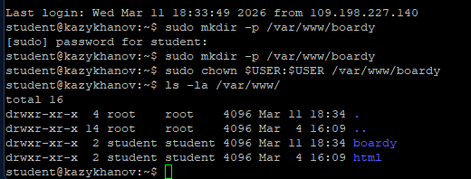

---

### Задание 2. Конфиг виртуального хоста

Создан конфиг `/etc/nginx/sites-available/boardy`, активирован через симлинку. Дефолтный конфиг отключён.

```bash
sudo nano /etc/nginx/sites-available/boardy
sudo ln -s /etc/nginx/sites-available/boardy /etc/nginx/sites-enabled/
sudo rm /etc/nginx/sites-enabled/default
sudo nginx -t
sudo systemctl reload nginx
```

Содержимое конфига:

```nginx
server {
    listen 80;
    server_name barsik.ai-info.ru;

    root /var/www/boardy;
    index index.html;

    access_log /var/log/nginx/boardy-access.log;
    error_log  /var/log/nginx/boardy-error.log;

    location / {
        try_files $uri $uri/ =404;
    }

    error_page 404 /404.html;
}
```

Описание директив:

| Директива | Описание |
|-----------|----------|
| `server_name barsik.ai-info.ru` | Виртуальный хост обрабатывает запросы с заголовком Host равным `barsik.ai-info.ru` |
| `root /var/www/boardy` | Корневая директория, откуда Nginx берёт файлы сайта |
| `access_log` | Путь к логу запросов для этого виртуального хоста (отдельно от других сайтов) |
| `error_log` | Путь к логу ошибок для этого виртуального хоста |
| `try_files $uri $uri/ =404` | Nginx ищет запрошенный файл, затем директорию, если не найдено — возвращает 404 |
| `error_page 404 /404.html` | При ошибке 404 отдаёт кастомную страницу `/404.html` |

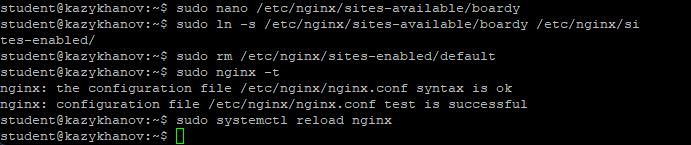

---

## Часть B. Страницы проекта

### Задание 3. Лендинг

Создана главная страница `/var/www/boardy/index.html` с названием проекта, описанием и ссылкой на форму обратной связи.

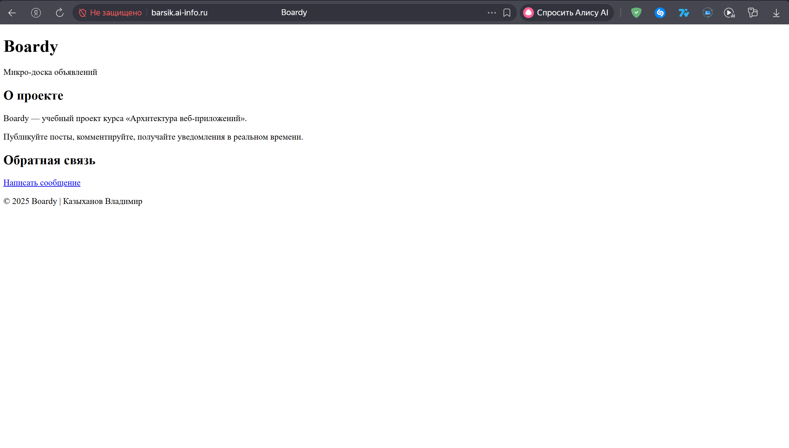

---

### Задание 4. Форма обратной связи

Создана страница `/var/www/boardy/feedback.html` с формой: поля «Имя» и «Сообщение», кнопка «Отправить». Атрибуты формы: `method="POST" action="/submit"`.

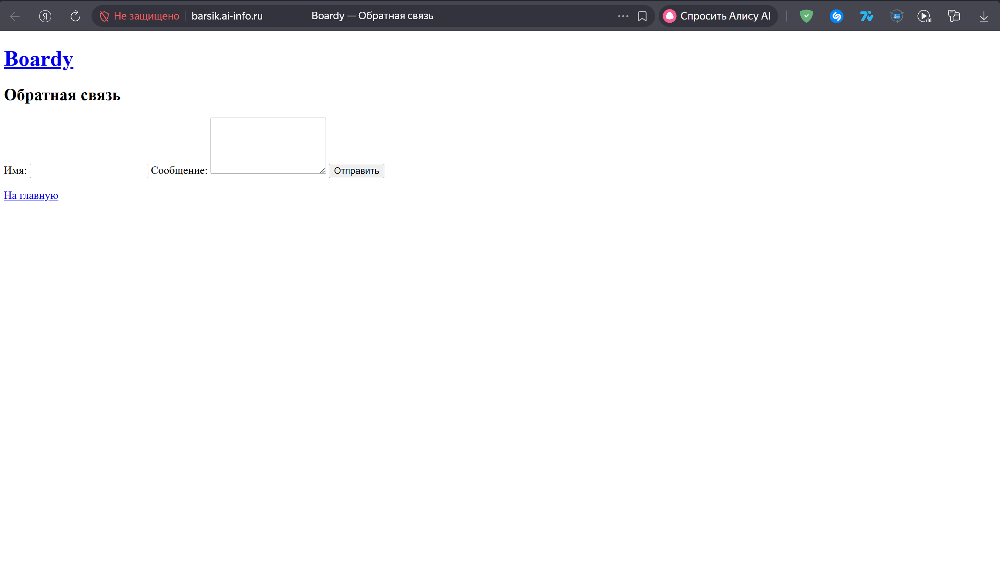

---

### Задание 5. Стили и 404

Создан файл стилей `css/style.css`, подключённый ко всем страницам. Создана кастомная страница `404.html`.

При обращении к несуществующему URL (`http://barsik.ai-info.ru/nonexistent`) Nginx возвращает кастомную страницу ошибки.

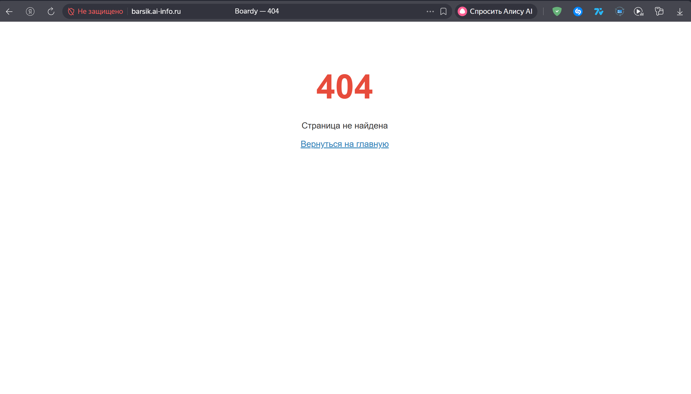

---

## Часть C. Второй виртуальный хост — API

### Задание 6. DNS-запись для поддомена

Создана A-запись в VK Cloud для поддомена API:

| Параметр | Значение |
|----------|----------|
| Тип | A |
| Имя | api |
| Значение | 95.163.181.69 |
| TTL | 300 |

Оба домена (`barsik.ai-info.ru` и `api.barsik.ai-info.ru`) указывают на один и тот же IP — разницу определяет Nginx по заголовку `Host`.

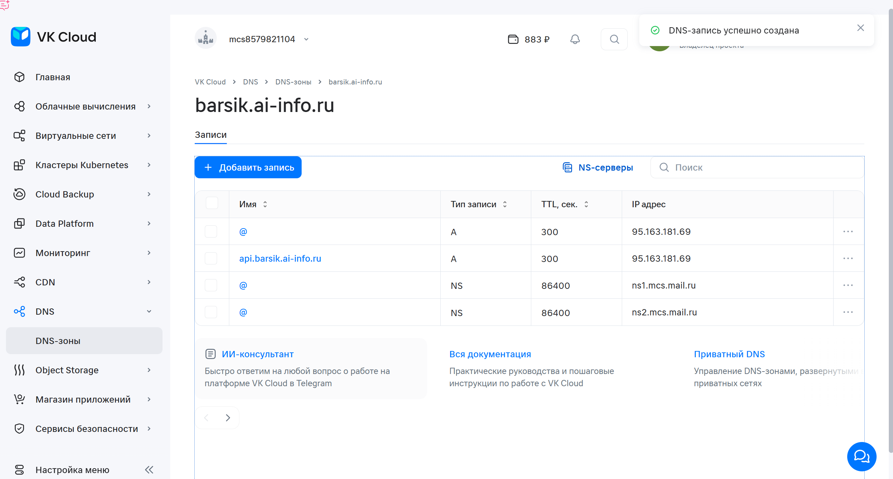

---

### Задание 7. Проверка DNS

```bash
dig +short api.barsik.ai-info.ru
# 95.163.181.69

dig @8.8.8.8 +short api.barsik.ai-info.ru
# 95.163.181.69
```

Поддомен успешно резолвится в IP VPS.

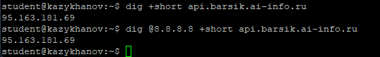

---

### Задание 8. Конфиг и заглушка API

Создана директория `/var/www/boardy-api` с заглушкой `index.html` (текст: «Boardy API — Service: OK»).

Конфиг `/etc/nginx/sites-available/boardy-api`:

```nginx
server {
    listen 80;
    server_name api.barsik.ai-info.ru;

    root /var/www/boardy-api;
    index index.html;

    access_log /var/log/nginx/boardy-api-access.log;
    error_log  /var/log/nginx/boardy-api-error.log;

    location / {
        try_files $uri $uri/ =404;
    }
}
```

Активирован через симлинку, проверен `nginx -t`, применён `reload`.

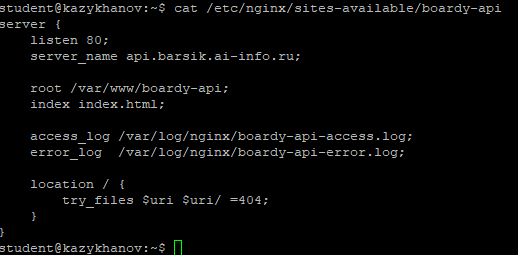

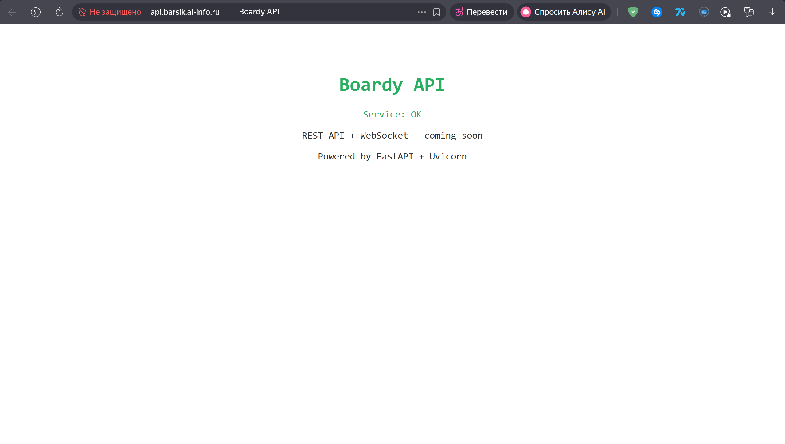

---

## Часть D. Исследование HTTP

### Задание 9. GET-запрос через curl -v

```bash
curl -v http://barsik.ai-info.ru/
```

Разбор вывода:

- **Стартовая строка запроса:** `> GET / HTTP/1.1` — метод GET, путь `/`, протокол HTTP/1.1.
- **Заголовок Host:** `> Host: barsik.ai-info.ru` — определяет, какой виртуальный хост обработает запрос.
- **Стартовая строка ответа:** `< HTTP/1.1 200 OK` — код 200, запрос успешен.
- **Content-Type:** `< Content-Type: text/html` — сервер возвращает HTML-документ.
- **Content-Length:** `< Content-Length: 1007` — размер тела ответа в байтах.

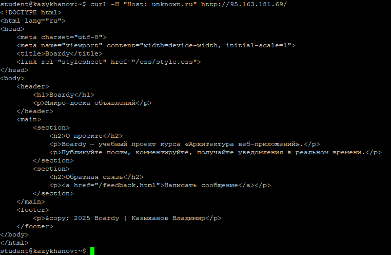

---

### Задание 10. Виртуальные хосты в действии

Три запроса по IP с разными заголовками Host:

```bash
curl -H "Host: barsik.ai-info.ru" http://95.163.181.69/
# → Лендинг Boardy (index.html из /var/www/boardy)

curl -H "Host: api.barsik.ai-info.ru" http://95.163.181.69/
# → Заглушка API (index.html из /var/www/boardy-api)

curl -H "Host: unknown.ru" http://95.163.181.69/
# → Лендинг Boardy (boardy — первый по алфавиту, стал default)
```

Один IP возвращает разные страницы, потому что Nginx определяет виртуальный хост по заголовку `Host`. Третий запрос с `Host: unknown.ru` вернул лендинг Boardy, так как ни один `server_name` не совпал, и Nginx выбрал первый сервер в порядке загрузки конфигов как сервер по умолчанию.

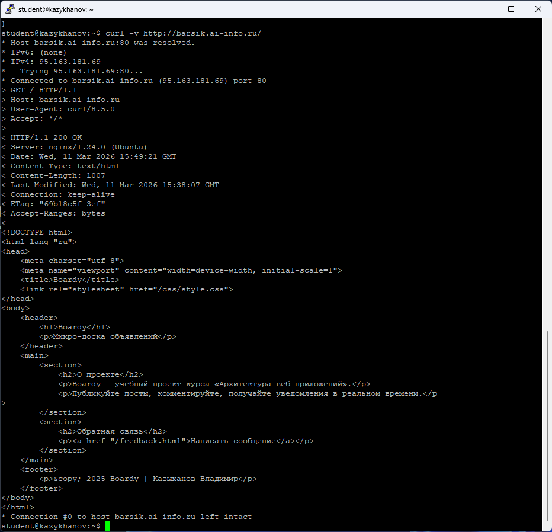

---

### Задание 11. POST-запрос

```bash
curl -v -X POST -d "name=Kazykhanov&message=Hello" http://barsik.ai-info.ru/submit
```

Разбор вывода:

- **Метод:** `> POST /submit HTTP/1.1` — отправка данных формы.
- **Content-Type запроса:** `> Content-Type: application/x-www-form-urlencoded` — формат данных формы.
- **Тело запроса:** `name=Kazykhanov&message=Hello` — данные из полей формы.
- **Код ответа:** `< HTTP/1.1 404 Not Found` — Nginx не нашёл файл `/submit`.

Nginx вернул 404, потому что `try_files` ищет файл `/submit` на диске, не находит и возвращает ошибку. Nginx — веб-сервер для статики, он не умеет обрабатывать POST-данные. На Практике 6 подключим CGI-скрипт, на Практике 9 — Laravel.

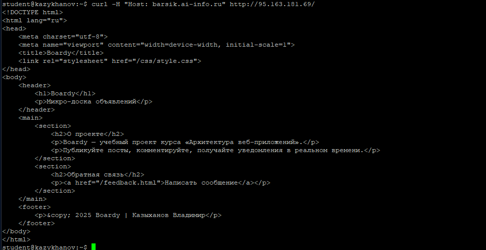
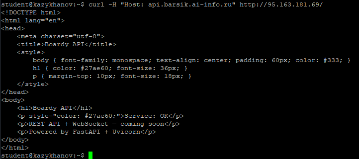
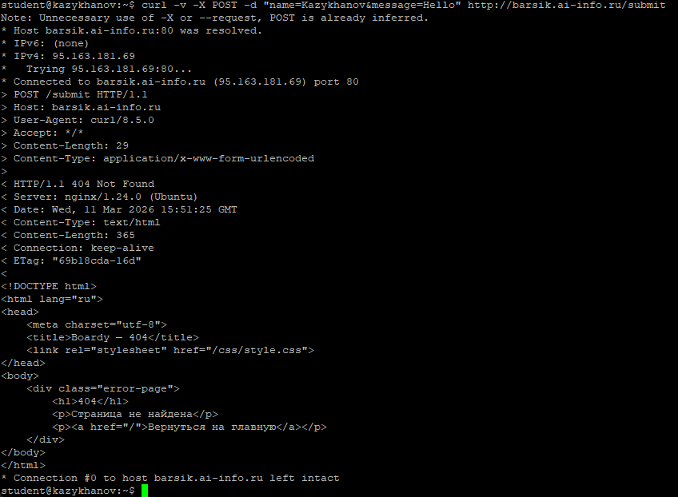

---

### Задание 12. HEAD-запрос

```bash
curl -v http://barsik.ai-info.ru/    # GET — заголовки + тело
curl -I http://barsik.ai-info.ru/    # HEAD — только заголовки
```

Результат `curl -I`:

```
HTTP/1.1 200 OK
Server: nginx/1.24.0 (Ubuntu)
Content-Type: text/html
Content-Length: 1007
```

HEAD возвращает те же заголовки, что и GET, но **без тела ответа**. Это полезно для быстрой проверки: существует ли ресурс, какой у него размер и тип — без скачивания всего содержимого.

---

## Часть E. Логи

### Задание 13. Раздельные логи

```bash
tail -5 /var/log/nginx/boardy-access.log
tail -5 /var/log/nginx/boardy-api-access.log
```

Пример строки лога boardy:

```
95.163.181.69 - - [11/Mar/2026:18:49:44 +0300] "GET / HTTP/1.1" 200 1007 "-" "curl/8.5.0"
│               │                                 │                │    │         │
IP              дата/время                        метод+путь       код  размер    User-Agent
```

Запросы к `barsik.ai-info.ru` попадают в `boardy-access.log`, а запросы к `api.barsik.ai-info.ru` — в `boardy-api-access.log`. Раздельные логи позволяют анализировать трафик каждого сервиса независимо.

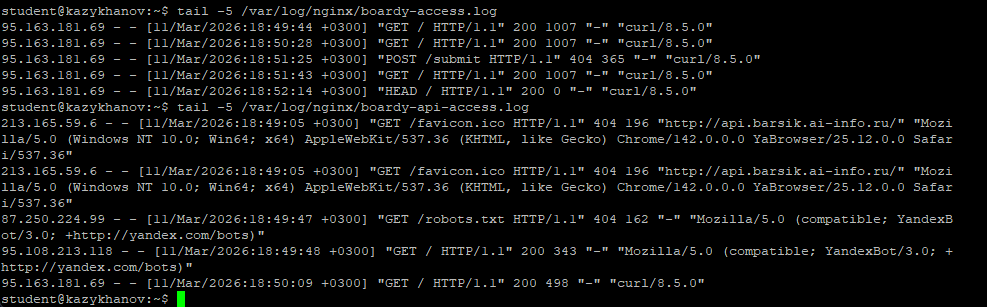

---

### Задание 14. Фильтрация логов

Статистика кодов ответа:

```bash
awk '{print $9}' /var/log/nginx/boardy-access.log | sort | uniq -c | sort -rn
```

Результат:

```
      9 200
      7 404
```

9 успешных запросов (200 OK) и 7 ошибок «не найдено» (404).

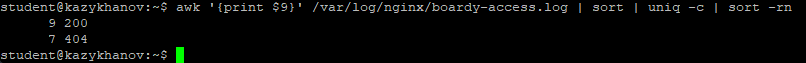
