# Практическая работа №5. HTTPS для Boardy

**Студент:** Казыханов Владимир  
**VPS:** Ubuntu 24.04, VK Cloud  
**IP VPS:** `95.163.181.69`  
**Домен:** `barsik.ai-info.ru`  
**API:** `api.barsik.ai-info.ru`

---

## Часть A. HTTPS для основного сайта

### Задание 1. Установка certbot

Установлены пакеты `certbot` и `python3-certbot-nginx`:

```bash
sudo apt update
sudo apt install -y certbot python3-certbot-nginx
certbot --version
```

Версия certbot: `2.9.0`.

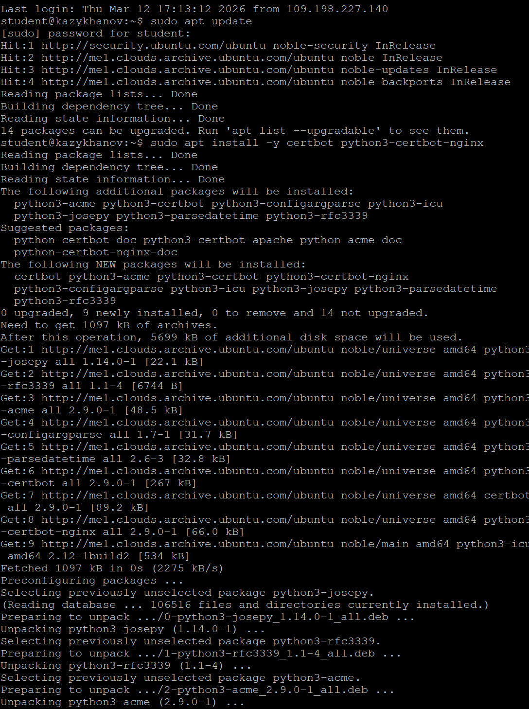
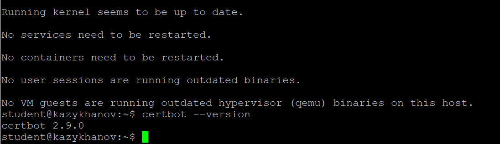

---

### Задание 2. Получение сертификата

Получен SSL-сертификат от Let's Encrypt:

```bash
sudo certbot --nginx -d barsik.ai-info.ru
```

Certbot автоматически подтвердил владение доменом, получил сертификат, настроил Nginx (listen 443 ssl, пути к сертификату, редирект HTTP → HTTPS). Сертификат действителен до 10 июня 2026.


---

### Задание 3. Проверка в браузере

Открыт `https://barsik.ai-info.ru/` — в адресной строке замочек, подключение защищено.

Информация о сертификате:

- **Кому выдан (CN):** barsik.ai-info.ru
- **Кем выдан:** ESET SSL Filter CA (локальный антивирусный прокси; реальный issuer — Let's Encrypt E7)
- **Срок действия:** 12 марта 2026 — 10 июня 2026

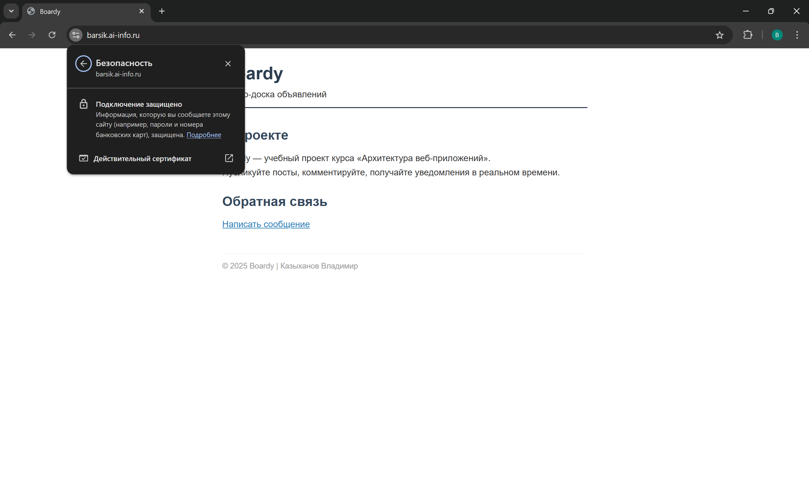
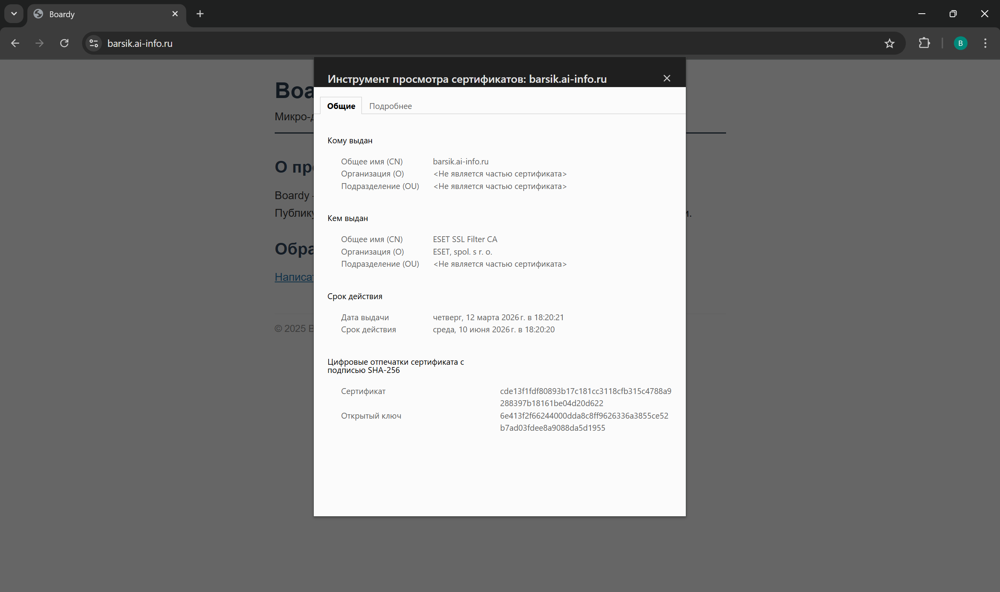

---

### Задание 4. Редирект

```bash
curl -v http://barsik.ai-info.ru/
```

Результат:

- **Код ответа:** `HTTP/1.1 301 Moved Permanently` — HTTP автоматически перенаправляет на HTTPS.
- **Заголовок Location:** `https://barsik.ai-info.ru/` — адрес, на который происходит перенаправление.

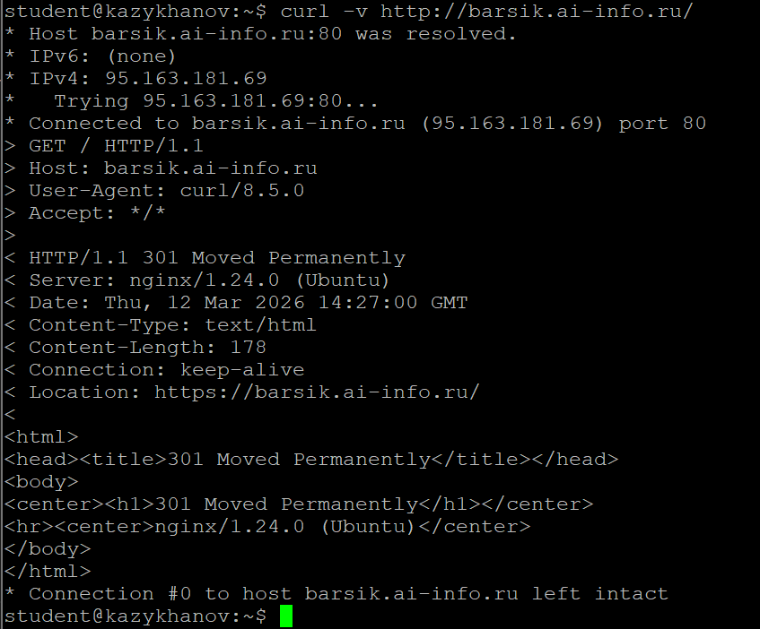

---

### Задание 5. Конфиг после certbot

```bash
cat /etc/nginx/sites-available/boardy
```

Строки, добавленные certbot:

- `listen 443 ssl;` — Nginx слушает порт 443 (HTTPS).
- `ssl_certificate /etc/letsencrypt/live/barsik.ai-info.ru/fullchain.pem;` — путь к сертификату и цепочке доверия.
- `ssl_certificate_key /etc/letsencrypt/live/barsik.ai-info.ru/privkey.pem;` — путь к приватному ключу.
- `include /etc/letsencrypt/options-ssl-nginx.conf;` — рекомендованные настройки SSL.
- `ssl_dhparam /etc/letsencrypt/ssl-dhparams.pem;` — параметры Диффи-Хеллмана.

Также certbot добавил второй блок `server` на порту 80, который перенаправляет HTTP → HTTPS через `return 301`.

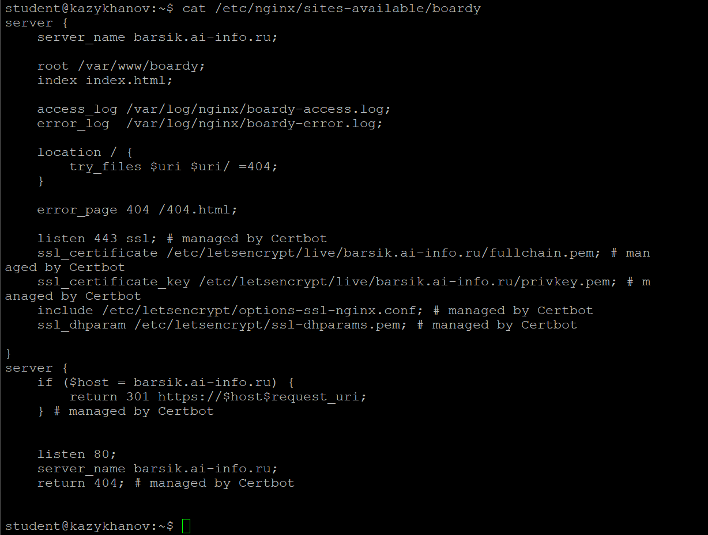

---

## Часть B. HTTPS для API-сервиса

### Задание 6. Сертификат для api-поддомена

```bash
sudo certbot --nginx -d api.barsik.ai-info.ru
```

Сертификат успешно получен и развёрнут в `/etc/nginx/sites-enabled/boardy-api`. HTTPS включён на `api.barsik.ai-info.ru`. Сертификат действителен до 10 июня 2026.

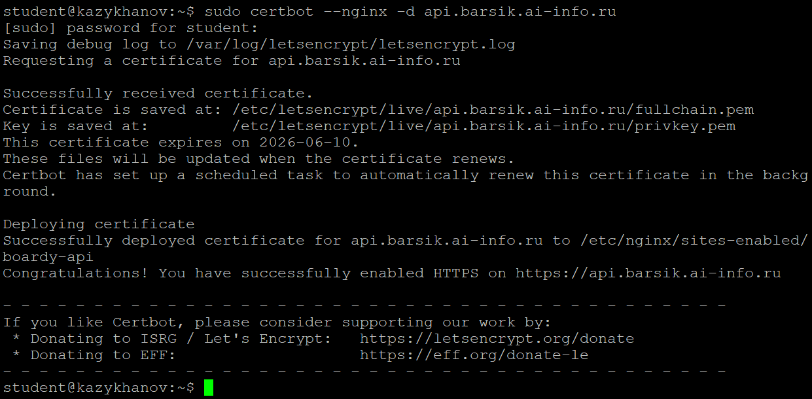

---

### Задание 7. Проверка обоих доменов

```bash
curl -I https://barsik.ai-info.ru/
curl -I https://api.barsik.ai-info.ru/
```

Оба домена отвечают `HTTP/1.1 200 OK` по HTTPS. Основной сайт возвращает Content-Length: 1007 (лендинг), API — Content-Length: 498 (заглушка).

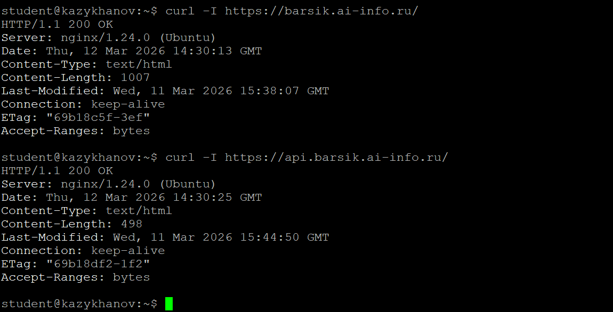

---

## Часть C. Разбор TLS

### Задание 8. TLS handshake

```bash
curl -v https://barsik.ai-info.ru/ 2>&1 | head -25
```

Разбор вывода:

- **Версия TLS:** TLSv1.3 — актуальная версия протокола.
- **Handshake:** Client hello → Server hello → Encrypted Extensions → Certificate → CERT verify → Finished.
- **Порт:** 443 (стандартный для HTTPS).

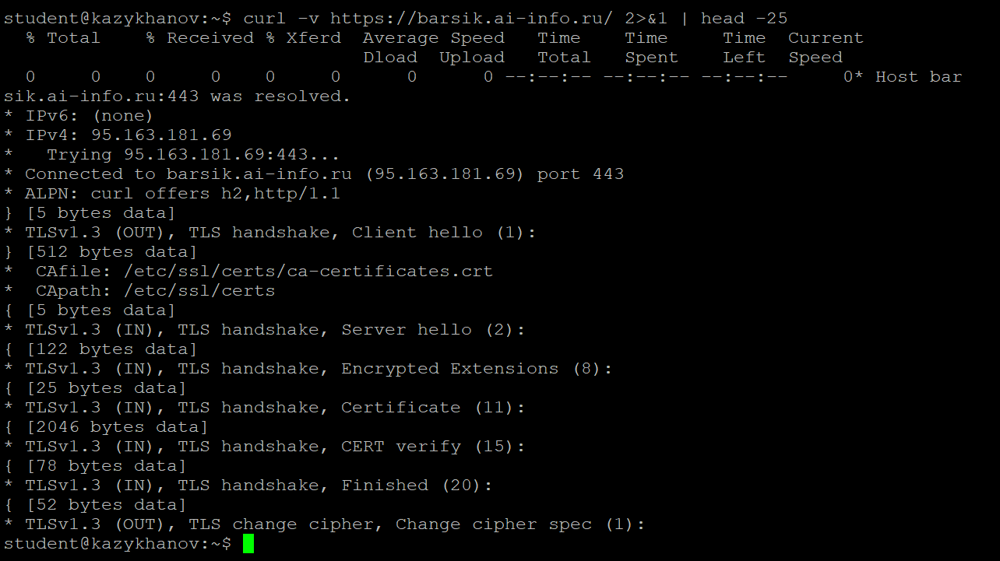

---

### Задание 9. Цепочка доверия

```bash
echo | openssl s_client -connect barsik.ai-info.ru:443 -showcerts 2>/dev/null | grep -E 's:|i:'
```

Цепочка доверия:

```
barsik.ai-info.ru (сертификат сайта)
  ↑ подписан
Let's Encrypt E7 (промежуточный CA)
  ↑ подписан
ISRG Root X1 (корневой CA, встроен в ОС)
```

Браузер проверяет снизу вверх: сертификат сайта подписан Let's Encrypt E7, который подписан ISRG Root X1. Корневой сертификат встроен в ОС — все звенья сходятся, браузер показывает замочек.

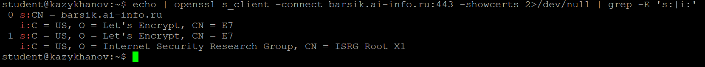

---

### Задание 10. Сравнение сертификатов

```bash
echo | openssl s_client -connect barsik.ai-info.ru:443 2>/dev/null | openssl x509 -noout -subject -dates
echo | openssl s_client -connect api.barsik.ai-info.ru:443 2>/dev/null | openssl x509 -noout -subject -dates
```

Результаты:

| Параметр | barsik.ai-info.ru | api.barsik.ai-info.ru |
|----------|-------------------|-----------------------|
| Subject (CN) | barsik.ai-info.ru | api.barsik.ai-info.ru |
| notBefore | Mar 12 13:20:21 2026 | Mar 12 13:30:57 2026 |
| notAfter | Jun 10 13:20:20 2026 | Jun 10 13:30:56 2026 |

**Общее:** оба сертификата выданы Let's Encrypt, оба действуют 90 дней (до 10 июня 2026).

**Различия:** разные subject (CN) — каждый сертификат привязан к своему домену. Разное время выдачи (получены с разницей в 10 минут).

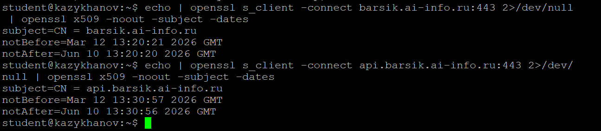

---

## Часть D. HSTS, кэширование, gzip

### Задание 11. HSTS

В конфиг `/etc/nginx/sites-available/boardy` (блок `listen 443 ssl`) добавлена директива:

```nginx
add_header Strict-Transport-Security "max-age=31536000" always;
```

Проверка:

```bash
curl -I https://barsik.ai-info.ru/ | grep Strict
# Strict-Transport-Security: max-age=31536000
```

**Что такое HSTS:** заголовок `Strict-Transport-Security` указывает браузеру запомнить, что сайт работает только по HTTPS. В течение `max-age` секунд (1 год) браузер будет автоматически заменять `http://` на `https://` ещё до отправки запроса. Защищает от даунгрейд-атак, когда злоумышленник пытается перехватить незашифрованный HTTP-трафик.

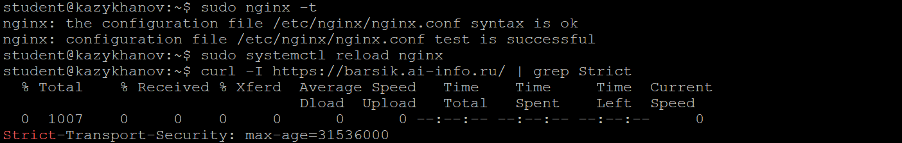

---

### Задание 12. Кэширование и gzip

В конфиг boardy добавлено кэширование статики:

```nginx
location ~* \.(css|js|png|jpg|jpeg|gif|ico|svg)$ {
    expires 7d;
    add_header Cache-Control "public, no-transform";
}
```

В `/etc/nginx/nginx.conf` включён gzip:

```nginx
gzip on;
gzip_types text/plain text/css application/json application/javascript text/xml application/xml application/xml+rss text/javascript;
gzip_min_length 256;
```

Проверка:

```bash
curl -I https://barsik.ai-info.ru/css/style.css | grep -E 'Cache|Expires'
# Expires: Thu, 19 Mar 2026 14:47:06 GMT
# Cache-Control: max-age=604800
# Cache-Control: public, no-transform

curl -H "Accept-Encoding: gzip" -I https://barsik.ai-info.ru/ | grep Content-Encoding
# Content-Encoding: gzip
```

Кэширование работает (Cache-Control + Expires на 7 дней), gzip сжатие включено.

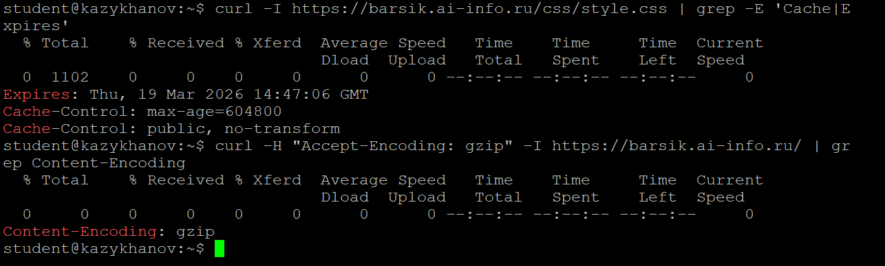

---

### Задание 13. Автообновление

```bash
sudo certbot renew --dry-run
```

Тестовое обновление пройдено успешно. Certbot автоматически обновляет сертификаты каждые 60 дней через systemd-таймер.

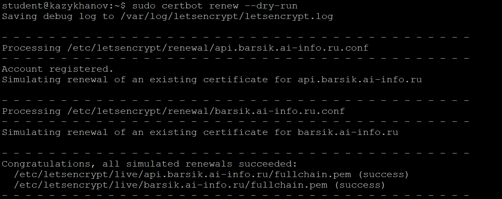
