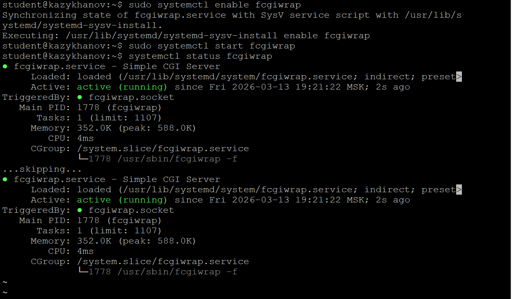
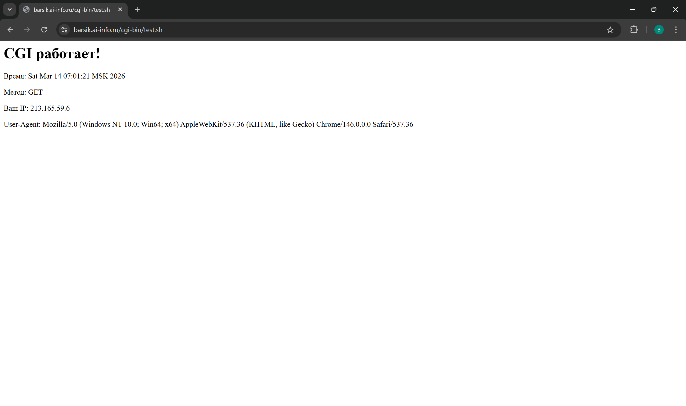
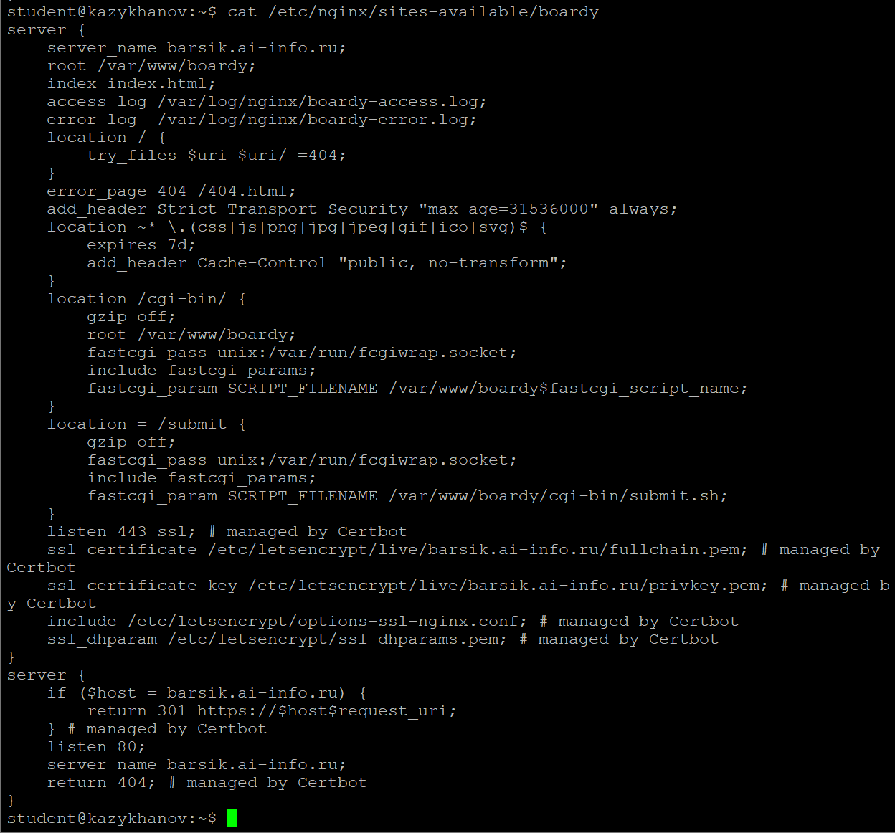
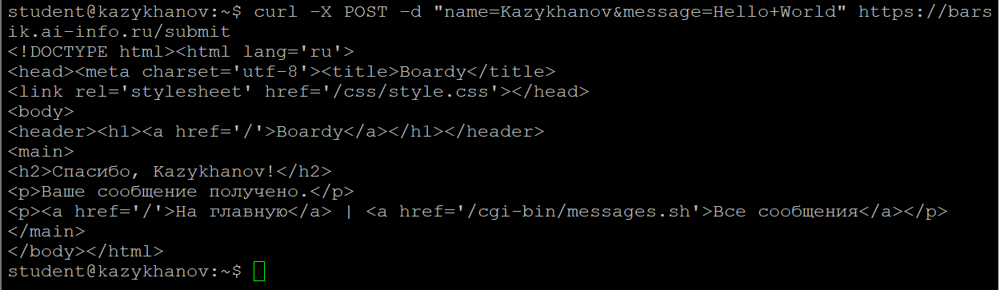
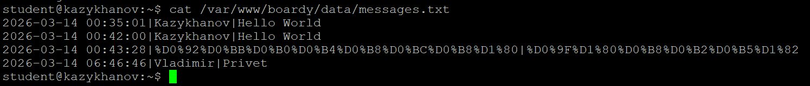
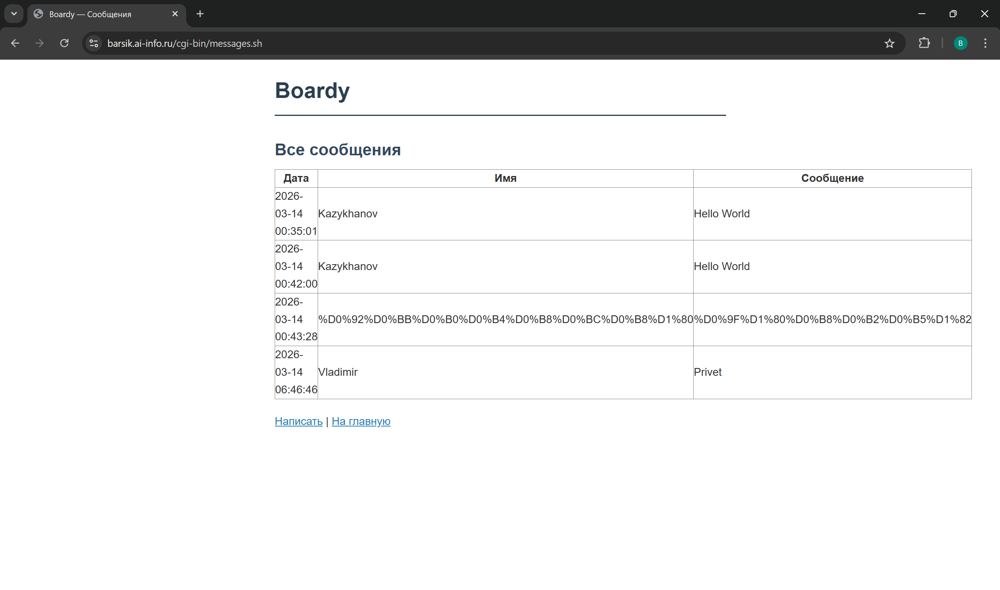
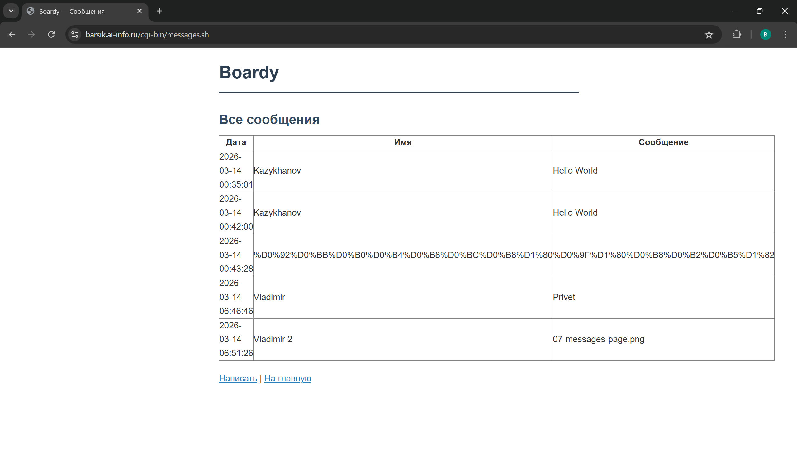

# Практическая работа №6. CGI: Boardy оживает

**Студент:** Казыханов Владимир  
**VPS:** Ubuntu 24.04, VK Cloud  
**IP VPS:** `95.163.181.69`  
**Домен:** `barsik.ai-info.ru`

---

## Часть A. CGI-скрипт

### Задание 1. Установка fcgiwrap

Установлен пакет `fcgiwrap` — посредник между Nginx и CGI-скриптами:

```bash
sudo apt install -y fcgiwrap
sudo systemctl enable fcgiwrap
sudo systemctl start fcgiwrap
systemctl status fcgiwrap
```

Статус — `active (running)`, PID 1778, сокет `/var/run/fcgiwrap.socket`.



---

### Задание 2. Тестовый скрипт

Создан тестовый CGI-скрипт `/var/www/boardy/cgi-bin/test.sh`, который выводит время, метод запроса, IP и User-Agent:

```bash
#!/bin/bash
echo "Content-Type: text/html; charset=utf-8"
echo ""
echo "<html><body>"
echo "<h1>CGI работает!</h1>"
echo "<p>Время: $(date)</p>"
echo "<p>Метод: $REQUEST_METHOD</p>"
echo "<p>Ваш IP: $REMOTE_ADDR</p>"
echo "<p>User-Agent: $HTTP_USER_AGENT</p>"
echo "</body></html>"
```

Скрипт возвращает динамический контент — при каждом запросе время меняется.



---

### Задание 3. Конфигурация Nginx

В конфиг `/etc/nginx/sites-available/boardy` добавлены два блока location:

```nginx
location /cgi-bin/ {
    gzip off;
    root /var/www/boardy;
    fastcgi_pass unix:/var/run/fcgiwrap.socket;
    include fastcgi_params;
    fastcgi_param SCRIPT_FILENAME /var/www/boardy$fastcgi_script_name;
}

location = /submit {
    gzip off;
    fastcgi_pass unix:/var/run/fcgiwrap.socket;
    include fastcgi_params;
    fastcgi_param SCRIPT_FILENAME /var/www/boardy/cgi-bin/submit.sh;
}
```

Описание директив:

| Директива | Описание |
|-----------|----------|
| `fastcgi_pass unix:/var/run/fcgiwrap.socket` | Передаёт запрос через FastCGI-сокет в fcgiwrap, который запускает скрипт |
| `include fastcgi_params` | Подключает стандартные параметры FastCGI (REQUEST_METHOD, CONTENT_LENGTH и др.) |
| `fastcgi_param SCRIPT_FILENAME ...` | Указывает путь к скрипту, который нужно выполнить |



---

## Часть B. Форма Boardy

### Задание 4. Скрипт обработки формы

Создан скрипт `/var/www/boardy/cgi-bin/submit.sh`, который читает POST-данные из stdin, извлекает `name` и `message`, сохраняет в файл и возвращает HTML-ответ:

```bash
curl -X POST -d "name=Kazykhanov&message=Hello+World" https://barsik.ai-info.ru/submit
```

Ответ: «Спасибо, Kazykhanov!» — форма работает, данные принимаются.



---

### Задание 5. Форма в браузере

Открыта страница `https://barsik.ai-info.ru/feedback.html`, заполнена форма (имя: Vladimir, сообщение: Privet), отправлена. Результат — страница «Спасибо, Vladimir!».


---

### Задание 6. Данные на диске

```bash
cat /var/www/boardy/data/messages.txt
```

Файл содержит 4 сообщения в формате `дата|имя|сообщение`:

```
2026-03-14 00:35:01|Kazykhanov|Hello World
2026-03-14 00:42:00|Kazykhanov|Hello World
2026-03-14 00:43:28|%D0%92...|%D0%9F...
2026-03-14 06:46:46|Vladimir|Privet
```

Третье сообщение — кириллица в URL-кодировке (ограничение простого bash-парсера, не декодирует UTF-8).



---

## Часть C. Страница сообщений

### Задание 7. Скрипт вывода сообщений

Создан скрипт `/var/www/boardy/cgi-bin/messages.sh`, который читает `messages.txt` и генерирует HTML-таблицу с тремя колонками: Дата, Имя, Сообщение.



---

### Задание 8. Полный цикл

Отправлено новое сообщение через форму (Vladimir 2, 07-messages-page.png), затем открыта страница сообщений — новое сообщение появилось в таблице.



---

## Часть D. Анализ

### Задание 9. Путь запроса

Схема пути POST-запроса от формы до записи в файл:

```
1. Браузер: пользователь заполнил форму, нажал «Отправить»
2. Браузер → HTTPS (TLS) → Nginx (:443)
3. Nginx: POST /submit → location = /submit → fastcgi_pass → fcgiwrap
4. fcgiwrap → запускает submit.sh
5. submit.sh: stdin (POST-данные) → парсинг name и message → запись в messages.txt → stdout (HTML)
6. fcgiwrap → Nginx → TLS → Браузер: «Спасибо, Vladimir!»
```

### Задание 10. Теоретические вопросы

**1. Что такое CGI и какую проблему он решил в 1993 году?**

CGI (Common Gateway Interface) — стандартный интерфейс для запуска внешних программ на веб-сервере. До CGI веб-серверы умели только отдавать статические файлы. CGI позволил генерировать HTML динамически — на основе данных пользователя, базы данных, текущего времени.

**2. Как CGI-скрипт получает данные POST-запроса?**

Данные POST-запроса передаются через stdin (стандартный ввод). Длина данных указана в переменной окружения `CONTENT_LENGTH`. Скрипт читает ровно `CONTENT_LENGTH` байт из stdin. Остальные параметры запроса (метод, IP, User-Agent) передаются через переменные окружения.

**3. Почему CGI создаёт проблемы при высокой нагрузке?**

Каждый запрос — это новый процесс (fork). Операционная система создаёт процесс, загружает интерпретатор, выполняет скрипт, уничтожает процесс. При 1000 одновременных запросах сервер создаст 1000 процессов, что быстро исчерпает ресурсы (память, CPU). Современные решения (PHP-FPM, FastAPI) держат пул процессов/потоков и переиспользуют их.

**4. Чем отличается fastcgi_pass от proxy_pass?**

`fastcgi_pass` передаёт запрос по протоколу FastCGI (бинарный, эффективный, специально для CGI-подобных приложений). `proxy_pass` передаёт запрос по HTTP — проксирует на другой HTTP-сервер. FastCGI используется для PHP-FPM и fcgiwrap, proxy_pass — для Node.js, Python (uvicorn), Go и других HTTP-серверов.

**5. Зачем нужен fcgiwrap, если Apache запускает CGI напрямую?**

Nginx принципиально не поддерживает запуск CGI-скриптов напрямую — это решение архитектуры (Nginx — асинхронный, fork() блокирующий). fcgiwrap выступает посредником: принимает FastCGI-запросы от Nginx, запускает CGI-скрипт как отдельный процесс, возвращает результат. Apache имеет модуль mod_cgi, который делает это сам — но Apache использует модель «один процесс на запрос», что менее эффективно при высокой нагрузке.
