# Практическая работа №7. PHP-FPM и FastAPI для Boardy

**Студент:** Казыханов Владимир  
**VPS:** Ubuntu 24.04, VK Cloud  
**IP VPS:** `95.163.181.69`  
**Домен:** `barsik.ai-info.ru`  
**API:** `api.barsik.ai-info.ru`

---

## Часть A. PHP-FPM

### Задание 1. Установка PHP-FPM

Установлены пакеты `php-fpm`, `php-mysql`, `php-mbstring`, `php-xml`:

```bash
sudo apt install -y php-fpm php-mysql php-mbstring php-xml
php -v
systemctl status php8.3-fpm --no-pager
ls /var/run/php/
```

Версия PHP: `8.3.6`. PHP-FPM запущен, статус — `active (running)`, PID 10829. В пуле 2 воркера (`pool www`). Сокеты: `php-fpm.sock`, `php8.3-fpm.sock`.

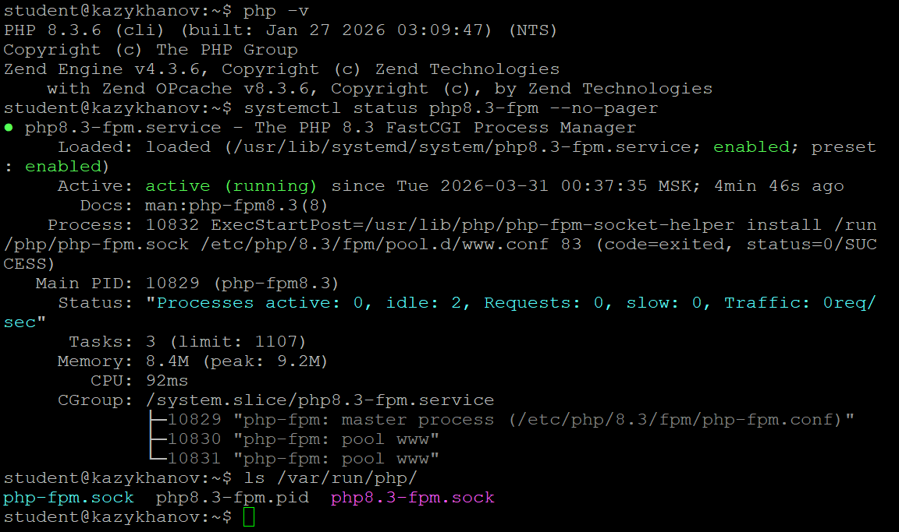

---

### Задание 2. Форма и сообщения на PHP

Созданы файлы `/var/www/boardy/submit.php` и `/var/www/boardy/messages.php`. В `feedback.html` обновлён `action` формы: `action="/submit.php"`.

Ключевые отличия PHP от bash-CGI:

- `$_POST['name']` вместо ручного парсинга `sed` — PHP автоматически разбирает POST-данные.
- `htmlspecialchars()` — защита от XSS-инъекций (в bash не было).
- `file_put_contents()` с `FILE_APPEND` — атомарная запись в файл.

Форма отправлена через браузер (имя: Volodiy), ответ — «Спасибо, Volodiy!». Страница messages.php показывает таблицу с 8 сообщениями (включая старые из CGI и новое через PHP).


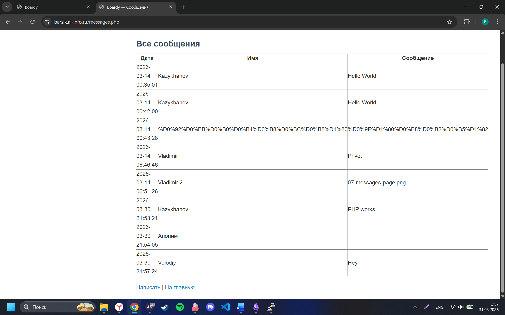

---

### Задание 3. Конфиг Nginx для PHP

В конфиге `/etc/nginx/sites-available/boardy` закомментированы старые CGI-блоки (`location /cgi-bin/` и `location = /submit`) и добавлен блок для PHP-FPM:

```nginx
# --- CGI (Практика 6, отключено) ---
# location /cgi-bin/ { ... }
# location = /submit { ... }

# --- PHP-FPM (Практика 7) ---
location ~ \.php$ {
    fastcgi_pass unix:/var/run/php/php8.3-fpm.sock;
    include fastcgi_params;
    fastcgi_param SCRIPT_FILENAME $document_root$fastcgi_script_name;
}
```

**Чем fastcgi_pass отличается от CGI через fcgiwrap?** CGI (через fcgiwrap) создаёт новый процесс (fork) на каждый запрос — запустил скрипт, получил ответ, уничтожил процесс. PHP-FPM держит пул готовых воркеров: процессы уже запущены, интерпретатор загружен, ждут запросов. Нет fork() → нет затрат на создание/уничтожение процессов → значительно быстрее.

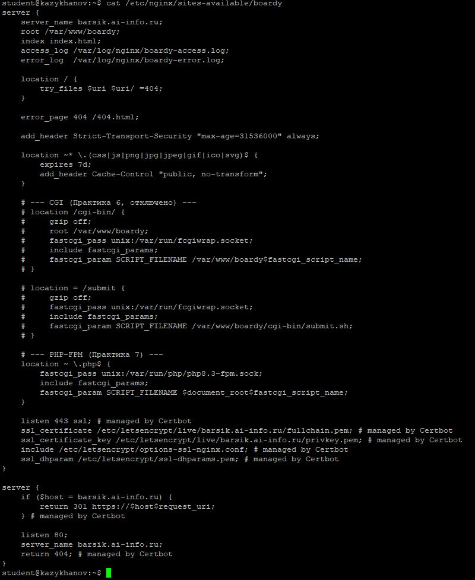

---

### Задание 4. Shared nothing

Создан файл `demo-shared-nothing.php`:

```php
<?php
$counter = 0;
$counter++;
echo "Счётчик: $counter";
```

Три вызова — всегда `Счётчик: 1`:

```bash
curl https://barsik.ai-info.ru/demo-shared-nothing.php  # Счётчик: 1
curl https://barsik.ai-info.ru/demo-shared-nothing.php  # Счётчик: 1
curl https://barsik.ai-info.ru/demo-shared-nothing.php  # Счётчик: 1
```

**Что такое shared nothing?** Переменные не живут между запросами. Каждый запрос — чистый лист: PHP загружает скрипт, выполняет, отдаёт ответ, освобождает всю память. Преимущество: изоляция (нет утечек памяти, нет гонок данных). Недостаток: нельзя запомнить ничего в памяти между запросами — для состояния нужна БД, файл или Redis.

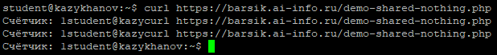

---

### Задание 5. Блокировка воркеров

Создан файл `demo-slow.php` с `sleep(2)`. Запущено 10 параллельных запросов:

```bash
time for i in $(seq 10); do
    curl -s https://barsik.ai-info.ru/demo-slow.php &
done
wait
```

Количество процессов PHP-FPM: 4 (1 master + 3 воркера, PHP-FPM динамически поднял дополнительный воркер под нагрузкой).

Результат по таймстемпам ответов: первая группа завершилась в `22:07:25`, последняя — в `22:07:28`, итого ~3 секунды на 10 запросов. Каждый воркер обслуживает один запрос. `sleep(2)` блокирует воркер на 2 секунды. Воркеров 3 → первые 3 запроса за ~2 сек, следующие 3 за ~2 сек, оставшиеся 4 за ~2 сек — итого ~3 пакета по 2 секунды.

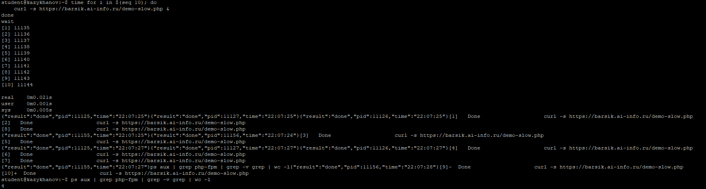

---

## Часть B. FastAPI

### Задание 6. Установка и приложение

Установлены Python 3, venv, FastAPI, Uvicorn. Создано приложение `/opt/boardy-api/main.py` с эндпоинтами:

- `/api/status` — статус сервиса (JSON)
- `/api/messages` — список сообщений из `messages.txt` (JSON)
- `/api/slow` — имитация async-запроса (2 сек, не блокирует)
- `/api/slow-blocking` — имитация блокирующего запроса (2 сек, блокирует event loop)
- `/api/counter` — счётчик запросов (состояние между запросами)

```bash
curl http://127.0.0.1:8000/api/status
# {"status":"ok","service":"boardy-api","time":"2026-03-31 01:13:01.713147"}
```

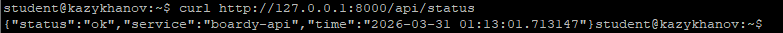

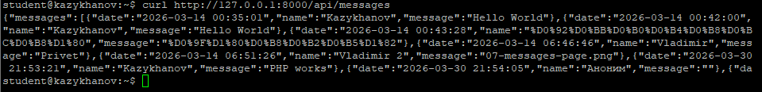

---

### Задание 7. Живой процесс (счётчик)

```bash
curl http://127.0.0.1:8000/api/counter  # {"counter": 1}
curl http://127.0.0.1:8000/api/counter  # {"counter": 2}
curl http://127.0.0.1:8000/api/counter  # {"counter": 3}
```

**Почему здесь счётчик растёт, а в PHP не рос?** Uvicorn — долгоживущий процесс. Он не уничтожает состояние после запроса: переменные, объекты, соединения с БД живут в памяти между запросами. В PHP каждый запрос — чистый лист (shared nothing), поэтому счётчик всегда сбрасывался в 0. Преимущество живого процесса: можно хранить кэш, пул соединений, WebSocket-подключения. Недостаток: возможны утечки памяти и гонки данных.

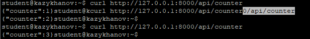

---

### Задание 8. Async: 10 запросов за 2 секунды

```bash
time for i in $(seq 10); do
    curl -s http://127.0.0.1:8000/api/slow &
done
wait
```

Результат: все 10 ответов пришли практически одновременно — таймстемпы в диапазоне `01:17:36.868`–`01:17:36.884`, разница менее 0.02 секунды. Общее время ~2 секунды.

**Почему 10 запросов по 2 секунды заняли ~2, а не 20?** `await asyncio.sleep(2)` — неблокирующая операция. Event loop отпускает управление во время ожидания и обслуживает другие запросы. Все 10 запросов ждут параллельно — итого ~2 секунды. В PHP-FPM каждый `sleep(2)` блокирует отдельный воркер, и количество одновременных запросов ограничено размером пула.

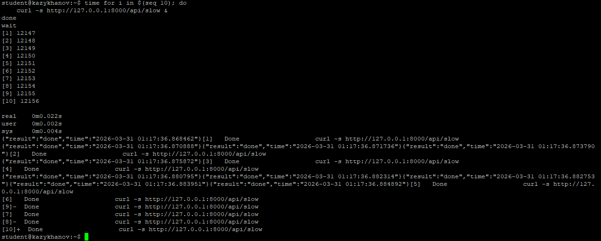

---

### Задание 9. Блокирующий код убивает event loop

```bash
time for i in $(seq 5); do
    curl -s http://127.0.0.1:8000/api/slow-blocking &
done
wait
```

Результат: ответы приходили последовательно с интервалом ~2 секунды — `01:18:28.55`, `01:18:30.55`, `01:18:32.56`, `01:18:34.56`, `01:18:36.56`. Общее время ~8 секунд.

**Чем /api/slow отличается от /api/slow-blocking?** `/api/slow` использует `await asyncio.sleep(2)` — отпускает event loop, позволяя обрабатывать другие запросы параллельно. `/api/slow-blocking` использует `time.sleep(2)` — блокирует единственный поток event loop на 2 секунды, все остальные запросы ждут. 5 запросов выполнились последовательно: 5 × 2 = ~10 секунд. Главное правило async: никогда не вызывать блокирующие функции в async-коде.

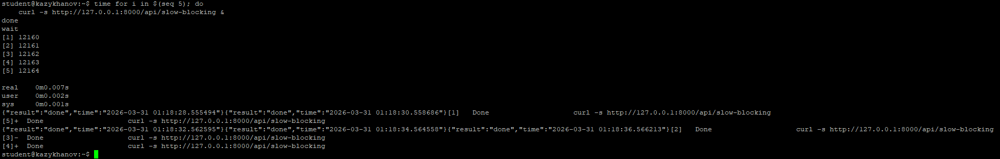

---

### Задание 10. Swagger

FastAPI автоматически генерирует Swagger-документацию на `/docs`. Видны все 5 эндпоинтов: `/api/status`, `/api/messages`, `/api/slow`, `/api/slow-blocking`, `/api/counter`. Версия API: 0.1.0, спецификация OAS 3.1.

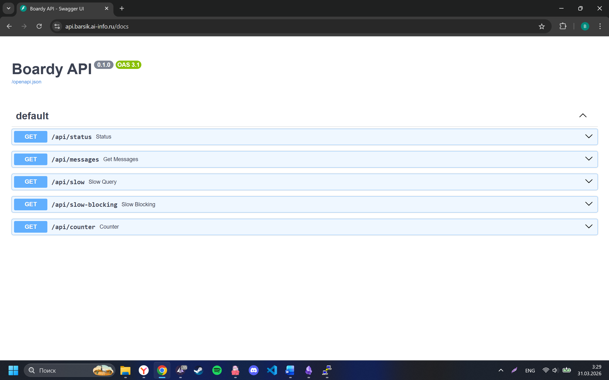

---

### Задание 11. systemd-сервис

Создан systemd-сервис `/etc/systemd/system/boardy-api.service`:

```ini
[Unit]
Description=Boardy API (FastAPI/Uvicorn)
After=network.target

[Service]
User=www-data
Group=www-data
WorkingDirectory=/opt/boardy-api
ExecStart=/opt/boardy-api/venv/bin/uvicorn main:app \
    --host 127.0.0.1 --port 8000
Restart=always
RestartSec=3

[Install]
WantedBy=multi-user.target
```

Сервис запущен, статус — `active (running)`, PID 12430. `enable` — запуск при старте ОС. `Restart=always` — если процесс упадёт, systemd перезапустит его через 3 секунды. Проверка: `curl http://127.0.0.1:8000/api/status` возвращает JSON.

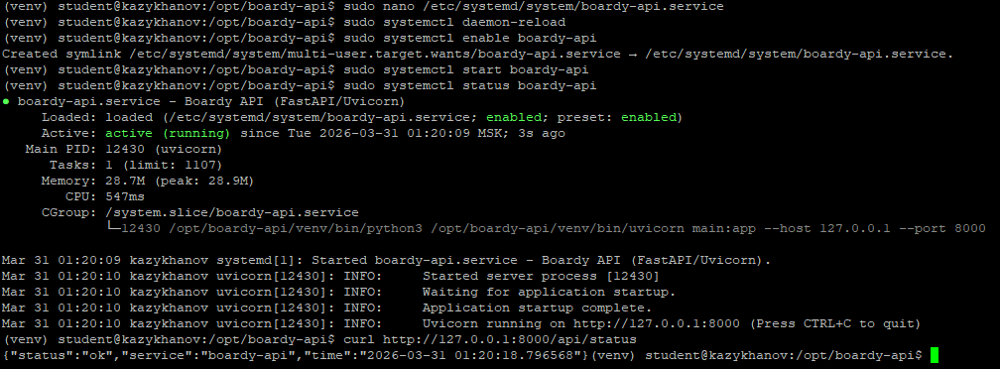

---

### Задание 12. Nginx proxy_pass

В конфиге `/etc/nginx/sites-available/boardy-api` статическая заглушка заменена на `proxy_pass`. Строки `root` и `index` закомментированы — Nginx теперь не отдаёт файлы, а проксирует на Uvicorn:

```nginx
# root /var/www/boardy-api;
# index index.html;

location / {
    proxy_pass http://127.0.0.1:8000;
    proxy_set_header Host $host;
    proxy_set_header X-Real-IP $remote_addr;
    proxy_set_header X-Forwarded-For $proxy_add_x_forwarded_for;
    proxy_set_header X-Forwarded-Proto $scheme;
}
```

**Чем proxy_pass отличается от fastcgi_pass?** `fastcgi_pass` передаёт запрос по протоколу FastCGI (бинарный, специально для PHP-FPM и CGI-подобных приложений). `proxy_pass` передаёт запрос по HTTP — проксирует на другой HTTP-сервер. FastAPI/Uvicorn — это самостоятельный HTTP-сервер, поэтому Nginx проксирует к нему по HTTP. PHP-FPM не HTTP-сервер, а FastCGI-приложение, поэтому для него `fastcgi_pass`.

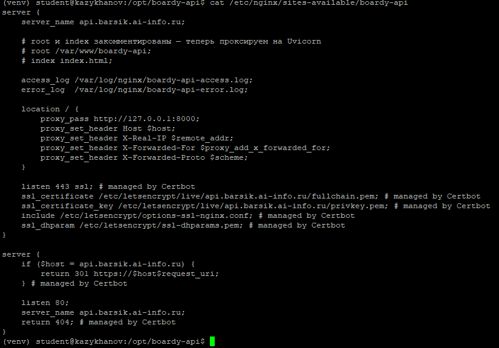

---

## Часть C. Сравнение

### Задание 13. Два формата — одни данные

```bash
curl https://barsik.ai-info.ru/messages.php        # HTML
curl https://api.barsik.ai-info.ru/api/messages     # JSON
```

Одни и те же данные из `messages.txt`, два формата. HTML — для браузера и человека (отрендеренная таблица с тегами `<table>`, `<tr>`, `<td>`). JSON — для приложений и API (структурированные данные, которые может обработать любой клиент: мобильное приложение, React-фронтенд, другой сервис).

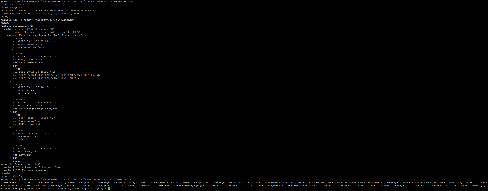

---

### Задание 14. Процессы

```bash
ps aux | grep php-fpm | head -5
ps aux | grep uvicorn
```

PHP-FPM: 3 процесса — master (`root`, PID 17037) и 2 воркера (`www-data`, PIDs 17043, 17044). Каждый воркер — отдельный процесс, обслуживает один запрос за раз. Uvicorn: 1 процесс (`www-data`, PID 12430) с event loop, обслуживает множество запросов параллельно (если код async).

| | PHP-FPM | FastAPI/Uvicorn |
|---|---------|-----------------|
| Модель | синхронная | асинхронная (event loop) |
| Состояние | shared nothing | процесс живёт |
| sleep(2) × 10 | ~3 сек (3 воркера) | ~2 сек (async) |
| Блокирующий код | не страшен | убивает event loop |
| Формат ответа | HTML | JSON |
| Nginx | fastcgi_pass | proxy_pass |

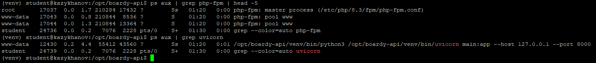
