# Практическая работа №8. MySQL: от файла к базе данных

**Студент:** Казыханов Владимир  
**VPS:** Ubuntu 24.04, VK Cloud  
**IP VPS:** `95.163.181.69`  
**Домен:** `barsik.ai-info.ru`  
**API:** `api.barsik.ai-info.ru`

---

## Часть A. MySQL - установка и настройка

### Задание 1. Установка MySQL

MySQL 8.0.45 установлен, сервис active (running), PID 2162.

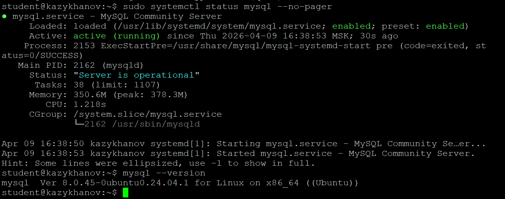

---

### Задание 2. База данных и пользователь

Создана база `boardy` с кодировкой `utf8mb4` и collation `utf8mb4_unicode_ci`. Создан пользователь `boardy` с правами только на свою базу.

**Почему utf8mb4, а не utf8?** `utf8` в MySQL (он же `utf8mb3`) - устаревший алиас, поддерживает только 3 байта из 4, что исключает часть символов Unicode (эмодзи, редкие иероглифы, математические символы). `utf8mb4` - полноценный UTF-8, стандарт с MySQL 5.5. Документация MySQL 8.0 рекомендует использовать только `utf8mb4`.

**Что такое collation?** Collation определяет правила сравнения и сортировки строк. `unicode_ci` - case-insensitive сравнение по правилам Unicode, корректно работает с кириллицей.

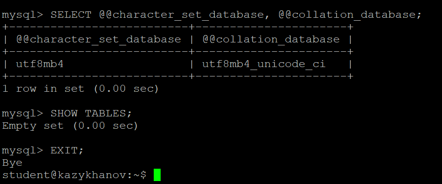

---

### Задание 3. phpMyAdmin

phpMyAdmin установлен, подключён к Nginx через location `/phpmyadmin`. Вход под пользователем `boardy`. Версия сервера: 8.0.45, PHP 8.3.6, кодировка UTF-8 Unicode (utf8mb4).

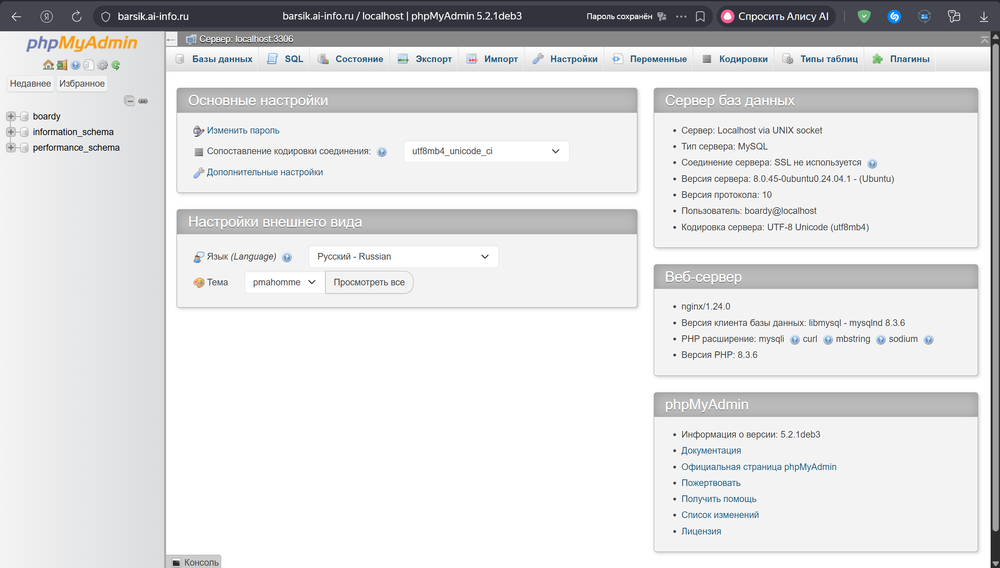

---

## Часть B. Таблицы и связи

### Задание 4. Три таблицы

Созданы таблицы `users`, `posts`, `comments`.

**FOREIGN KEY** - ограничение, связывающее столбец одной таблицы с PRIMARY KEY другой. `posts.author_id` ссылается на `users.id` - нельзя создать пост с несуществующим автором.

**ON DELETE CASCADE** - при удалении пользователя автоматически удаляются его посты и комментарии. Целостность данных поддерживается БД, а не приложением.

**Движок:** InnoDB - поддерживает транзакции (ACID), FOREIGN KEY, строковые блокировки. MyISAM не поддерживает ни транзакций, ни FK.

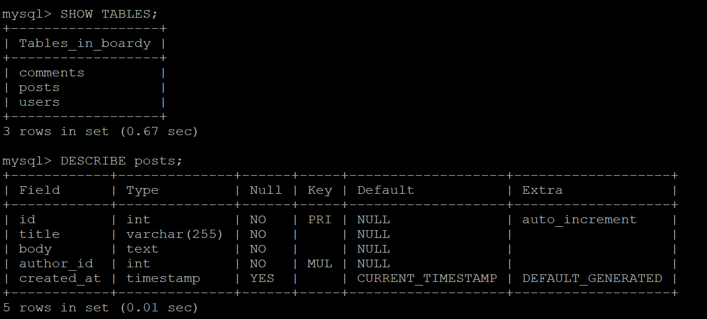

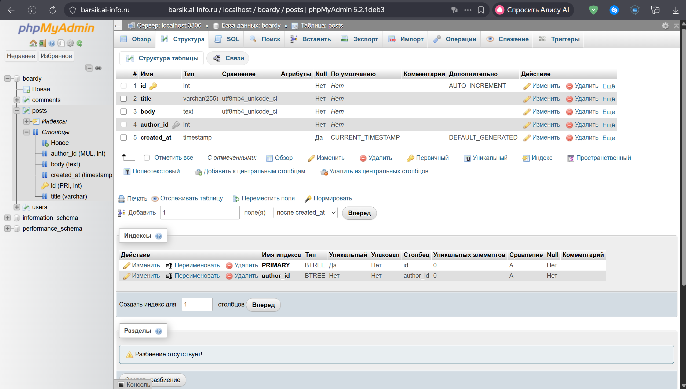

---

### Задание 5. SQL-скрипт

Все CREATE TABLE сохранены в `schema.sql` с `DROP TABLE IF EXISTS` в начале для повторного запуска.

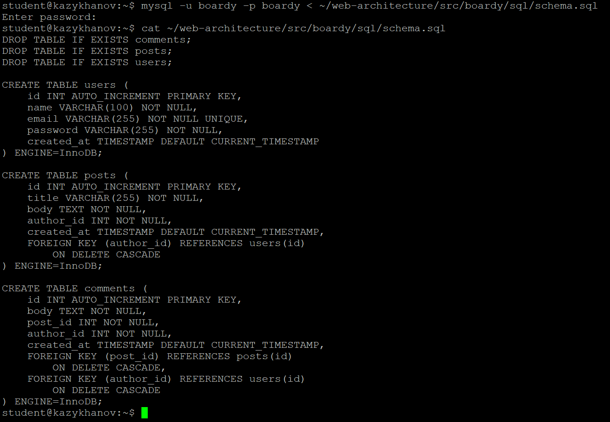

---

## Часть C. SQL - базовые операции

### Задание 6. INSERT

Добавлены 3 пользователя (Иванов, Петров, Сидорова), 5 постов от разных авторов, 3 комментария.

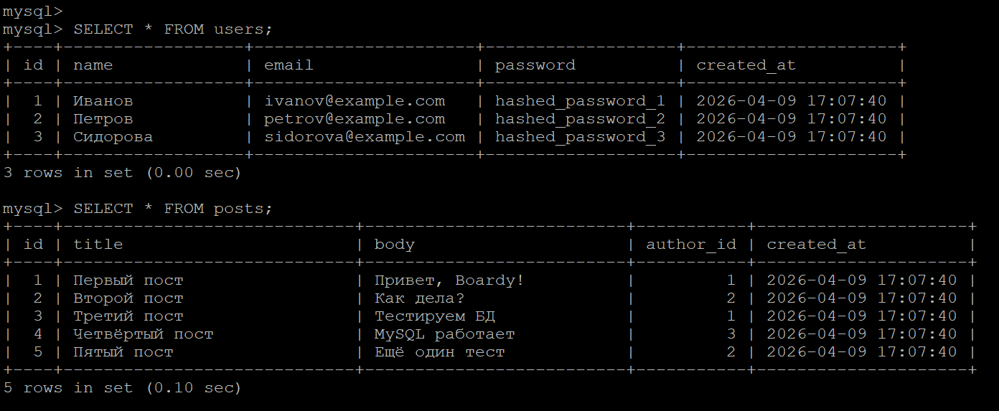

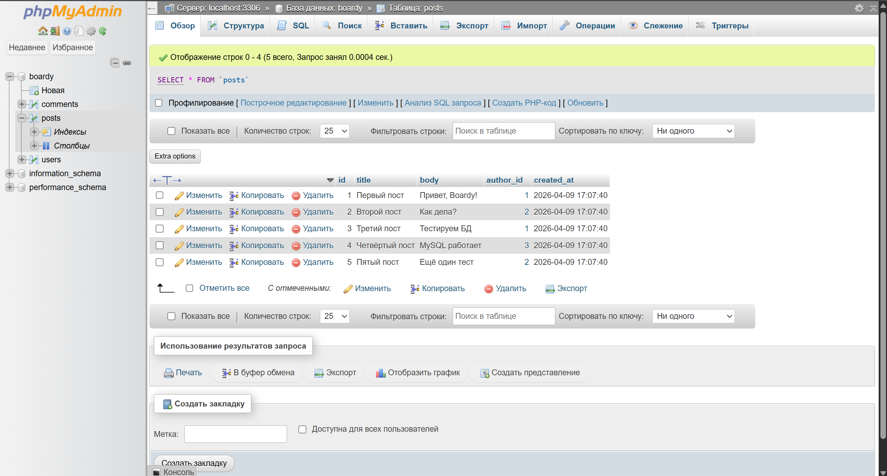

---

### Задание 7. SELECT + JOIN

```sql
SELECT posts.title, posts.body, users.name AS author
FROM posts
JOIN users ON posts.author_id = users.id;
```

**Зачем JOIN?** Посты хранят только `author_id` (число), а не имя автора. JOIN связывает две таблицы по `posts.author_id = users.id` и подставляет имя. Без JOIN пришлось бы делать отдельный запрос для каждого поста - это N+1 проблема.

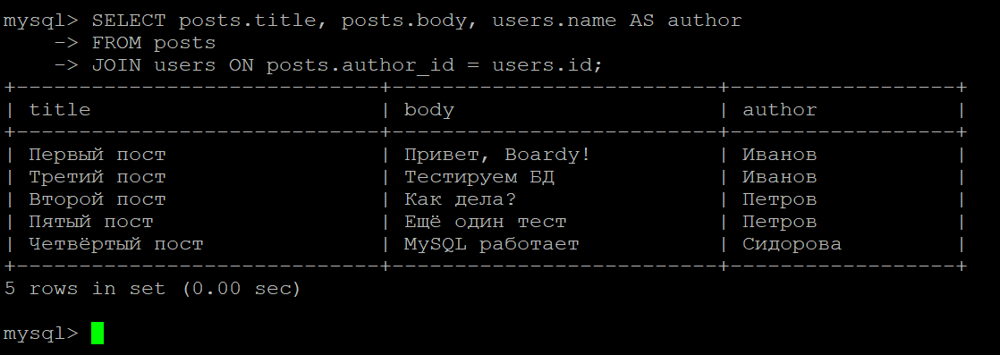

---

### Задание 8. Foreign Key - защита целостности

Попытка создать пост с `author_id = 999` - MySQL отклонил: `ERROR 1452: Cannot add or update a child row: a foreign key constraint fails`.

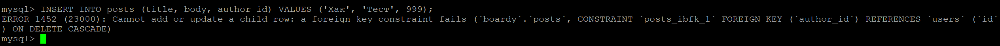

---

### Задание 9. CASCADE

До удаления: 5 постов, 3 комментария. Удалён пользователь Сидорова (id=3). После: 4 поста, 2 комментария - её пост и комментарий удалились автоматически (ON DELETE CASCADE).

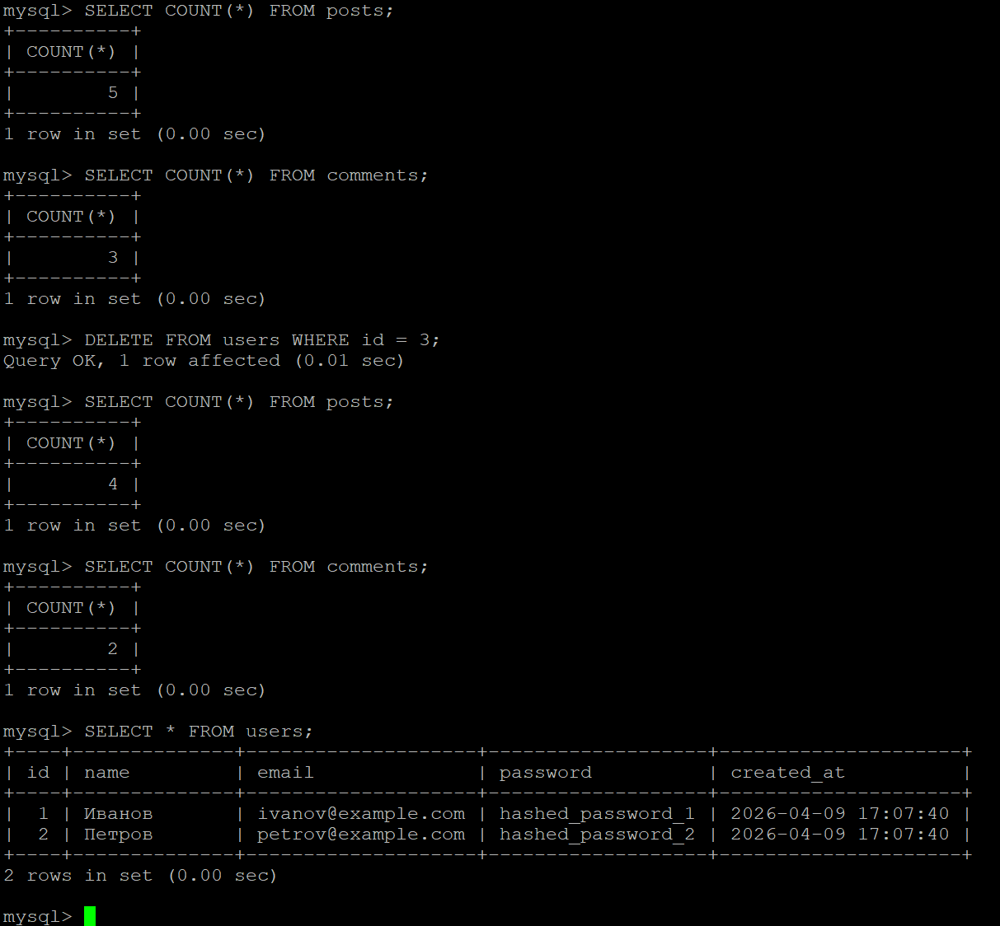

---

### Задание 10. SQL-инъекция

Нормальный запрос `WHERE name = 'Иванов'` - 1 строка. Инъекция `WHERE name = '' OR '1'='1'` - все строки.

**Как работает:** пользователь вводит `' OR '1'='1` вместо имени. Если данные подставляются в SQL конкатенацией, условие `OR '1'='1'` всегда истинно - запрос возвращает все строки.

**Prepared statements** - защита: запрос и данные отправляются в MySQL раздельно. Данные не могут изменить структуру запроса.

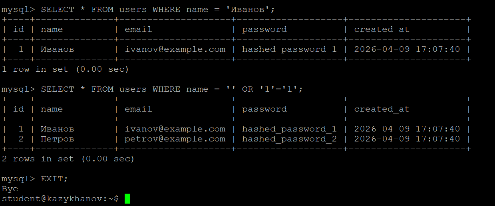

---

## Часть D. PHP + MySQL

### Задание 11. db.php

Создан файл подключения с PDO. `charset=utf8mb4` в DSN - чтобы PHP и MySQL общались в одной кодировке.

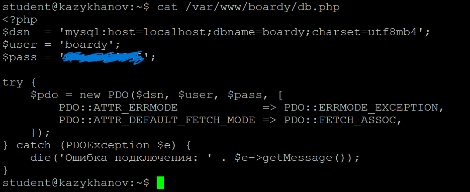

---

### Задание 12–13. submit.php и messages.php через MySQL

submit.php: ищет пользователя по имени (prepared statement), если нет - создаёт. Затем INSERT поста. messages.php: SELECT с JOIN - имя автора рядом с сообщением.

Форма отправлена (Vladimir → «Спасибо, Vladimir!»). В phpMyAdmin видна новая запись. Страница messages.php показывает 6 постов с именами авторов из MySQL.

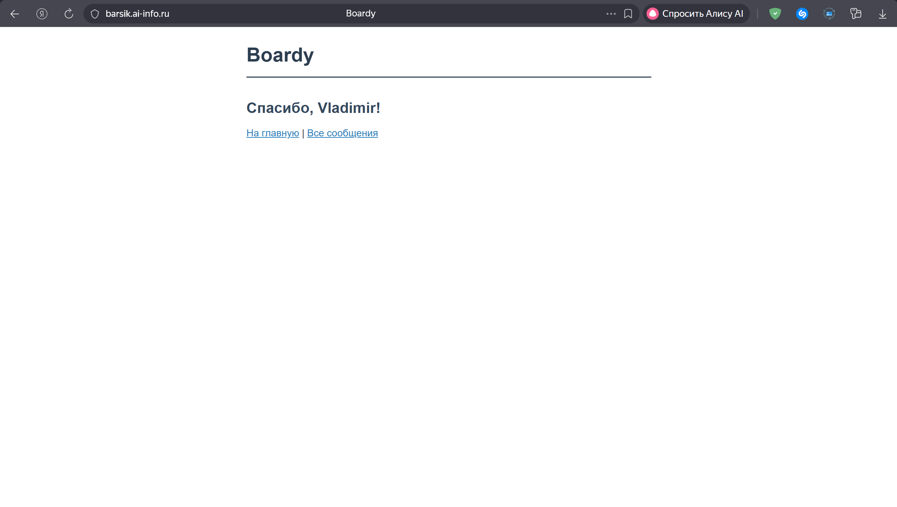

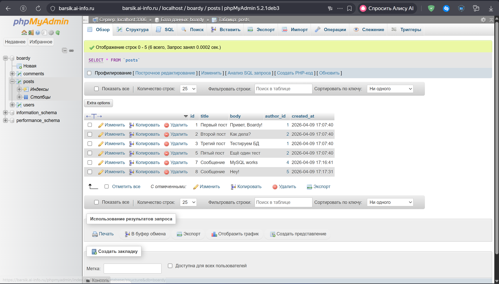

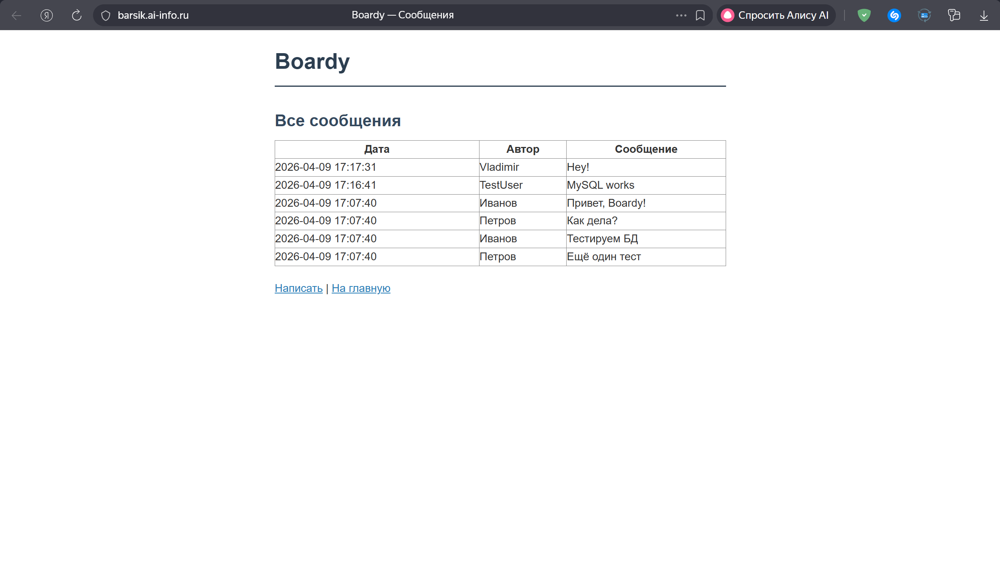

---

## Часть E. FastAPI + MySQL

### Задание 14. aiomysql

Установлен `aiomysql`. main.py обновлён: `/api/messages` и `/api/users` читают из MySQL.

**Почему aiomysql?** Асинхронный драйвер - `await` не блокирует event loop при запросе к БД. Синхронный драйвер заблокировал бы event loop (как `time.sleep` на Практике 7), и все остальные запросы ждали бы.

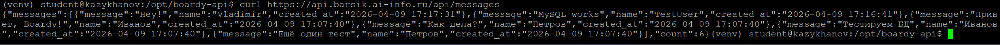

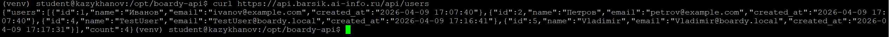
