# Практическая работа №9. REST API, SSR vs CSR, JavaScript, React

**Студент:** Казыханов Владимир
**Среда:** WSL (Ubuntu 24.04), локальная разработка
**Сайт:** `http://localhost`
**API:** `http://localhost:8000`

---

## Часть A. REST API

### Задание 1. Структура проекта

Создана структура: `database.py` (подключение к БД), `routers/comments.py` (CRUD комментариев), обновлен `main.py` (подключение роутера + CORS).

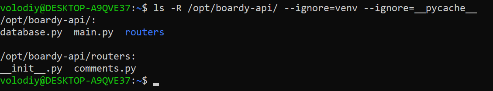

---

### Задание 2. GET - список комментариев

```bash
curl http://localhost:8000/api/posts/1/comments
```

Возвращает JSON-массив комментариев к посту 1 с именами авторов (JOIN `comments` + `users`).

**SQL-запрос:** `SELECT c.id, c.body, c.created_at, u.name AS author_name FROM comments c JOIN users u ON c.author_id = u.id WHERE c.post_id = %s ORDER BY c.created_at`. JOIN нужен потому что комментарии хранят только `author_id`, а имя автора лежит в таблице `users`.

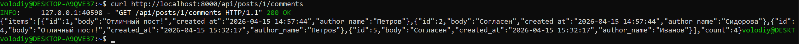

---

### Задание 3. POST - создать комментарий

```bash
curl -X POST http://localhost:8000/api/posts/1/comments \
  -H "Content-Type: application/json" \
  -d '{"body": "Мой комментарий"}'
```

Ответ: 201 Created, `{"id":7,"body":"Мой комментарий","status":"created"}`.

**Почему 201, а не 200?** 200 - запрос обработан. 201 - ресурс создан. Семантически точнее: клиент знает, что на сервере появилась новая запись. **Content-Type: application/json** - говорит серверу, что тело запроса в формате JSON (а не form-urlencoded как у HTML-форм).

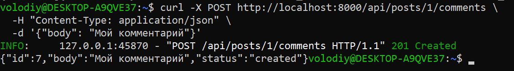

---

### Задание 4. PUT - редактировать

```bash
curl -X PUT http://localhost:8000/api/comments/7 \
  -H "Content-Type: application/json" \
  -d '{"body": "Исправлено"}'
```

**Чем PUT отличается от POST?** POST создает новый ресурс (URL коллекции: `/posts/1/comments`). PUT обновляет существующий (URL конкретного ресурса: `/comments/7`). Разные глаголы, разные URL, разные действия.

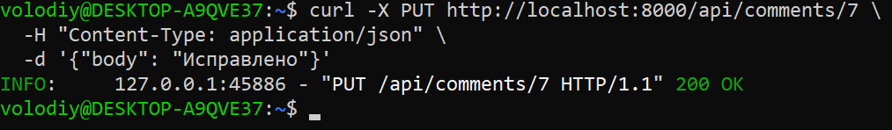

---

### Задание 5. DELETE - удалить

```bash
curl -v -X DELETE http://localhost:8000/api/comments/7
```

Ответ: 204 No Content.

**4 HTTP-глагола REST API:**
- GET - чтение, код 200 (OK)
- POST - создание, код 201 (Created)
- PUT - обновление, код 200 (OK)
- DELETE - удаление, код 204 (No Content, тело пустое)

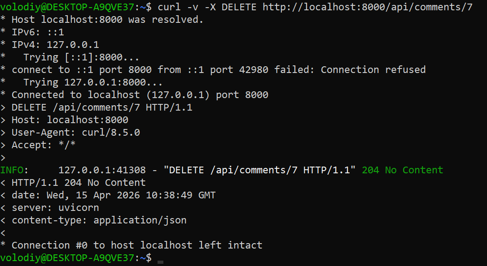

---

### Задание 6. Ошибки

- DELETE `/api/comments/999` - 404 Not Found (комментарий не существует)
- POST с пустым body - 422 Unprocessable Entity (валидация не пройдена)

**404 vs 422:** 404 - ресурс не найден (проблема с URL/ID). 422 - данные невалидны (проблема с телом запроса).

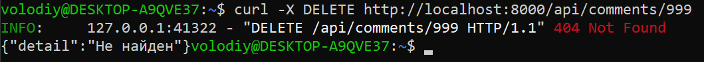

---

### Задание 7. Swagger

FastAPI автоматически генерирует документацию на `/docs`. Видны все эндпоинты: GET, POST, PUT, DELETE для комментариев + status, messages, users.

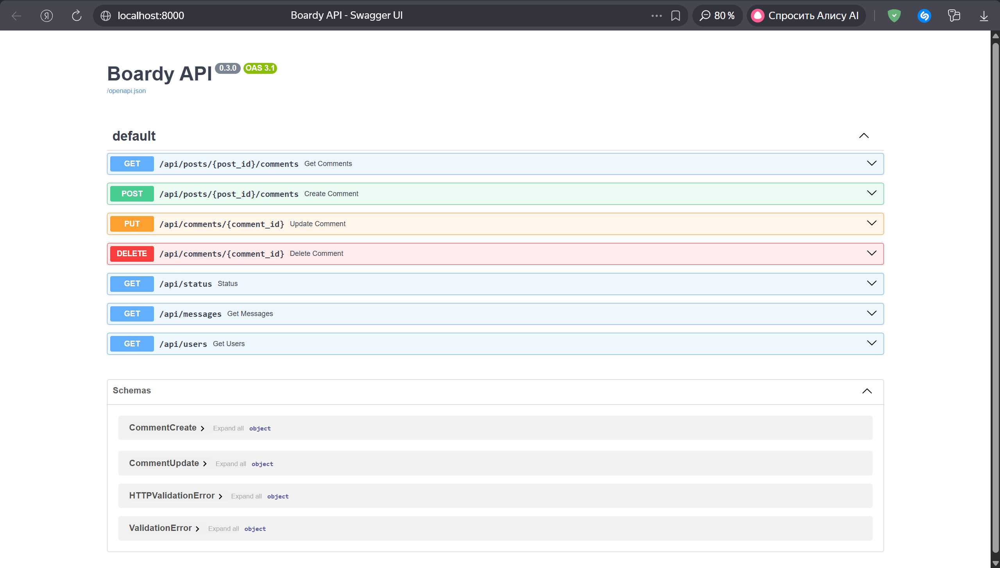

---

## Часть B. JavaScript-клиенты

### Задание 8. Vanilla JS - демо

Страница `comments-demo.html` загружает комментарии через `fetch` GET и отрисовывает через `innerHTML`. Форма отправляет POST. Без фреймворков, голый DOM.

**Функция esc()** создает текстовый узел через `textContent` и возвращает экранированную строку через `innerHTML`. Без нее пользователь мог бы вставить `<script>` и выполнить произвольный JS в браузерах других людей (XSS-атака).

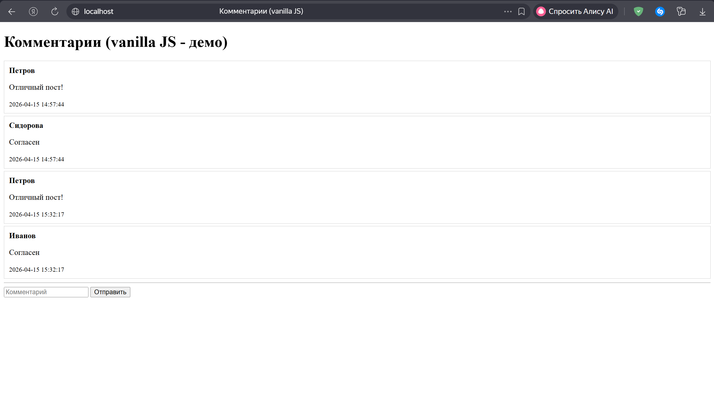

---

### Задание 9. React - полный CRUD

Страница `comments.html` с React + Bootstrap. Полный CRUD: создание, чтение, редактирование на месте, удаление с подтверждением.

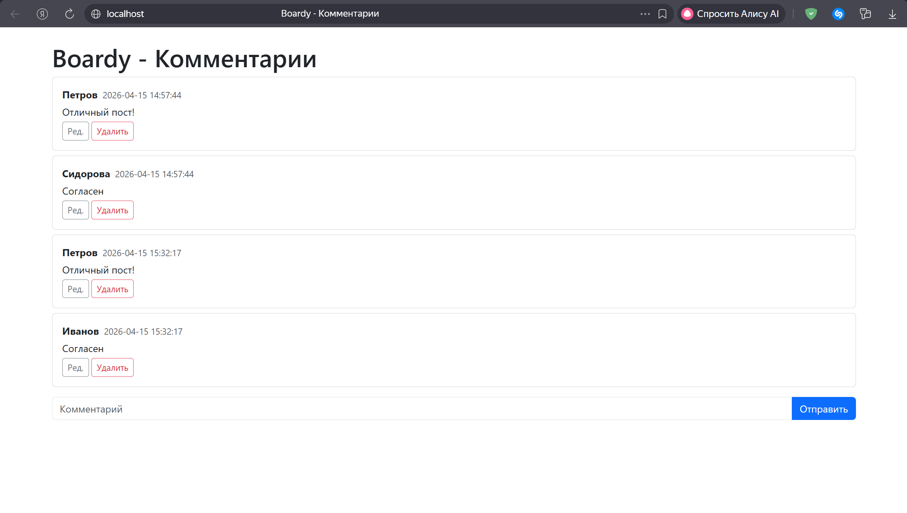

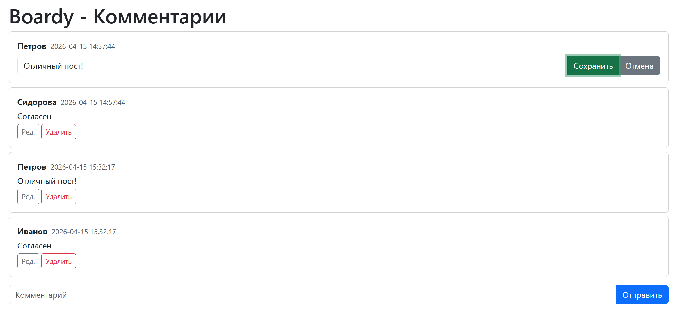

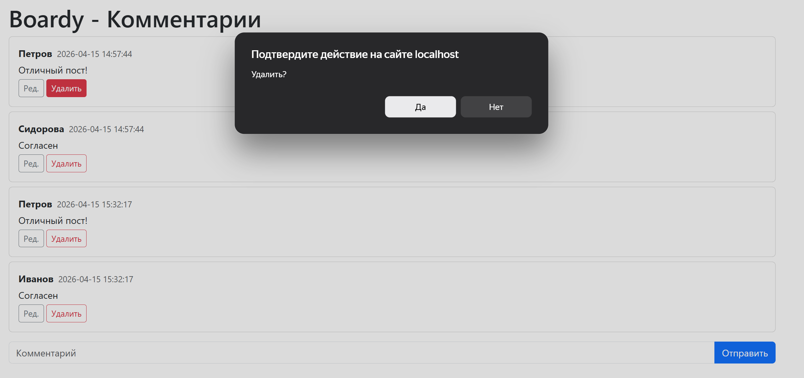

---

### Задание 10. Сравнение кода

| | Vanilla JS | React |
|---|-----------|-------|
| Состояние | Нигде, перезагружаем весь DOM | useState - хранится между рендерами |
| Обновление списка | innerHTML заново | setItems() - React перерисует сам |
| Редактирование | Руками подменять DOM-элементы | Условный рендер: `{editId === item.id ? <input/> : <p/>}` |
| Защита от XSS | Вручную через esc() | Автоматически, React экранирует `{item.body}` |

---

### Задание 11. DevTools - Network

7 запросов при загрузке comments.html: HTML-страница, bootstrap.min.css, react.js, react-dom.js, babel.min.js, comments.jsx, и последний - fetch к API (`/api/posts/1/comments`) - это единственный запрос к нашему серверу за данными.

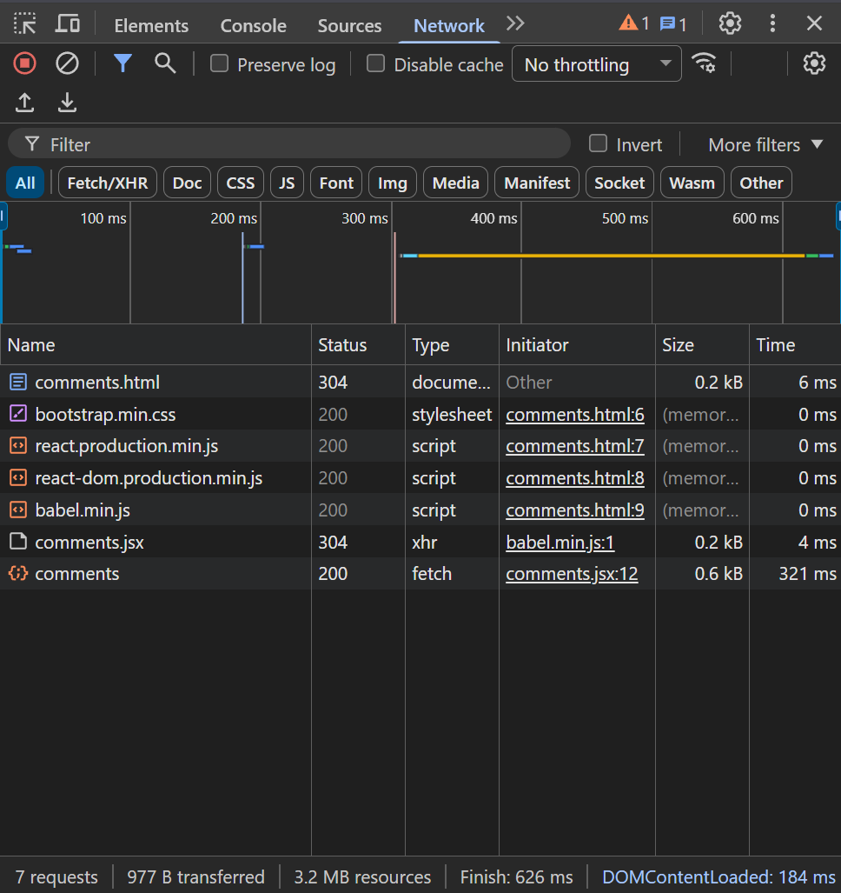

---

## Часть C. SSR vs CSR

### Задание 12. View Source

messages.php (SSR) - в исходнике видны все данные: `<td>Иванов</td>`, `<td>Привет, Boardy!</td>`. Поисковый бот прочитает.

comments.html (CSR) - в исходнике только `<div id="app"></div>`. Данных нет. Поисковый бот увидит пустую страницу.

**Почему?** SSR - сервер собрал готовый HTML с данными. CSR - сервер отдал пустой HTML, данные загружает JavaScript после загрузки страницы.

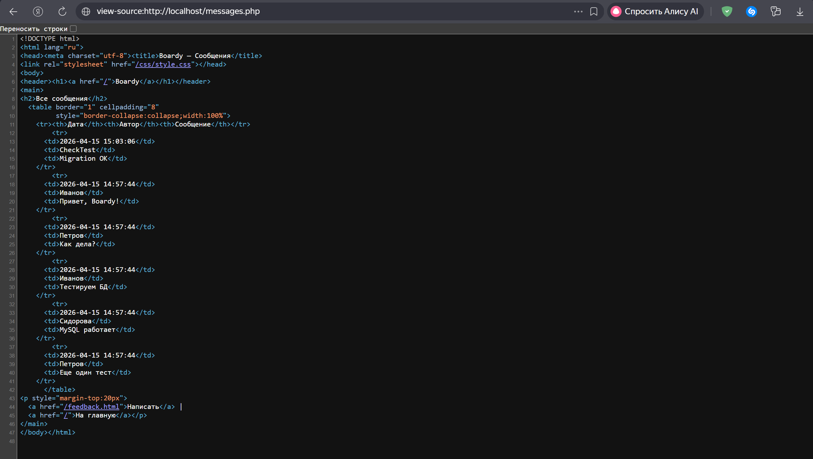

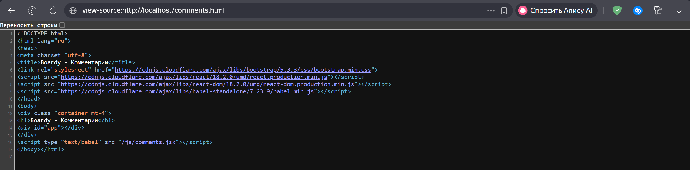

---

### Задание 13. XSS

Комментарий `` отображается как обычный текст. Alert не сработал.

**Vanilla JS** защищается через функцию `esc()` - ручная. Забыл вызвать - дыра. **React** экранирует автоматически - `{item.body}` всегда безопасен. React надежнее.

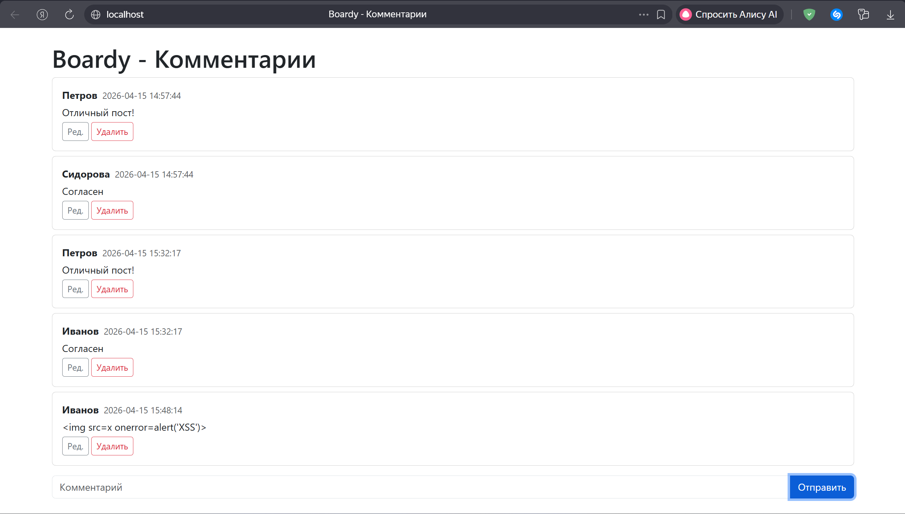

---

### Задание 14. Итоговая таблица

| | SSR (PHP) | Vanilla JS | React |
|---|-----------|-----------|-------|
| Кто рендерит HTML | Сервер (PHP) | Браузер (JS) | Браузер (React) |
| Формат ответа сервера | HTML | JSON | JSON |
| View Source: данные видны? | Да | Нет | Нет |
| Перезагрузка при отправке | Да | Нет | Нет |
| Защита от XSS | htmlspecialchars() | esc() вручную | Автоматически |
| Сложность кода | Низкая | Средняя (боль) | Средняя (удобно) |
